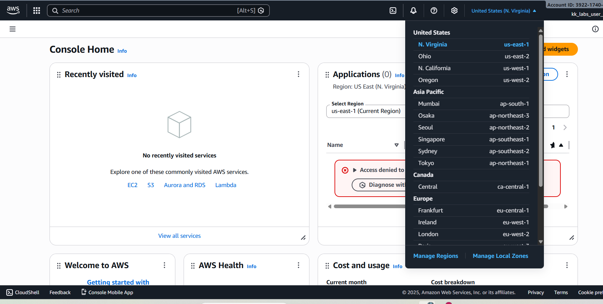
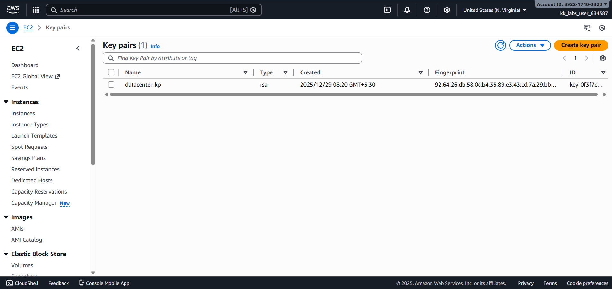

# Day 01 – Create EC2 Key Pair (AWS)

## Task Overview
As part of the **100 Days of Cloud (AWS)** challenge by KodeKloud, this task focuses on creating an EC2 key pair that will be used for secure SSH-based access to EC2 instances.

The goal was to create a key pair with specific requirements while ensuring correct AWS region selection and best practices.

---

## Concept
An EC2 key pair consists of a public and private key used to securely access EC2
instances via SSH. AWS stores the public key, while the private key must be
securely saved by the user.

---

## Real-World Use Case
EC2 key pairs are commonly used to:
- Enable secure SSH access to Linux EC2 instances
- Authenticate administrators without passwords
- Control access to servers in cloud environments
- Support secure operational and DevOps workflows

---

## Requirements
- **Key pair name:** `datacenter-kp`
- **Key pair type:** RSA
- **AWS Region:** `us-east-1` (N. Virginia)

---

## AWS Services Used
- **Amazon EC2**
  - EC2 Key Pairs

---

## Steps Performed
1. Switched AWS Console region to **N. Virginia (us-east-1)**.
2. Navigated to **EC2 → Key Pairs**.
3. Created a new key pair with:
   - Name: `datacenter-kp`
   - Key pair type: RSA
4. Verified the key pair creation from the EC2 Key Pairs list.

> Note: No EC2 instance was launched as it was not required for this task.

---

## Verification
The following screenshots confirm successful completion of the task:

- **Region confirmation:**  
  
  

- **Key pair listing showing name and type:**  
  
  

---

## Outcome
The EC2 key pair `datacenter-kp` was successfully created in the correct AWS region with the required RSA key type, fulfilling all task constraints.

---

## Learnings
- EC2 key pairs are region-specific resources.
- Key pairs are required for secure access to EC2 instances.
- AWS does not allow re-downloading private keys once created, reinforcing the importance of secure storage.

---

 **Status:** Completed
