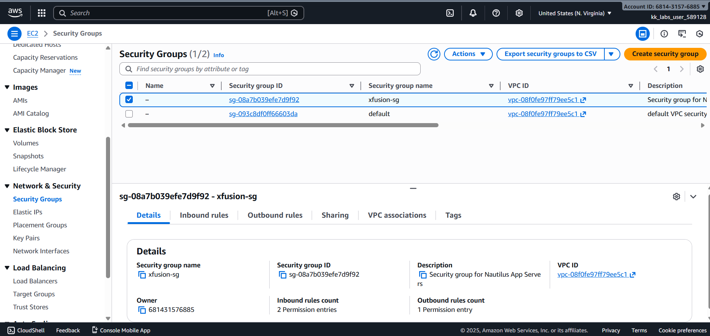
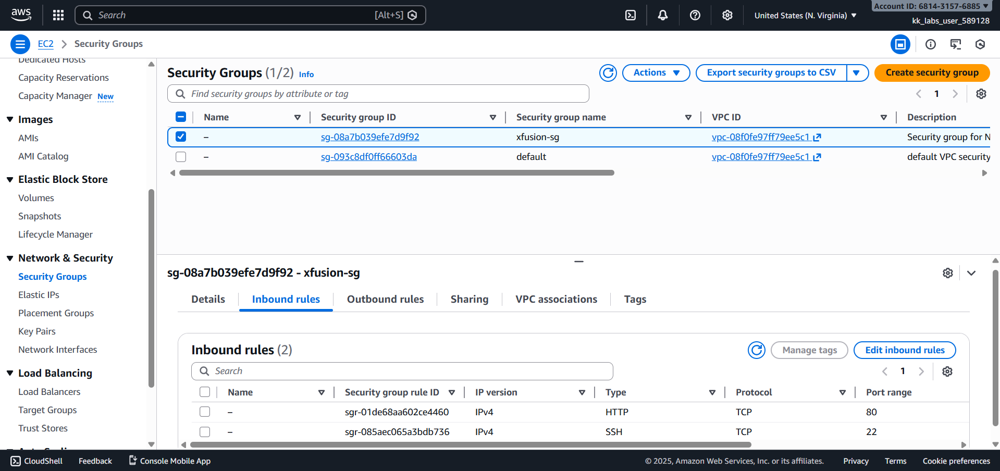

# Day 02 – Create EC2 Security Group (AWS)

## Task Overview
As part of the **100 Days of Cloud (AWS)** challenge by KodeKloud, this task focuses on creating an EC2 security group to manage inbound network traffic for application servers.

The objective was to define a security group with specific inbound rules while ensuring correct AWS region selection and following AWS networking best practices.

---

## Concept
A security group acts as a virtual firewall for EC2 instances, controlling inbound
and outbound traffic based on defined rules. Security groups are stateful and
operate at the instance level.

---

## Real-World Use Case
Security groups are commonly used to:
- Restrict access to applications and servers
- Allow traffic only from trusted sources
- Protect EC2 instances from unauthorized access
- Enforce network security best practices

---

## Requirements
- **Security group name:** `xfusion-sg`
- **Description:** Security group for Nautilus App Servers
- **Inbound rules:**
  - HTTP (TCP 80) from `0.0.0.0/0`
  - SSH (TCP 22) from `0.0.0.0/0`
- **AWS Region:** `us-east-1` (N. Virginia)

---

## AWS Services Used
- **Amazon EC2**
  - EC2 Security Groups

---

## Steps Performed
1. Switched AWS Console region to **N. Virginia (us-east-1)**.
2. Navigated to **EC2 → Security Groups**.
3. Created a new security group with:
   - Name: `xfusion-sg`
   - Description: *Security group for Nautilus App Servers*
4. Configured inbound rules:
   - Allowed HTTP (TCP 80) from anywhere (`0.0.0.0/0`)
   - Allowed SSH (TCP 22) from anywhere (`0.0.0.0/0`)
5. Verified the inbound rules and security group creation from the Security Groups list.

---

## Verification
The following screenshots confirm successful completion of the task:

- **Security group listing:**  
  
  

- **Inbound rules configuration:**  
  
  

---

## Outcome
The EC2 security group `xfusion-sg` was successfully created in the correct AWS region with the required inbound rules, fulfilling all task constraints.

---

## Learnings
- Security groups act as virtual firewalls for EC2 instances.
- Inbound rules must be explicitly defined to allow traffic.
- Security groups are stateful and region-specific AWS resources.

---

**Status:** Completed
