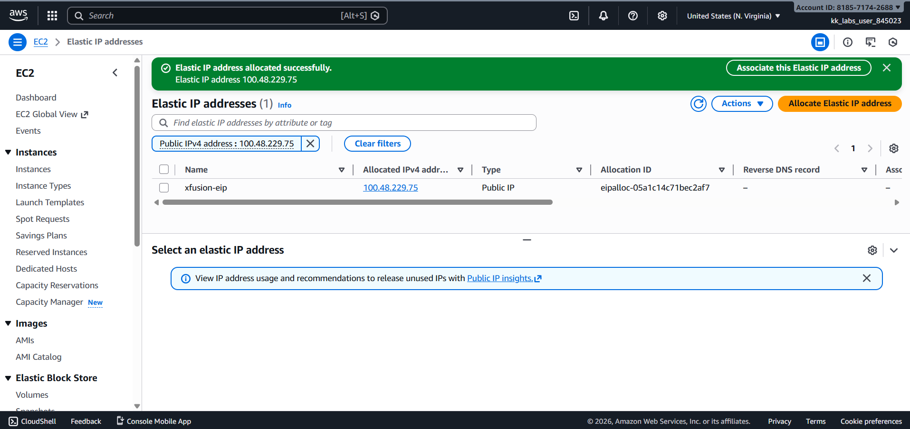
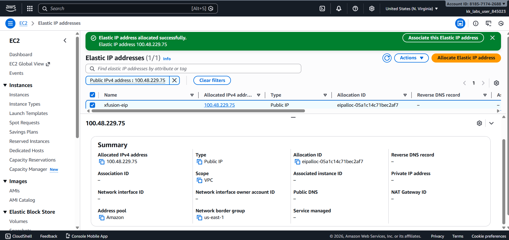

# Day 04 – Allocate Elastic IP (AWS)

## Task Overview
As part of the **100 Days of Cloud (AWS)** challenge by KodeKloud, this task focuses on allocating an Elastic IP address. Elastic IPs provide a static, public IPv4 address that can be associated with AWS resources, enabling reliable access even when underlying instances change.

The objective was to allocate an Elastic IP and properly name it for identification and management.

---

## Concept
An Elastic IP (EIP) is a static public IPv4 address allocated to an AWS account.
Elastic IPs remain available until explicitly released and can be associated or
disassociated with AWS resources as needed.

---

## Real-World Use Case
Elastic IPs are commonly used to:
- Provide stable public access to servers
- Maintain the same IP address during instance replacement
- Support legacy systems requiring fixed IPs
- Avoid DNS changes during infrastructure updates

---

## Requirements
- **Elastic IP name:** `xfusion-eip`
- **AWS Region:** `us-east-1` (N. Virginia)

---

## AWS Services Used
- **Amazon EC2**
  - Elastic IP Addresses

---

## Steps Performed
1. Switched AWS Console region to **N. Virginia (us-east-1)**.
2. Navigated to **EC2 → Elastic IPs**.
3. Allocated a new Elastic IP address.
4. Added a Name tag with value **`xfusion-eip`**.
5. Verified the Elastic IP allocation from the Elastic IPs list.

---

## Verification
The following screenshots confirm successful completion of the task:

- **Elastic IP list showing allocated address and name tag:**  
  
  

- **Elastic IP details view confirming allocation and region:**  
  
  

---

## Outcome
The Elastic IP `xfusion-eip` was successfully allocated in the `us-east-1` region, fulfilling all task requirements.

---

## Learnings
- Elastic IPs provide a static public IPv4 address in AWS.
- Elastic IPs are **region-specific** resources.
- Proper tagging helps in easy identification and management of cloud resources.
- Elastic IPs do not need to be associated with an instance unless explicitly required.

---

**Status:** Completed
