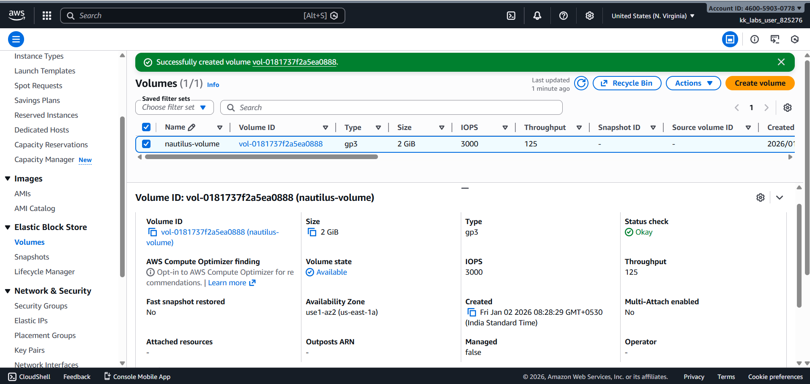

# Day 05 – Create EBS Volume (AWS)

## Task Overview
As part of the **100 Days of Cloud (AWS)** challenge by KodeKloud, this task focuses on creating an Amazon Elastic Block Store (EBS) volume. EBS volumes provide persistent block storage for EC2 instances and are a fundamental component of AWS compute infrastructure.

The objective was to create an EBS volume with specific size and type requirements and ensure proper naming for easy identification.

---

## Requirements
- **Volume name:** `nautilus-volume`
- **Volume type:** `gp3`
- **Volume size:** `2 GiB`

---

## AWS Services Used
- **Amazon EC2**
  - Elastic Block Store (EBS)

---

## Steps Performed
1. Navigated to **EC2 → Elastic Block Store → Volumes**.
2. Created a new EBS volume with:
   - Name: `nautilus-volume`
   - Volume type: `gp3`
   - Size: `2 GiB`
3. Verified that the volume was created successfully and marked as **Available**.

---

## Verification
The following screenshots confirm successful completion of the task:

- **EBS volume list showing name, type, and size:**  
  

- **EBS volume details view confirming configuration:**  
  

---

## Outcome
The EBS volume `nautilus-volume` was successfully created with the required specifications, fulfilling all task constraints.

---

## Learnings
- EBS volumes provide persistent block storage independent of EC2 instance lifecycle.
- Volume type selection (gp3) affects performance and cost.
- EBS volumes are created within a specific Availability Zone.
- Proper naming and verification simplify resource management.

---

**Status:** Completed
