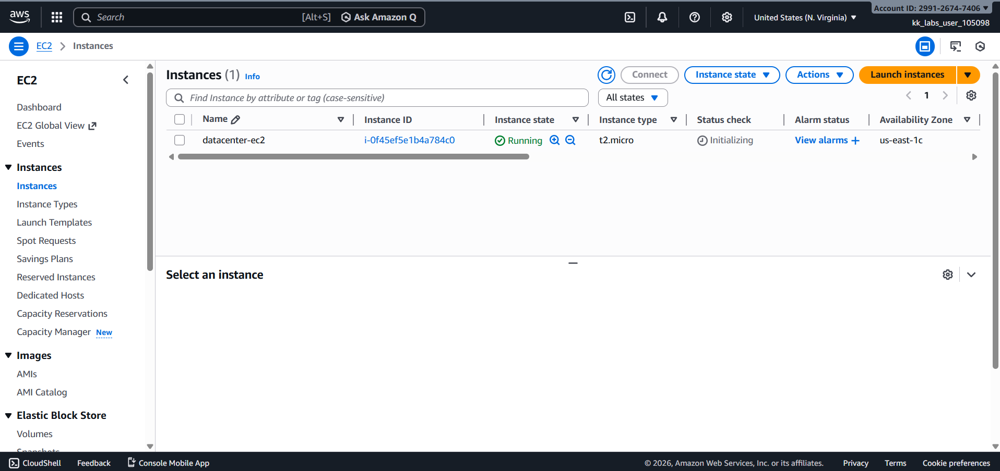
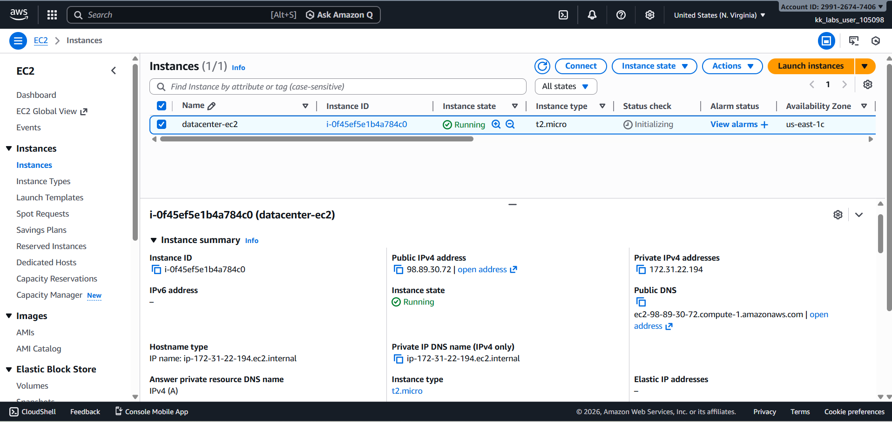
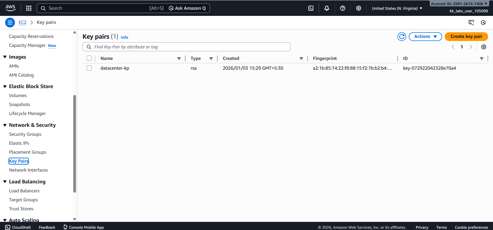
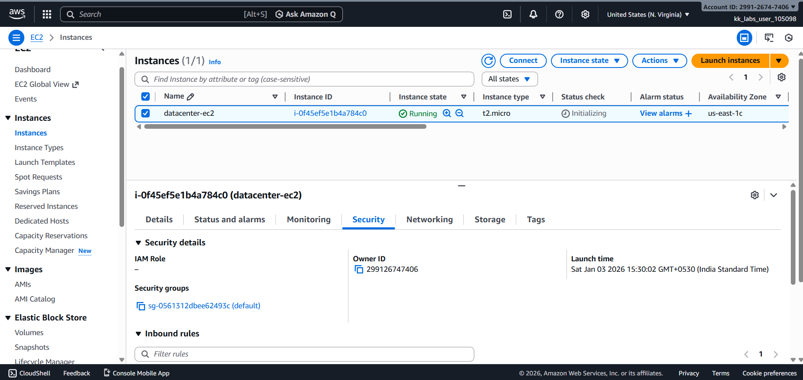

# Day 06 – Launch EC2 Instance (AWS)

## Task Overview
As part of the **100 Days of Cloud (AWS)** challenge by KodeKloud, this task focuses on launching an Amazon EC2 instance using specific configuration requirements. EC2 instances provide scalable compute capacity and form the foundation of most AWS-based workloads.

The objective was to launch an EC2 instance with a defined AMI, instance type, key pair, and security group.

---

## Requirements
- **Instance name:** `datacenter-ec2`
- **AMI:** Amazon Linux
- **Instance type:** `t2.micro`
- **Key pair:** `datacenter-kp` (RSA)
- **Security group:** Default security group

---

## AWS Services Used
- **Amazon EC2**
  - EC2 Instances
  - EC2 Key Pairs
  - Security Groups

---

## Steps Performed
1. Navigated to **EC2 → Instances**.
2. Launched a new EC2 instance using:
   - Amazon Linux AMI
   - Instance type: `t2.micro`
3. Created and selected a new RSA key pair named **`datacenter-kp`**.
4. Attached the **default security group**.
5. Assigned the instance name **`datacenter-ec2`**.
6. Verified that the instance was running successfully.

---

## Verification
The following screenshots confirm successful completion of the task:

- **EC2 instances list showing instance name and type:**  
  
  

- **EC2 instance details confirming AMI, instance type, and key pair:**  
  
  

- **Key pair list showing RSA key pair:**  
  
  

- **Instance security tab confirming default security group:**  
  
  

---

## Outcome
The EC2 instance `datacenter-ec2` was successfully launched using the Amazon Linux AMI with the required instance type, key pair, and default security group, fulfilling all task requirements.

---

## Learnings
- EC2 instances require an AMI, instance type, key pair, and security group.
- Key pairs enable secure SSH access to EC2 instances.
- Default security groups allow basic inbound and outbound traffic.
- Instance metadata and configuration can be verified from the EC2 console.

---

**Status:** Completed
