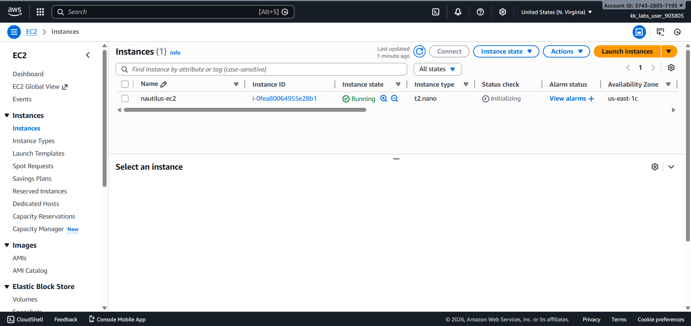
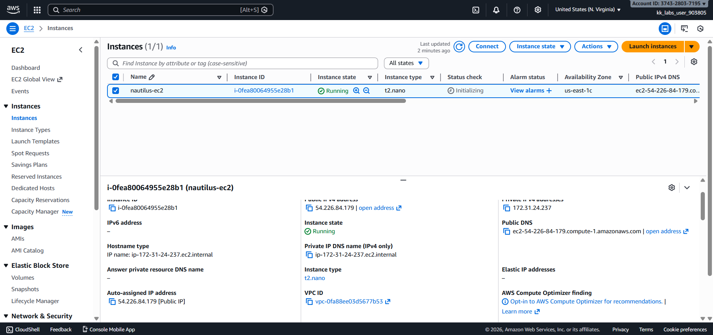
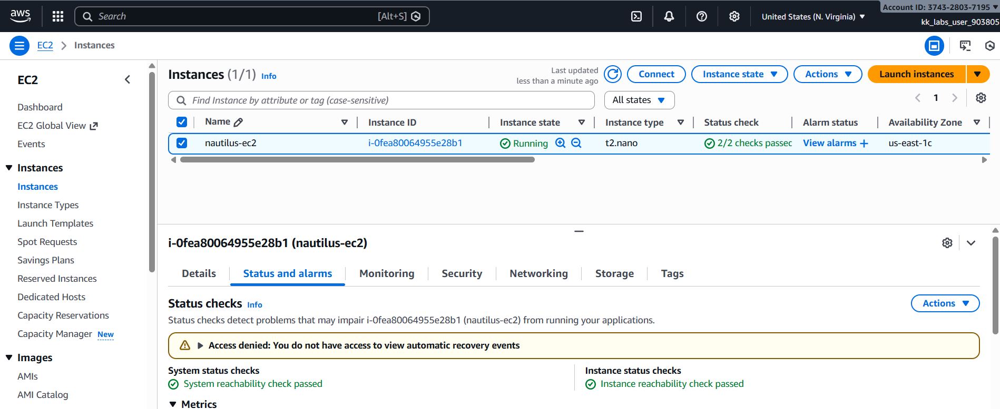

# Day 07 – Modify EC2 Instance Type (AWS)

## Task Overview
As part of the **100 Days of Cloud (AWS)** challenge by KodeKloud, this task focuses on optimizing EC2 resource usage by modifying the instance type of an existing EC2 instance. Instance resizing is a common operational activity used to reduce cost or improve performance.

The objective was to change the instance type of an underutilized EC2 instance while ensuring it remains in a running state after the modification.

---

## Concept
EC2 instance types define the compute, memory, and networking capacity of an instance.
AWS allows instance resizing by changing the instance type, enabling users to
right-size resources based on workload requirements.

---

## Real-World Use Case
Modifying EC2 instance types is commonly used to:
- Reduce costs by downsizing underutilized instances
- Increase performance during high traffic or peak loads
- Optimize resources after monitoring application usage
- Adjust infrastructure without redeploying applications

---

## Requirements
- **Instance name:** `nautilus-ec2`
- **Current instance type:** `t2.micro`
- **New instance type:** `t2.nano`
- **Final instance state:** Running
- **AWS Region:** `us-east-1`

---

## AWS Services Used
- **Amazon EC2**
  - EC2 Instances

---

## Steps Performed
1. Navigated to **EC2 → Instances**.
2. Selected the EC2 instance named **`nautilus-ec2`**.
3. Waited for the instance **status checks** to initialize.
4. Stopped the EC2 instance.
5. Modified the instance type from **`t2.micro`** to **`t2.nano`**.
6. Started the EC2 instance.
7. Verified that:
   - The instance type was updated successfully.
   - The instance state was **Running**.

---

## Verification
The following screenshots confirm successful completion of the task:

- **EC2 instances list showing updated instance type:**  

  

- **EC2 instance details confirming new instance type:**  
  
  

- **Status check tab showing completed checks:**  
  
  

---

## Outcome
The EC2 instance `nautilus-ec2` was successfully resized from `t2.micro` to `t2.nano` and is running normally, meeting all task requirements.

---

## Learnings
- EC2 instance types can be modified only when the instance is stopped.
- Status checks may remain in an initializing state briefly even if the instance appears running.
- Right-sizing EC2 instances helps optimize cost and resource utilization.
- Instance configuration changes can be verified from the EC2 console.

---

**Status:** Completed