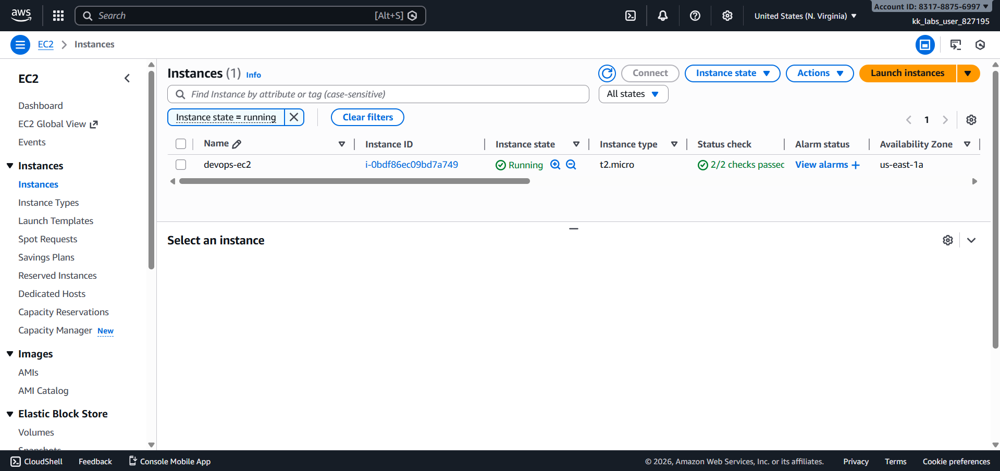
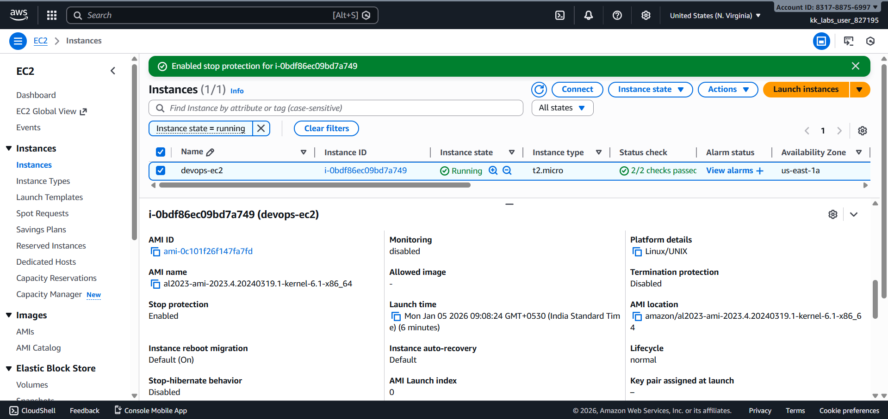

# Day 08 – Enable Stop Protection for EC2 Instance (AWS)

## Task Overview
As part of the **100 Days of Cloud (AWS)** challenge by KodeKloud, this task focuses on enabling **Stop Protection** for an EC2 instance. Stop protection is used to prevent accidental stopping of critical EC2 instances.

The objective was to enable stop protection for an existing EC2 instance in the correct AWS region.

---

## Requirements
- **EC2 instance name:** `devops-ec2`
- **Stop protection:** Enabled
- **AWS Region:** `us-east-1` (N. Virginia)

---

## AWS Services Used
- **Amazon EC2**
  - EC2 Instances
  - Instance Settings

---

## Steps Performed
1. Switched AWS Console region to **N. Virginia (us-east-1)**.
2. Navigated to **EC2 → Instances**.
3. Selected the EC2 instance named **`devops-ec2`**.
4. Enabled **Stop Protection** from the instance settings.
5. Verified that stop protection was successfully enabled from the instance details.

---

## Verification
The following screenshots confirm successful completion of the task:

- **EC2 instances list showing `devops-ec2`:**  
  
  

- **Instance details confirming stop protection is enabled:**  

  

---

## Outcome
Stop protection was successfully enabled for the EC2 instance `devops-ec2` in the `us-east-1` region, ensuring the instance cannot be stopped accidentally.

---

## Learnings
- Stop protection prevents accidental stopping of EC2 instances.
- Instance protection settings are useful for critical or production workloads.
- EC2 instance attributes can be modified safely from the AWS Console.
- Verification via the instance details tab is essential after configuration changes.

---

**Status:** Completed
