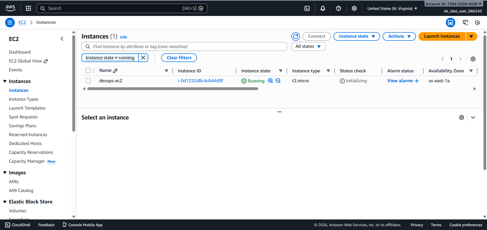
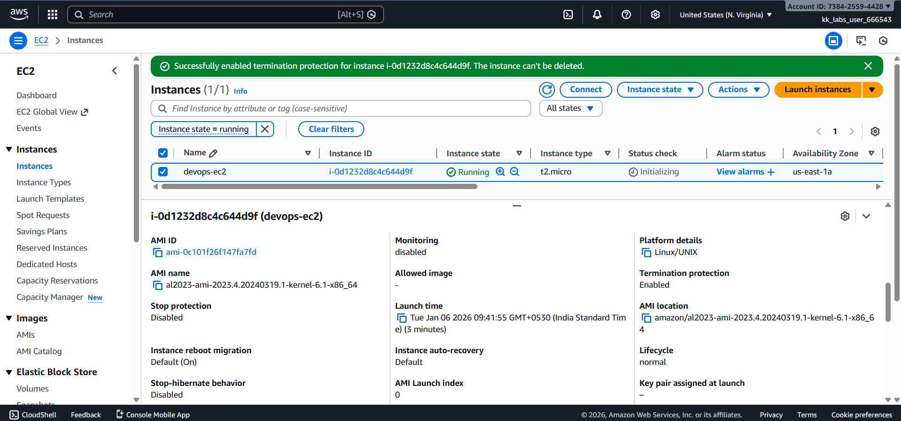

# Day 09 – Enable Termination Protection for EC2 Instance (AWS)

## Task Overview
As part of the **100 Days of Cloud (AWS)** challenge by KodeKloud, this task focuses on enabling **Termination Protection** for an EC2 instance. Termination protection helps prevent accidental deletion of critical EC2 instances.

The objective was to enable termination protection for an existing EC2 instance in the correct AWS region.

---

## Concept
Termination protection is an EC2 instance setting that prevents accidental termination
of instances. When enabled, AWS blocks termination actions unless the protection is
explicitly disabled first.

---

## Real-World Use Case
Termination protection is typically used to:
- Safeguard critical production and database servers
- Prevent human errors during maintenance or automation
- Add an extra layer of protection for long-running workloads
- Ensure business-critical instances are not deleted unintentionally

---

## Requirements
- **EC2 instance name:** `devops-ec2`
- **Termination protection:** Enabled
- **AWS Region:** `us-east-1` (N. Virginia)

---

## AWS Services Used
- **Amazon EC2**
  - EC2 Instances
  - Instance Settings

---

## Steps Performed
1. Switched AWS Console region to **N. Virginia (us-east-1)**.
2. Navigated to **EC2 → Instances**.
3. Selected the EC2 instance named **`devops-ec2`**.
4. Enabled **Termination Protection** from the instance settings.
5. Verified that termination protection was successfully enabled from the instance details.

---

## Verification
The following screenshots confirm successful completion of the task:

- **EC2 instances list showing `devops-ec2`:**  
  
  

- **Instance details confirming termination protection is enabled:**  
  
  

---

## Outcome
Termination protection was successfully enabled for the EC2 instance `devops-ec2` in the `us-east-1` region, ensuring the instance cannot be terminated accidentally.

---

## Learnings
- Termination protection prevents accidental deletion of EC2 instances.
- It is especially useful for critical or production workloads.
- Instance protection settings can be managed from the EC2 console.
- Always verify configuration changes using the instance details tab.

---

**Status:** Completed
