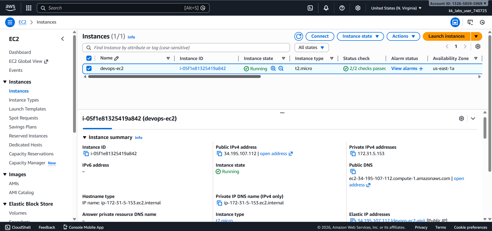
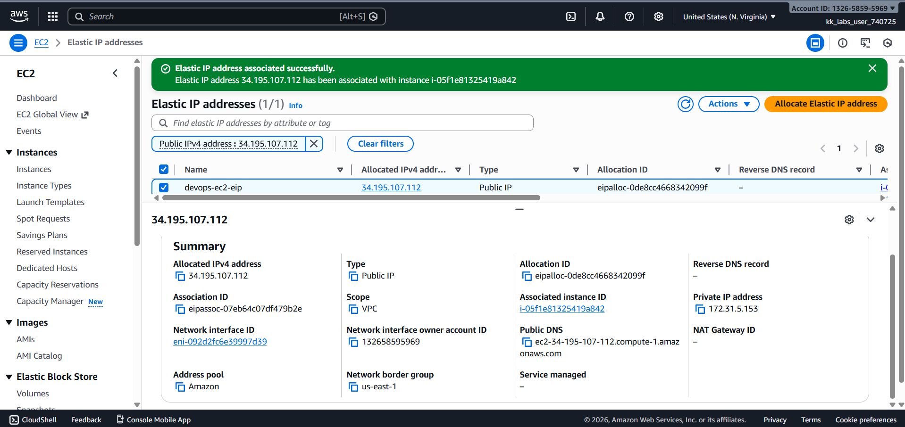

# Day 10 – Attach Elastic IP to EC2 Instance (AWS)

## Task Overview
As part of the **100 Days of Cloud (AWS)** challenge by KodeKloud, this task focuses on associating an **Elastic IP (EIP)** with an existing **EC2 instance**. Elastic IPs provide a static public IPv4 address that can be remapped to different instances if required.

The objective was to attach an existing Elastic IP to the specified EC2 instance in the correct AWS region.

---

## Requirements
- **EC2 Instance Name:** `devops-ec2`
- **Elastic IP Name:** `devops-ec2-eip`
- **AWS Region:** `us-east-1` (N. Virginia)

---

## AWS Services Used
- **Amazon EC2**
  - EC2 Instances
  - Elastic IPs

---

## Steps Performed
1. Switched AWS Console region to **N. Virginia (us-east-1)**.
2. Navigated to **EC2 → Elastic IPs**.
3. Selected the Elastic IP named **`devops-ec2-eip`**.
4. Clicked **Actions → Associate Elastic IP**.
5. Selected the EC2 instance **`devops-ec2`**.
6. Completed the association process.
7. Verified the Elastic IP was successfully attached to the instance.

---

## Verification
The following screenshots confirm successful completion of the task:

- **EC2 instances list showing `devops-ec2`:**  
  
  

- **Elastic IP associated with the EC2 instance:**  
  
  

---

## Outcome
The Elastic IP `devops-ec2-eip` was successfully attached to the EC2 instance `devops-ec2` in the `us-east-1` region, ensuring a persistent public IP address for the instance.

---

## Learnings
- Elastic IPs provide a static public IPv4 address for EC2 instances.
- EIPs can be reassigned between instances if required.
- Associating an Elastic IP ensures consistent connectivity even after instance restarts.
- Always verify Elastic IP associations to avoid unnecessary AWS charges.

---

**Status:** Completed
