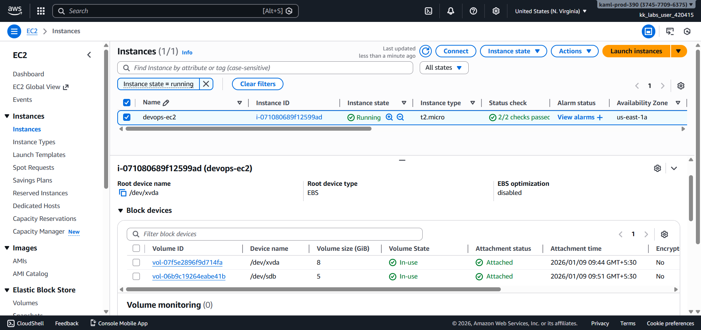
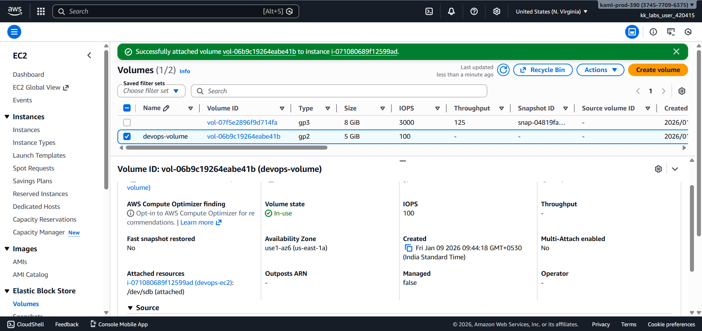

# Day 12 – Attach EBS Volume to EC2 Instance (AWS)

## Task Overview
As part of the **100 Days of Cloud (AWS)** challenge by KodeKloud, this task focuses on attaching an existing Amazon EBS volume to an existing EC2 instance. Proper volume attachment is essential for extending storage capacity while keeping compute and data layers separate.

The objective was to attach an already available EBS volume to an EC2 instance using a specific device name.

---

## Requirements
- **EC2 instance name:** `devops-ec2`
- **EBS volume name:** `devops-volume`
- **Region:** `us-east-1`
- **Device name:** `/dev/sdb`

---

## AWS Services Used
- **Amazon EC2**
  - EC2 Instances
  - Elastic Block Store (EBS)

---

## Steps Performed
1. Navigated to **EC2 → Volumes**.
2. Selected the existing volume **`devops-volume`**.
3. Clicked **Actions → Attach volume**.
4. Chose the EC2 instance **`devops-ec2`**.
5. Set the device name as **`/dev/sdb`**.
6. Attached the volume and confirmed the attachment status.

---

## Verification
The following screenshots confirm successful completion of the task:

- **EC2 instance storage tab showing attached volume and device name:**  
  
  

- **EBS volume list showing volume state as in-use:**  
  
  

---

## Outcome
The EBS volume `devops-volume` was successfully attached to the EC2 instance `devops-ec2` with the device name `/dev/sdb`. The volume state shows **in-use**, confirming successful attachment.

---

## Learnings
- EBS volumes provide persistent block storage for EC2 instances.
- Volumes can be attached or detached without recreating instances.
- Correct device naming is important during volume attachment.
- Volume attachment status can be verified from both EC2 and EBS views.

---

**Status:** Completed
