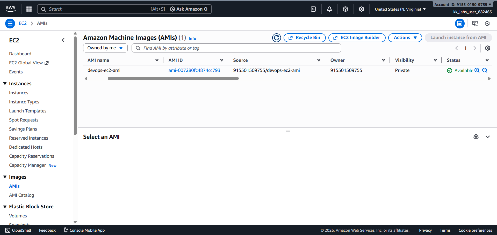
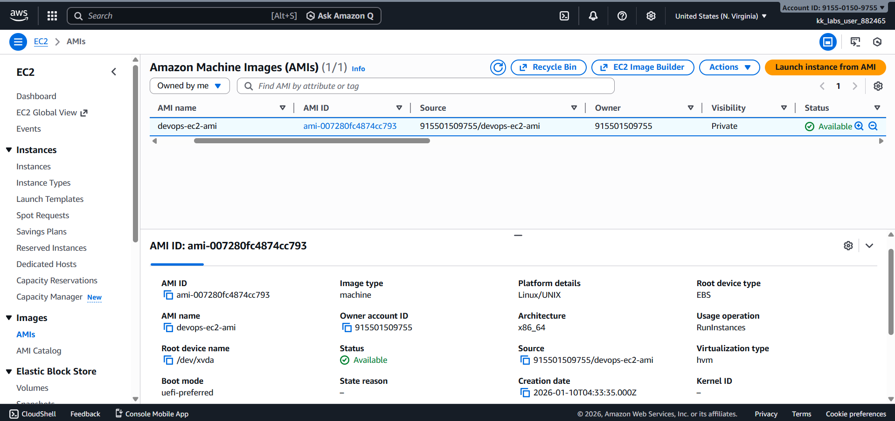

# Day 13 – Create AMI from EC2 Instance (AWS)

## Task Overview
As part of the **100 Days of Cloud (AWS)** challenge by KodeKloud, this task focuses on creating an Amazon Machine Image (AMI) from an existing EC2 instance. AMIs are used to create reusable templates for launching identical EC2 instances, which is critical for scaling and disaster recovery.

The objective was to create an AMI from an existing EC2 instance and ensure it reaches the available state.

---

## Concept
An Amazon Machine Image (AMI) is a reusable template that contains the operating system,
application configuration, and attached storage of an EC2 instance. AMIs enable quick and
consistent provisioning of new EC2 instances without manual setup.

---

## Real-World Use Case
In real-world production environments, AMIs are commonly used to:
- Launch identical EC2 instances using Auto Scaling Groups
- Create backups of critical servers
- Quickly restore systems during disaster recovery
- Maintain consistent environments across development, staging, and production

---

## Requirements
- **Source EC2 instance name:** `devops-ec2`
- **AMI name:** `devops-ec2-ami`
- **Region:** `us-east-1`
- **AMI state:** Available

---

## AWS Services Used
- **Amazon EC2**
  - EC2 Instances
  - Amazon Machine Images (AMIs)

---

## Steps Performed
1. Navigated to **EC2 → Instances**.
2. Selected the existing EC2 instance **`devops-ec2`**.
3. Clicked **Actions → Image and templates → Create image**.
4. Entered the AMI name as **`devops-ec2-ami`**.
5. Created the AMI and monitored its status.
6. Verified that the AMI reached the **Available** state.

---

## Verification
The following screenshots confirm successful completion of the task:

- **AMI list showing name and state as available:**  

  

- **AMI details confirming source instance:**  

  

---

## Outcome
The AMI **`devops-ec2-ami`** was successfully created from the EC2 instance **`devops-ec2`**
and is now in the **Available** state, making it ready for reuse to launch new EC2 instances.

---

## Learnings
- AMIs act as templates for EC2 instances.
- Creating an AMI captures the instance configuration and attached volumes.
- AMI status must be **Available** before it can be used.
- AMIs simplify scaling, backup, and recovery strategies.

---

**Status:** Completed
