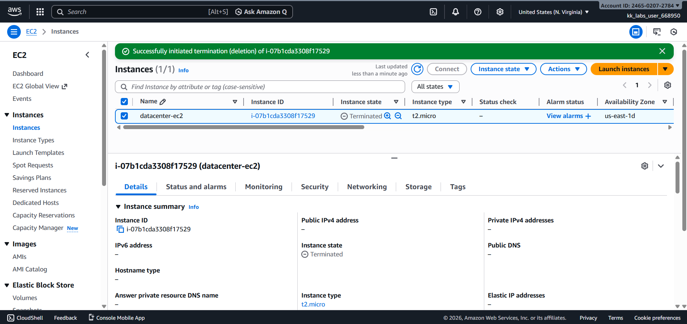
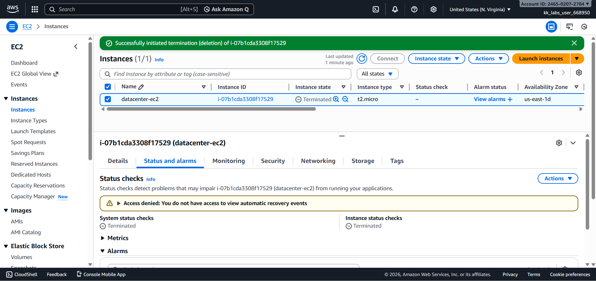

# Day 14 – Terminate EC2 Instance (AWS)

## Task Overview
As part of the **100 Days of Cloud (AWS)** challenge by KodeKloud, this task focuses on terminating an obsolete EC2 instance that is no longer required. Cleaning up unused resources is an important cloud practice to reduce costs and maintain an optimized environment.

The objective was to terminate a specific EC2 instance and verify that it reached the terminated state before submission.

---

## Concept
Terminating an EC2 instance permanently deletes the virtual server and releases its underlying compute resources. Once an instance is terminated, it cannot be restarted, and all data stored on instance store volumes is lost. This operation is final and is commonly used when an instance is no longer needed.

---

## Real-World Use Case
In real-world cloud environments, terminating EC2 instances is commonly done to:
- Remove obsolete or temporary servers after project completion
- Reduce unnecessary AWS costs by eliminating unused resources
- Clean up failed or misconfigured instances
- Maintain a secure and well-governed cloud environment

---

## Requirements
- **Instance name:** `datacenter-ec2`
- **AWS Region:** `us-east-1` (N. Virginia)
- **Final state:** Terminated

---

## AWS Services Used
- **Amazon EC2**
  - EC2 Instances

---

## Steps Performed
1. Switched AWS Console region to **N. Virginia (us-east-1)**.
2. Navigated to **EC2 → Instances**.
3. Selected the instance named **`datacenter-ec2`**.
4. Terminated the instance using **Instance state → Terminate instance**.
5. Waited until the instance reached the **terminated** state.
6. Verified termination from both the **Instances list** and **Status & Alarms** tab.

---

## Verification
The following screenshots confirm successful completion of the task:

- **EC2 instances list showing terminated state:**  

  

- **Status & Alarms tab confirming termination:**  

  

---

## Outcome
The EC2 instance **`datacenter-ec2`** was successfully terminated in the **us-east-1** region, fulfilling all task requirements.

---

## Learnings
- Terminated EC2 instances cannot be restarted.
- Deleting unused resources is essential for cost optimization.
- Termination immediately stops billing for compute resources.
- Always verify instance state before considering a task complete.

---

**Status:** Completed
