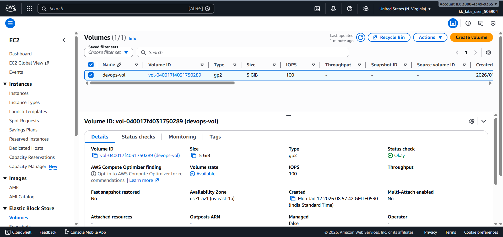
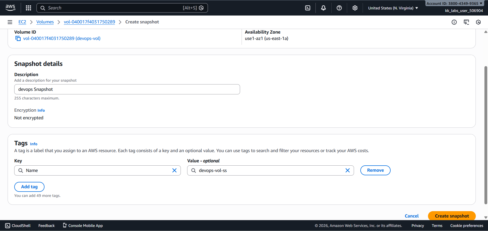
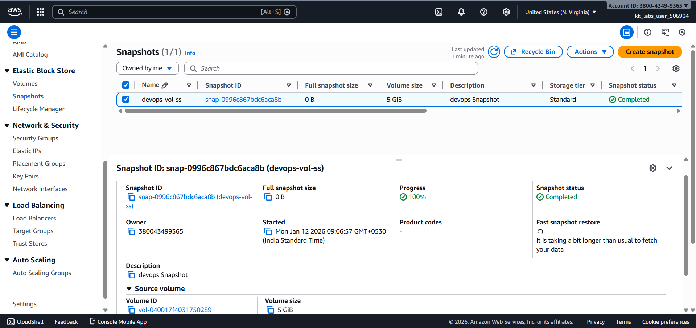

# Day 15 – Create EBS Snapshot (AWS)

## Task Overview
As part of the **100 Days of Cloud (AWS)** challenge by KodeKloud, this task focuses on creating a snapshot of an existing EBS volume. Snapshots are used to back up data and play a critical role in disaster recovery and automation strategies.

The objective was to create a snapshot with a specific name and description and ensure the snapshot reached the completed state before submission.

---

## Concept
An Amazon EBS snapshot is a point-in-time backup of an EBS volume stored in Amazon S3. Snapshots are incremental, meaning only the changed blocks since the last snapshot are saved, making them efficient and cost-effective. They can be used to restore volumes, create new volumes, or copy data across regions.

---

## Real-World Use Case
In real-world cloud environments, EBS snapshots are commonly used to:
- Take regular backups of critical production volumes
- Restore data after accidental deletion or corruption
- Create golden images for automation
- Support disaster recovery and business continuity plans

---

## Requirements
- **Volume name:** `devops-vol`
- **Snapshot name (tag):** `devops-vol-ss`
- **Description:** `devops Snapshot`
- **AWS Region:** `us-east-1` (N. Virginia)
- **Snapshot state:** Completed

---

## AWS Services Used
- **Amazon EC2**
  - Elastic Block Store (EBS)
  - EBS Snapshots

---

## Steps Performed
1. Switched AWS Console region to **N. Virginia (us-east-1)**.

   

2. Navigated to **EC2 → Volumes** and selected the volume named **`devops-vol`**.

   

3. Created a snapshot for the selected volume and provided:
   - Description: **devops Snapshot**
   - Tag:
     - Key: `Name`
     - Value: `devops-vol-ss`

   

4. Waited for the snapshot process to complete.

---

## Verification
The following screenshot confirms successful completion of the task:

- **Snapshot list showing completed status:**  

  

---

## Outcome
The snapshot **`devops-vol-ss`** was successfully created from the volume **`devops-vol`** in the **us-east-1** region, and its status was verified as **completed**, fulfilling all task requirements.

---

## Learnings
- EBS snapshots are incremental and stored in Amazon S3.
- Snapshots do not have a native name field; naming is done using tags.
- Always wait for snapshot status to be **completed** before considering the task finished.
- Snapshots are a foundational component of backup and disaster recovery strategies.

---

**Status:** Completed
