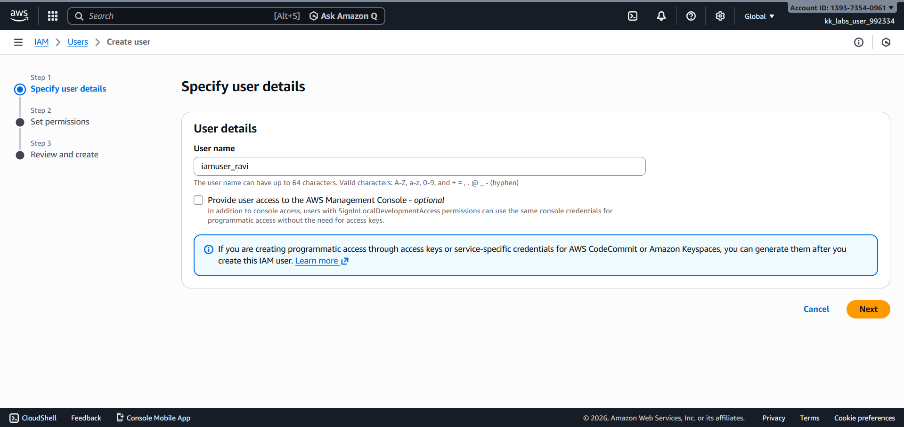
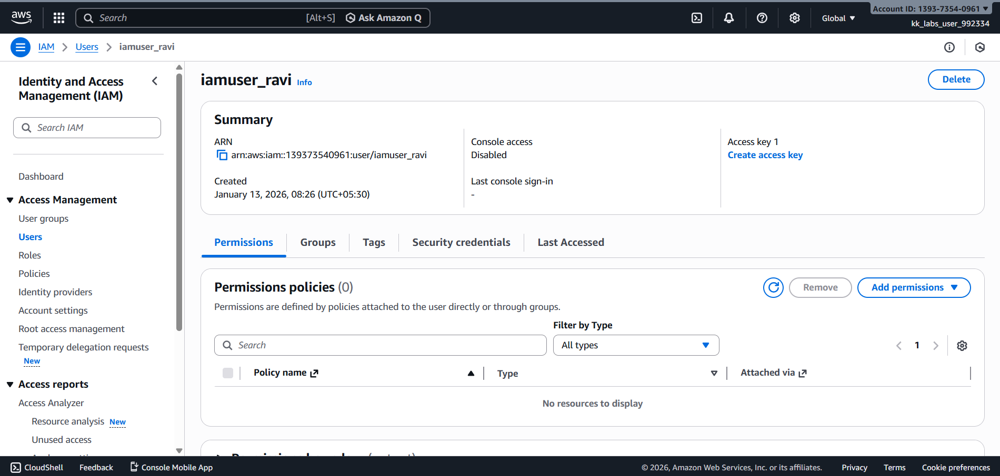

# Day 16 – Create IAM User (AWS)

## Task Overview
As part of the **100 Days of Cloud (AWS)** challenge by KodeKloud, this task focuses on setting up **AWS Identity and Access Management (IAM)**. IAM is a core AWS service used to securely manage users and control access to AWS resources.

The objective was to create an IAM user with the specified name and verify that the user was successfully created.

---

## Concept
AWS Identity and Access Management (IAM) enables secure control of access to AWS services and resources. IAM users represent individual identities that can be granted permissions using policies, allowing organizations to follow security best practices such as the **principle of least privilege**.

---

## Real-World Use Case
IAM users are commonly used in real-world cloud environments to:
- Grant controlled AWS access to developers and administrators
- Avoid sharing root account credentials
- Apply role-based access control (RBAC)
- Improve auditing and security through user-level activity tracking

---

## Requirements
- **IAM user name:** `iamuser_ravi`
- **AWS Service:** IAM (Global service)
- **Final state:** User successfully created

---

## AWS Services Used
- **AWS Identity and Access Management (IAM)**

---

## Steps Performed
1. Logged into the AWS Management Console using the provided credentials and navigated to **IAM → Users**.

   

2. Created a new IAM user with the name **`iamuser_ravi`** by following the default user creation flow.

---

## Verification
The following screenshot confirms successful completion of the task:

- **IAM user details / users list showing `iamuser_ravi`:**  

  

---

## Outcome
The IAM user **`iamuser_ravi`** was successfully created and is now available for permission assignment and access management within AWS.

---

## Learnings
- IAM is a global AWS service and does not depend on regions.
- Creating IAM users is essential for secure AWS access management.
- Root account credentials should never be used for daily operations.
- IAM users can later be assigned permissions via policies or groups.

---

**Status:** Completed
