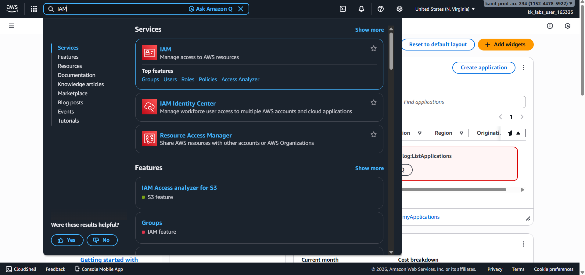
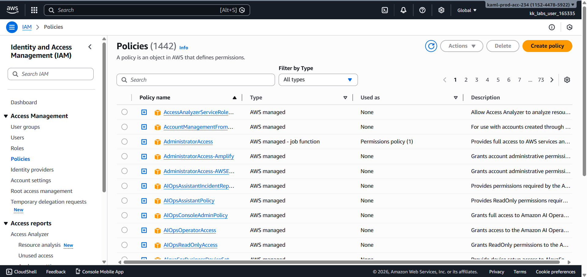
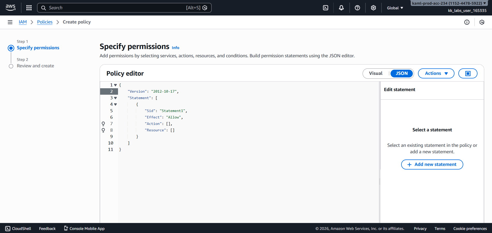
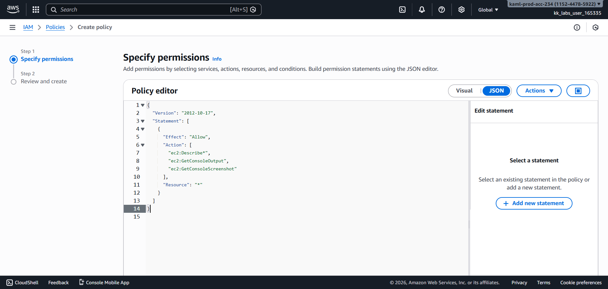
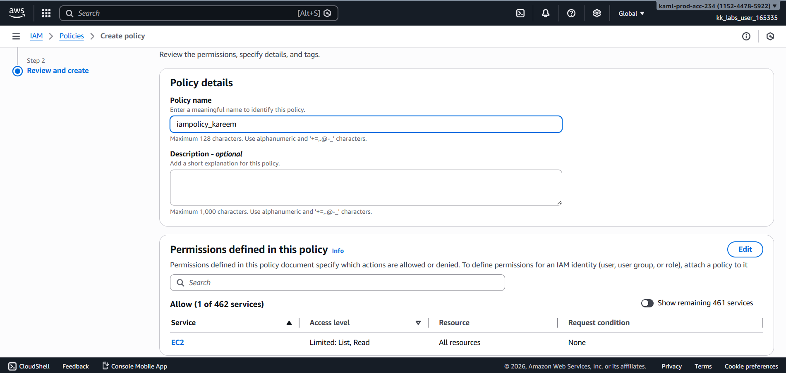
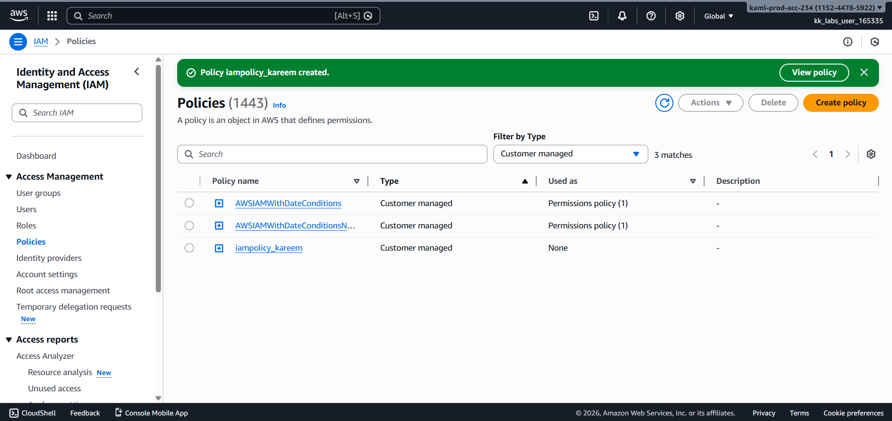
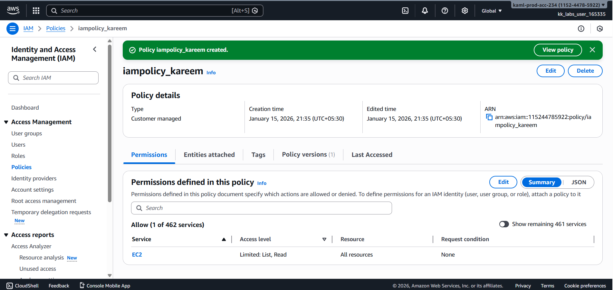

# Day 18 – Create IAM Policy (AWS)

## Task Overview
As part of the **100 Days of Cloud (AWS)** challenge by KodeKloud, this task focuses on creating a custom **IAM policy** to control access permissions. IAM policies define what actions users, groups, or roles are allowed to perform on AWS resources.

The objective was to create an IAM policy that provides **read-only access to the Amazon EC2 console**, allowing users to view EC2 instances, AMIs, and snapshots.

---

## Concept
An IAM policy is a JSON document that defines permissions using **actions**, **resources**, and **effects**. Policies follow the principle of **least privilege**, ensuring users only have access to what they actually need. AWS provides managed policies, but custom policies are often required for precise access control.

---

## Real-World Use Case
IAM read-only policies are commonly used to:
- Grant auditors visibility without modification rights
- Allow developers or interns to view infrastructure safely
- Monitor resources without risking accidental changes
- Enforce security best practices through restricted access

---

## Requirements
- **IAM policy name:** `iampolicy_kareem`
- **Policy type:** Customer managed
- **Permissions:** Read-only access to EC2
- **AWS Service:** IAM (Global service)
- **Access scope:** EC2 instances, AMIs, and snapshots

---

## AWS Services Used
- **AWS Identity and Access Management (IAM)**
- **Amazon EC2**

---

## Steps Performed
1. Navigated to **Services → IAM**.

   

2. Selected **Policies** from the left navigation panel, and Clicked on **Create policy**.

   

3. Switch to JSON Editor and Selected the **JSON** tab instead of Visual editor
  
    

4. Removed existing auto-generated policy and defined read-only EC2 permissions.

   

5. Reviewed the policy permissions to ensure only read actions were allowed, Entered the policy name as **`iampolicy_kareem`** and created the policy.

   

---

## Verification
The following screenshots confirm successful completion of the task:

- **IAM policies list showing `iampolicy_kareem`:**

  

- **Policy details page confirming EC2 read-only permissions:**

  

---

## Outcome
The IAM policy **`iampolicy_kareem`** was successfully created with **read-only access to the Amazon EC2 console**, allowing visibility of EC2 instances, AMIs, and snapshots while preventing any modifications.

---

## Learnings
- IAM policies are written in JSON and define fine-grained permissions.
- Read-only EC2 access can be efficiently implemented using ec2:Describe* actions.
- The Visual editor may generate oversized policies, causing IAM size limit errors.
- Using the JSON editor with wildcard actions helps avoid policy size constraints.
- Following least-privilege principles improves cloud security and access control.
- Custom policies provide more control than AWS-managed policies.

---

**Status:** Completed
