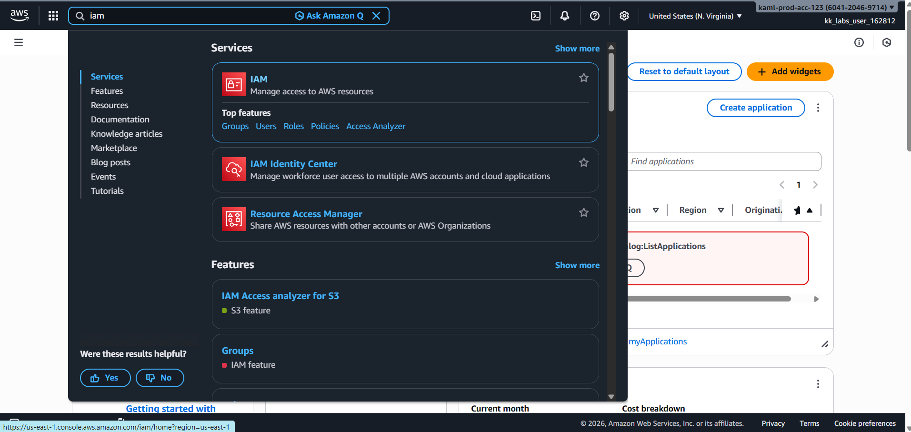
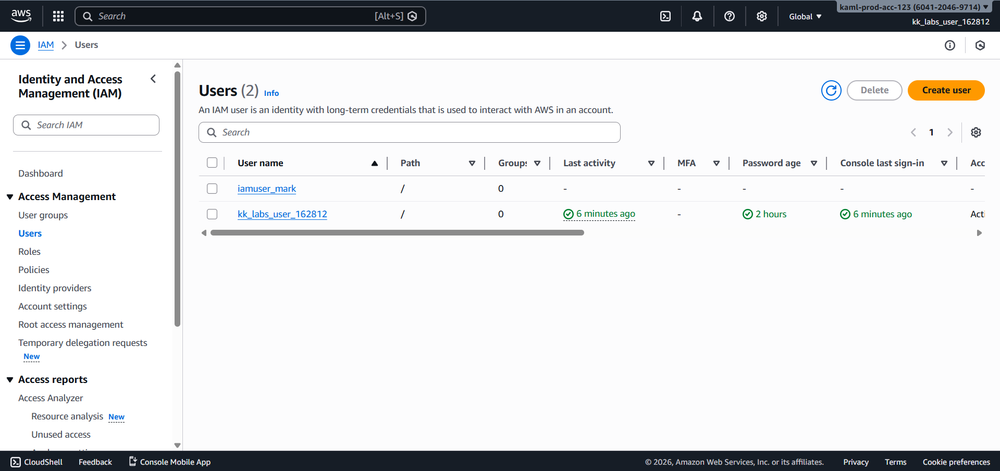
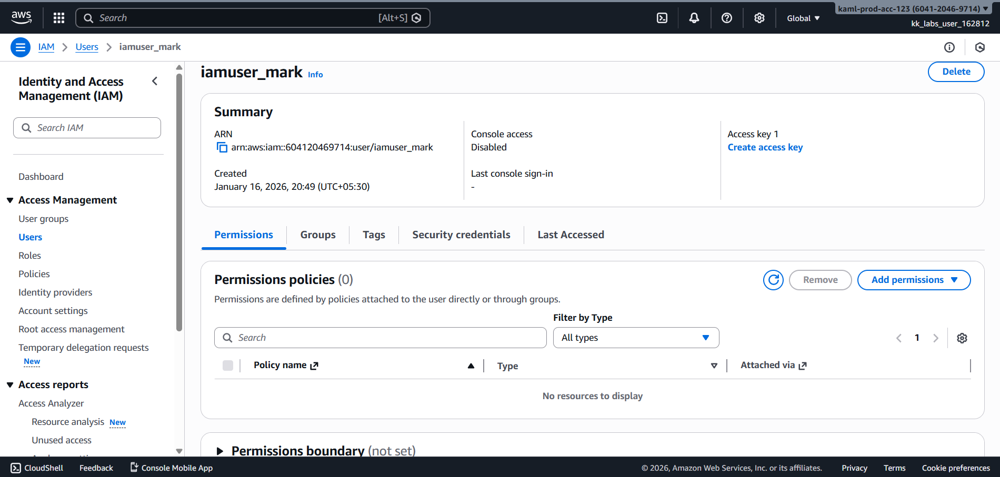
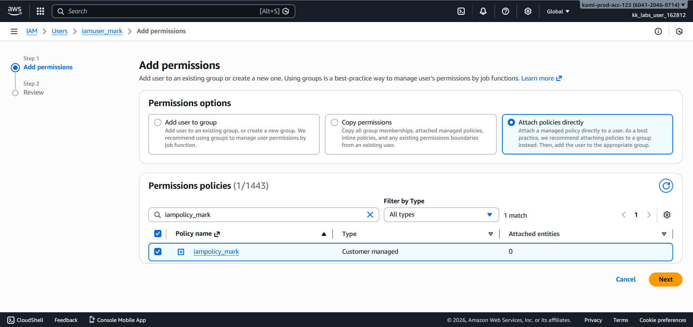
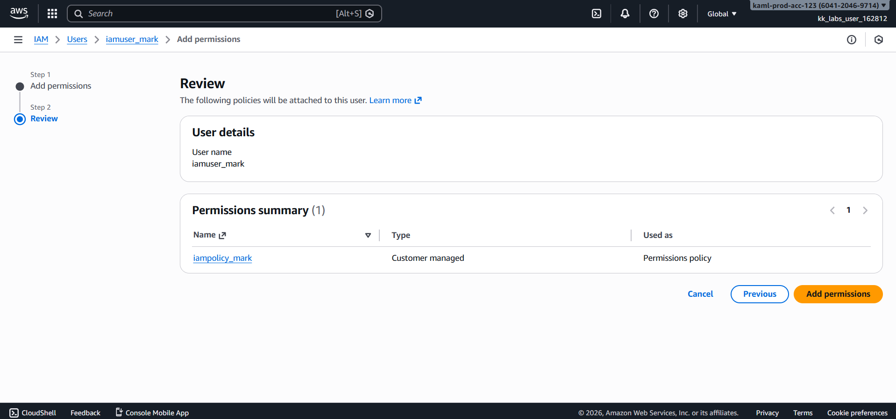
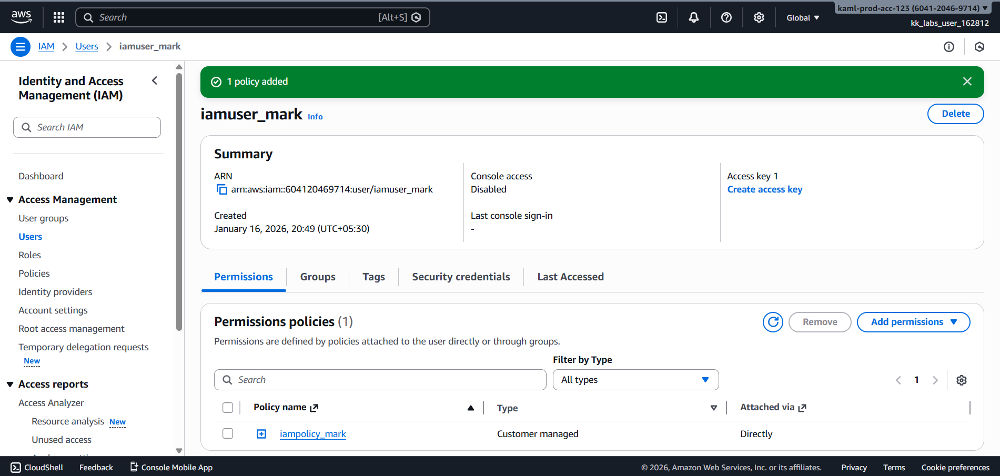
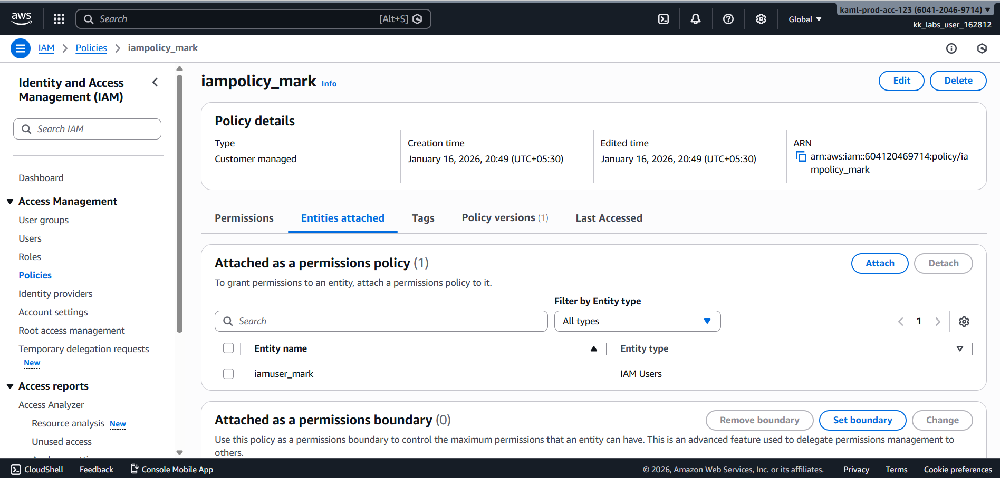

# Day 19 – Attach IAM Policy to User (AWS)

## Task Overview
As part of the **100 Days of Cloud (AWS)** challenge by KodeKloud, this task focuses on managing IAM permissions by attaching an existing IAM policy to an existing IAM user. Correctly assigning policies to users is essential for maintaining secure and controlled access to AWS resources.

The objective was to attach the IAM policy **`iampolicy_mark`** to the IAM user **`iamuser_mark`**.

---

## Concept
In AWS IAM, permissions are granted by attaching **policies** to **users**, **groups**, or **roles**. Policies define what actions are allowed or denied, while users represent identities that interact with AWS services.

Attaching policies instead of directly embedding permissions enables easier permission management, reuse, and adherence to the **principle of least privilege**.

---

## Real-World Use Case
Attaching IAM policies to users is commonly done to:
- Grant role-based access to team members
- Manage permissions centrally using reusable policies
- Modify user access without recreating users
- Maintain security compliance and audit readiness

---

## Requirements
- **IAM User name:** `iamuser_mark`
- **IAM Policy name:** `iampolicy_mark`
- **Action:** Attach policy to user
- **AWS Service:** IAM (Global service)

---

## AWS Services Used
- **AWS Identity and Access Management (IAM)**

---

## Steps Performed
1. Navigated to **Services → IAM**.

   

2. Selected **Users** from the left navigation panel and clicked on the user **`iamuser_mark`**.

   

3. Opened the **Permissions** tab for the user and clicked **Add permissions**.

   

4. Chose **Attach policies directly** and searched for the policy **`iampolicy_mark`**.

   

5. Reviewed the selected policy and clicked **Add permissions** to complete the attachment.

   

---

## Verification
The following screenshots confirm successful completion of the task:

- **User permissions tab showing `iampolicy_mark` attached:**

  

- **Policy summary confirming correct attachment to user:**

  

---

## Outcome
The IAM policy **`iampolicy_mark`** was successfully attached to the IAM user **`iamuser_mark`**, ensuring the user has the intended permissions and fulfilling all task requirements.

---

## Learnings
- IAM policies can be reused across multiple users and roles.
- Attaching policies simplifies permission management and updates.
- IAM is a global service and not region-specific.
- Always verify attached permissions after making IAM changes.
- Policy-based access control supports scalable and secure cloud environments.

---

**Status:** Completed
