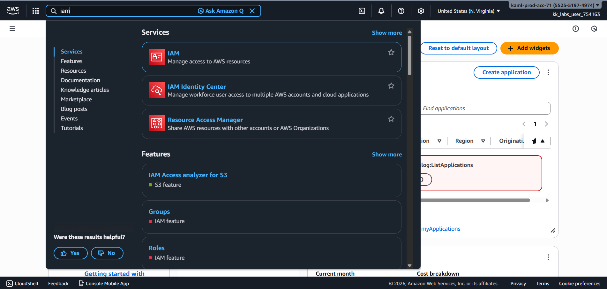
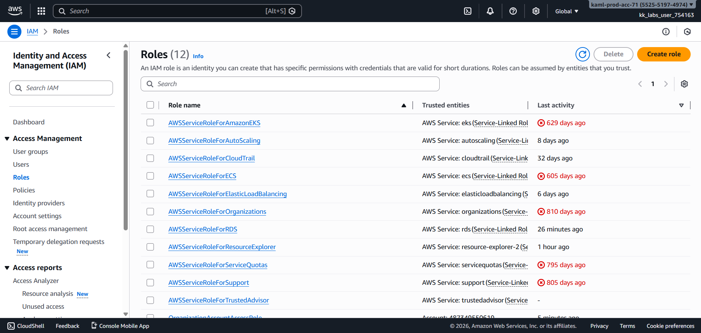
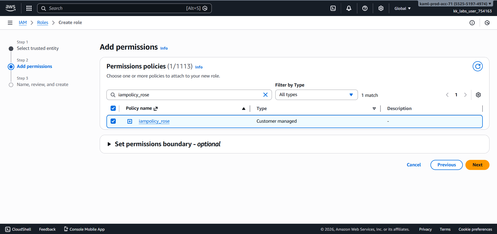
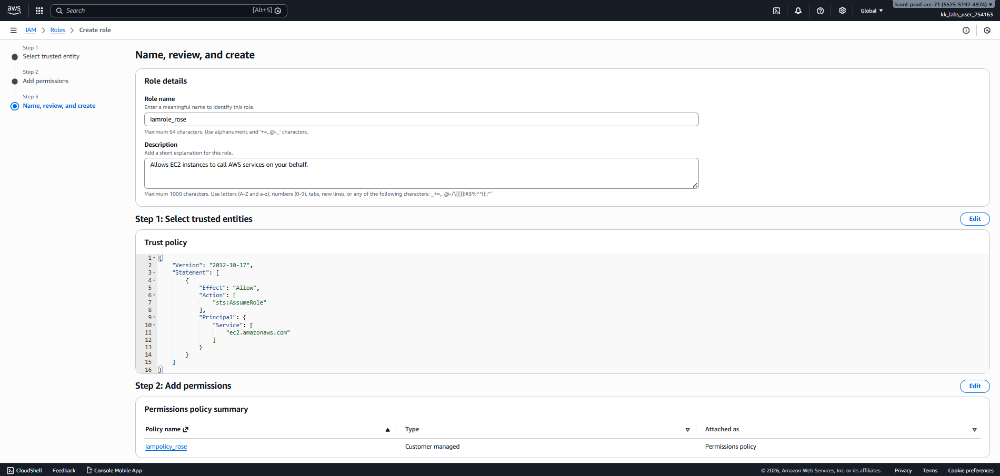
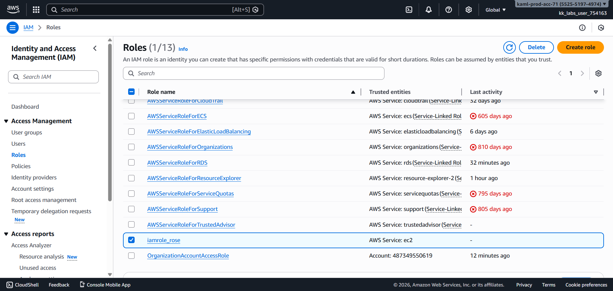
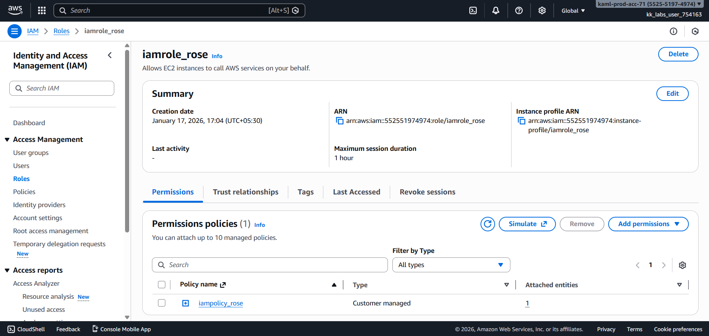

# Day 20 – Create IAM Role for EC2 (AWS)

## Task Overview
As part of the **100 Days of Cloud (AWS)** challenge by KodeKloud, this task focuses on creating an **IAM Role** for an AWS service. IAM roles are commonly used to grant AWS services secure, temporary permissions without using access keys.

The objective was to create an IAM role named **`iamrole_rose`**, configured for the **EC2** service, with the required policy attached.

---

## Concept
In AWS IAM, **roles** are identities that can be assumed by trusted entities such as AWS services, applications, or users. Unlike IAM users, roles do not have long-term credentials.

IAM roles are widely used by AWS services like EC2 to securely access other AWS resources using attached **IAM policies**.

---

## Real-World Use Case
IAM roles for EC2 are commonly used to:
- Allow EC2 instances to access S3, DynamoDB, or CloudWatch
- Eliminate hardcoded credentials in applications
- Apply least-privilege access to compute resources
- Improve security and credential rotation automatically

---

## Requirements
- **IAM Role name:** `iamrole_rose`
- **Trusted entity:** AWS Service
- **Use case:** EC2
- **IAM Policy attached:** `iampolicy_rose`
- **AWS Service:** IAM (Global service)

---

## AWS Services Used
- AWS Identity and Access Management (IAM)
- Amazon EC2

---

## Steps Performed
1. Navigated to **Services → IAM**.

   

2. Selected **Roles** from the left navigation panel and clicked **Create role**.

   

3. Chose **AWS Service** as the trusted entity and selected **EC2** as the use case.

   

4. Attached the required IAM policy **`iampolicy_rose`** to the role.

   

5. Provided the role name **`iamrole_rose`**, reviewed the configuration, and created the role.

   

---

## Verification
The following screenshots confirm successful completion of the task:

- IAM role list showing `iamrole_rose`:

  

- Role permissions tab confirming `iampolicy_rose` attachment:

  

---

## Outcome
The IAM role **`iamrole_rose`** was successfully created for the **EC2** service with the policy **`iampolicy_rose`** attached, meeting all specified requirements.

---

## Learnings
- IAM roles provide secure, temporary access without static credentials.
- EC2 commonly uses IAM roles to access other AWS services securely.
- Policies define permissions, while roles define who or what can use them.
- IAM roles help enforce the principle of least privilege.
- IAM is a global service and applies across all AWS regions.

---

**Status:** Completed
