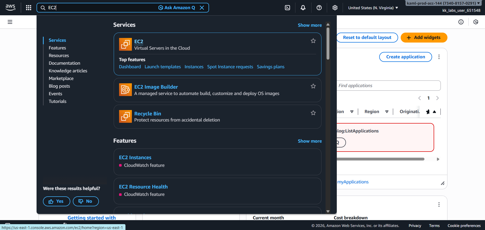
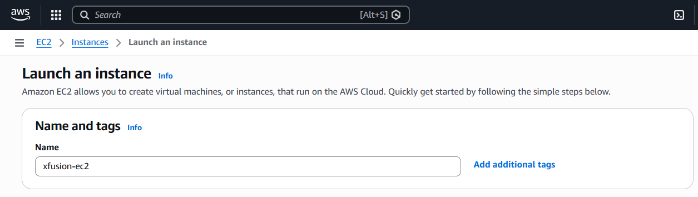
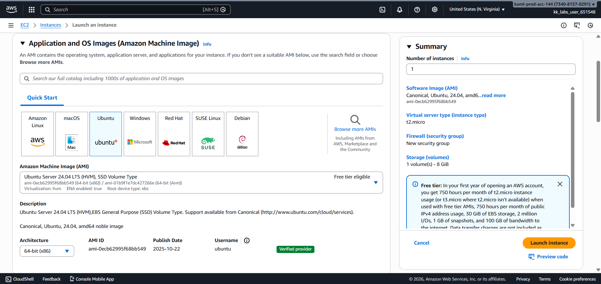
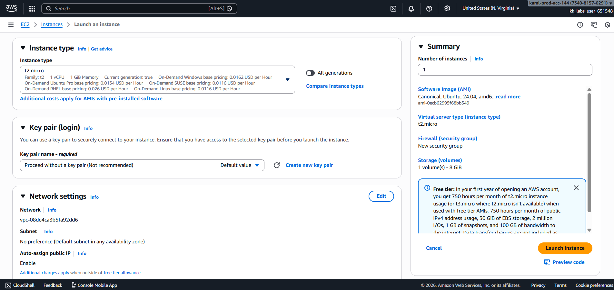
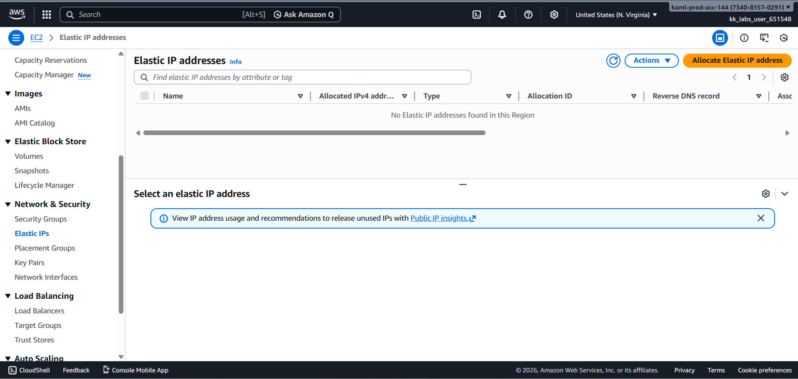
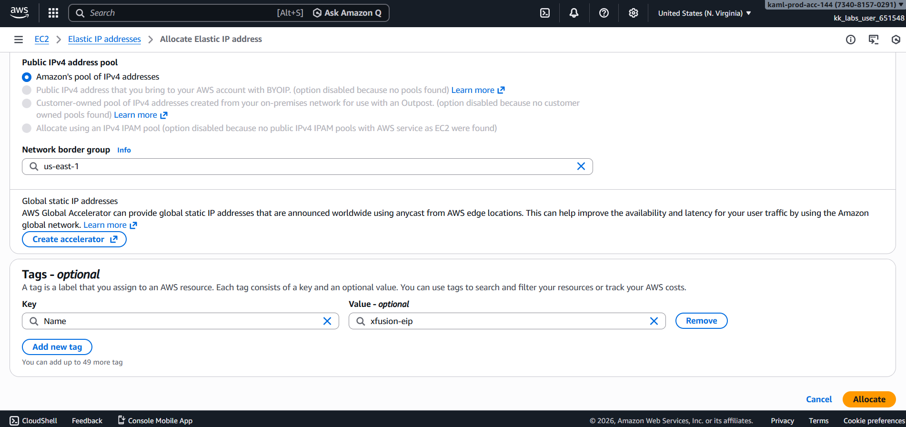
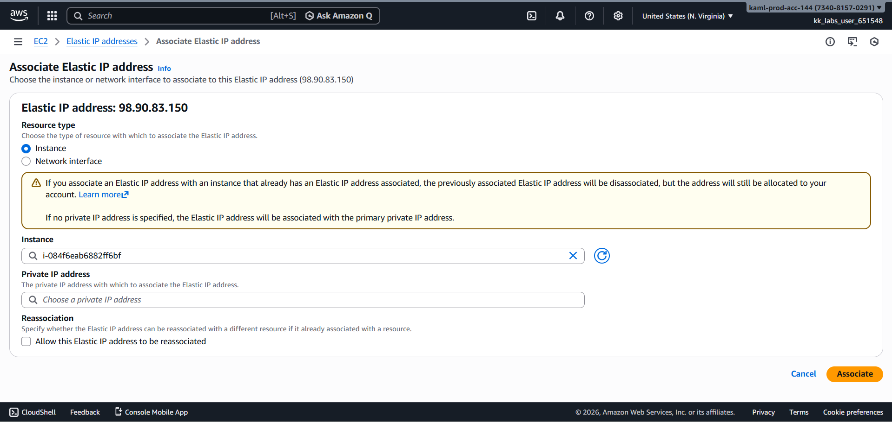
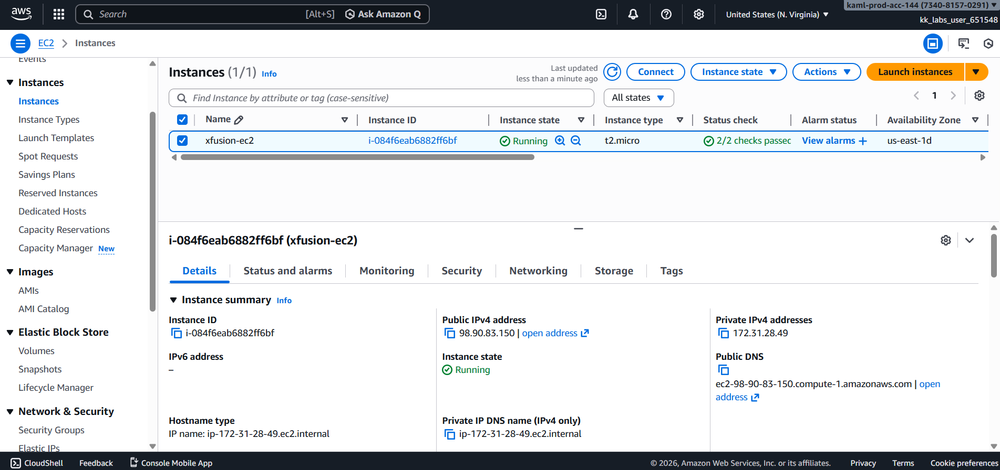
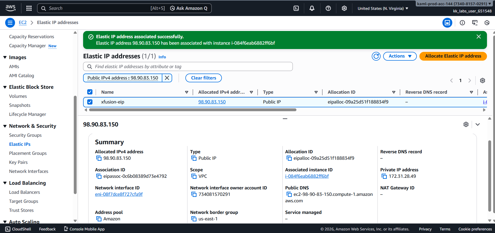

# Day 21 – Launch EC2 Instance with Elastic IP (AWS)

## Task Overview
As part of the **100 Days of Cloud (AWS)** challenge by KodeKloud, this task focuses on launching an **EC2 instance** and associating it with an **Elastic IP (EIP)** to ensure a stable and consistent public IP address.

The objective was to create an EC2 instance named **`xfusion-ec2`** using a Linux AMI and associate it with an Elastic IP named **`xfusion-eip`**.

---

## Concept
An **Elastic IP (EIP)** is a static, public IPv4 address designed for dynamic cloud computing. Unlike the default public IP of an EC2 instance (which can change on stop/start), an Elastic IP remains constant until explicitly released.

Associating an Elastic IP with an EC2 instance ensures uninterrupted access to applications hosted on the instance.

---

## Real-World Use Case
Elastic IPs are commonly used to:
- Host public-facing applications and APIs
- Ensure stable IPs for DNS mapping
- Avoid IP changes during instance restarts
- Provide reliable access points for production workloads

---

## Requirements
- **EC2 Instance name:** `xfusion-ec2`
- **AMI:** Any Linux AMI (Ubuntu used)
- **Instance type:** `t2.micro`
- **Elastic IP name:** `xfusion-eip`
- **Action:** Associate Elastic IP with EC2 instance
- **AWS Services:** EC2

---

## AWS Services Used
- Amazon EC2
- Elastic IP (EC2 Networking)

---

## Steps Performed
1. Navigated to **Services → EC2**.

   

2. Clicked **Launch instance** and Added the instance name tag as **`xfusion-ec2`**.

   

3. Selected a Linux AMI (Ubuntu).

   

4. Chose instance type **t2.micro** and configured basic instance settings.

   

5. Navigated to **Elastic IPs** and clicked on allocate Elastic IP address.

   

6. Added a name tag **`xfusion-eip`** to the Elastic IP for identification.

   

7. Associated the Elastic IP with the EC2 instance **`xfusion-ec2`**.

   

---

## Verification
The following screenshots confirm successful completion of the task:

- EC2 instance list showing `xfusion-ec2` in running state:

  

- Elastic IP associated with the instance:

  

---

## Outcome
The EC2 instance **`xfusion-ec2`** was successfully launched using a Linux AMI and associated with the Elastic IP **`xfusion-eip`**, providing a stable and consistent public IP address for application access.

---

## Learnings
- Default public IPs change when EC2 instances are stopped and started.
- Elastic IPs provide a static public IP for reliable access.
- Elastic IPs must be explicitly released to avoid unnecessary charges.
- Tagging resources improves visibility and management.
- Stable IPs are critical for production and externally accessible applications.

---

**Status:** Completed
