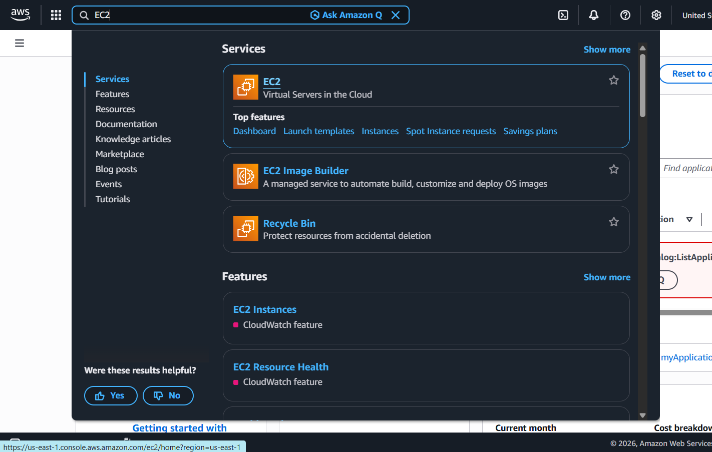
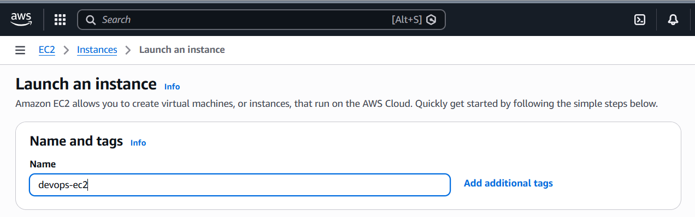
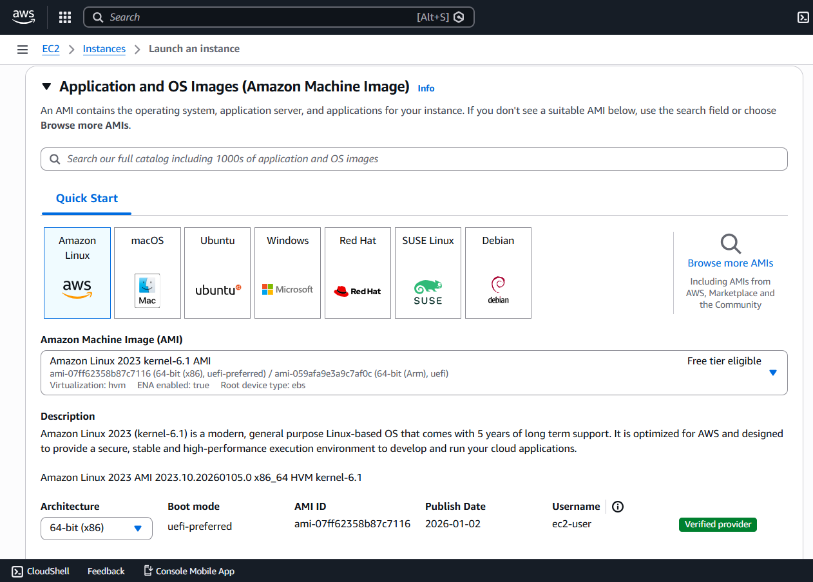
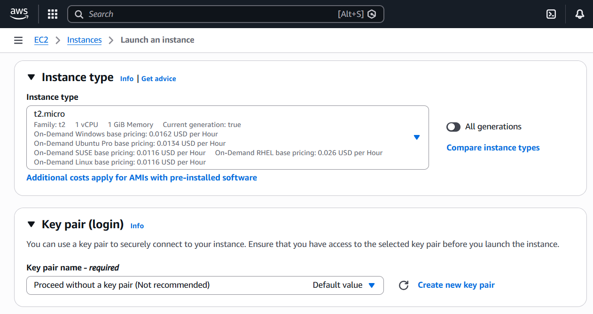
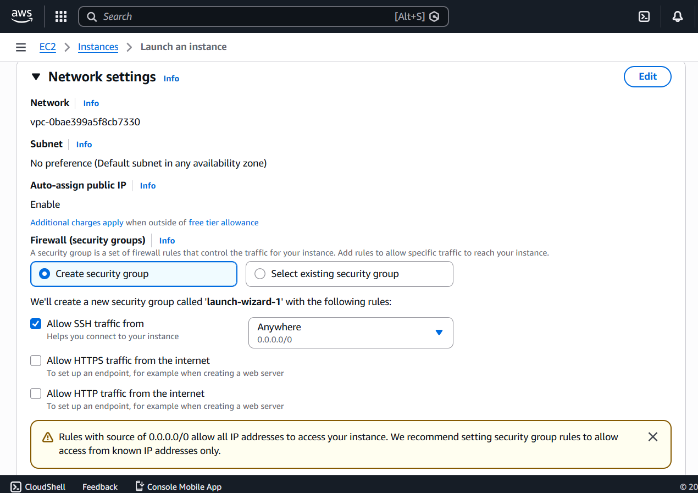
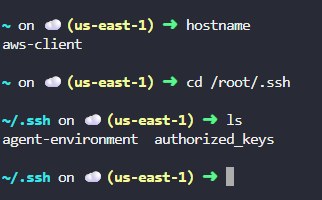
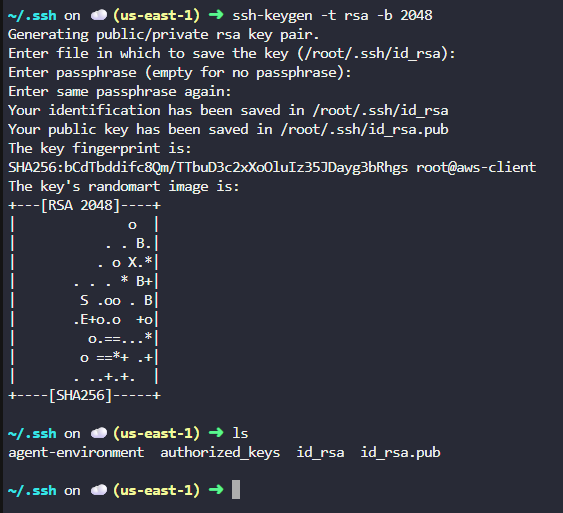
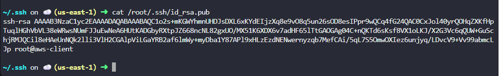
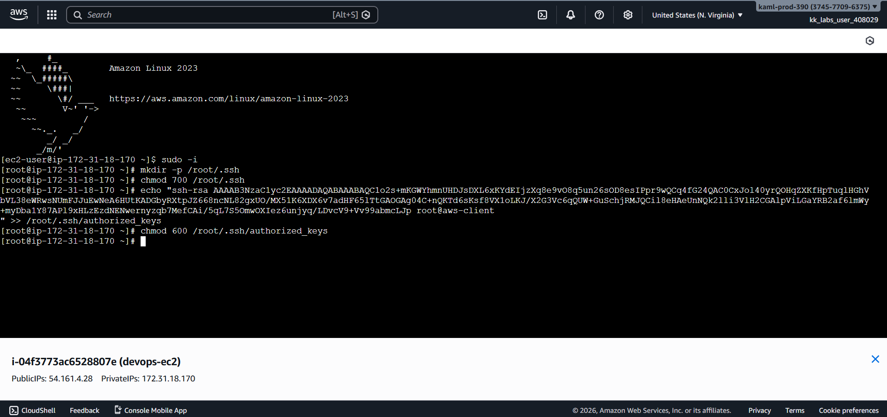
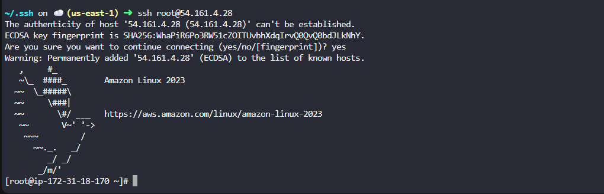

# Day 22 – Configure Passwordless SSH Access to EC2 (AWS)

## Task Overview
As part of the **100 Days of Cloud (AWS)** challenge by KodeKloud, this task focuses on securely configuring **passwordless SSH access** from a landing host (**`aws-client`**) to a newly created EC2 instance.

The objective was to launch an EC2 instance named **`devops-ec2`** and enable secure SSH access using an SSH key pair instead of passwords.

---

## Concept
**SSH key-based authentication** uses a public–private key pair to authenticate users securely.  
The private key remains on the client machine, while the public key is stored on the server in the `authorized_keys` file.

This method is more secure than password-based authentication and is widely used in cloud and DevOps environments.

---

## Real-World Use Case
Passwordless SSH access is commonly used to:
- Enable secure server-to-server communication
- Support automation tools like Ansible and CI/CD pipelines
- Eliminate risks associated with password leaks
- Simplify access management for cloud infrastructure

---

## Requirements
- **EC2 Instance name:** `devops-ec2`
- **Instance type:** `t2.micro`
- **Region:** `us-east-1`
- **Landing host:** `aws-client`
- **SSH user:** `root`
- **Authentication:** SSH key-based (passwordless)

---

## AWS Services Used
- Amazon EC2
- EC2 Security Groups
- IAM (for permissions)

---

## Steps Performed
1. Navigated to **Services → EC2**.

   

2. Clicked **Launch instance** and set the instance name as **`devops-ec2`**.

   

3. Selected a Linux-based AMI for the EC2 instance.

   

4. Chose instance type **t2.micro**.

   

5. Configured a security group allowing **SSH (port 22)** access.

   

6. Logged in to the landing host and verified the existing SSH directory on **`aws-client`**.

   

7. Generated a new SSH key pair under `/root/.ssh` on the **aws-client** host.

   

8. Verified the generated public SSH key.

   

9. Added the public key to the EC2 instance root user's `authorized_keys` file.

   

10. Connected to the EC2 instance from **aws-client** using passwordless SSH.

    

---

## Verification
The following screenshots confirm successful completion of the task:

- SSH key present on the aws-client host

- Public key added to EC2 root user's `authorized_keys`

- Successful SSH login without password prompt

---

## Outcome
The EC2 instance **`devops-ec2`** was successfully launched and configured to allow **passwordless SSH access** from the **aws-client** host using SSH key-based authentication.

---

## Learnings
- SSH key-based authentication is more secure than passwords
- Proper permissions are required when working with `/root/.ssh`
- Passwordless SSH is essential for automation and DevOps workflows
- Secure key management is critical in cloud environments
- Always verify access after completing SSH configuration

---

**Status:** Completed
