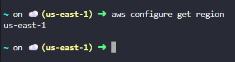
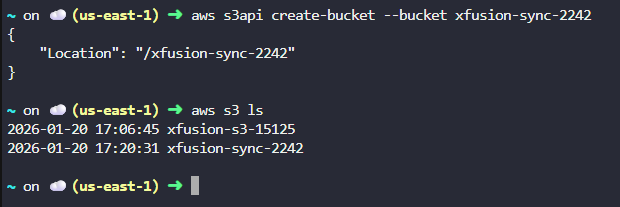
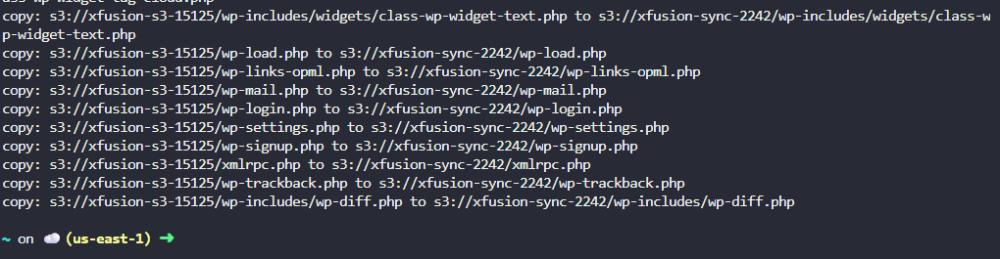
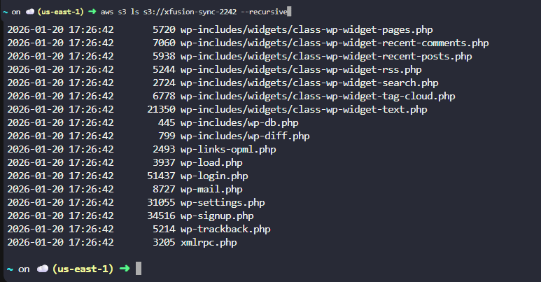
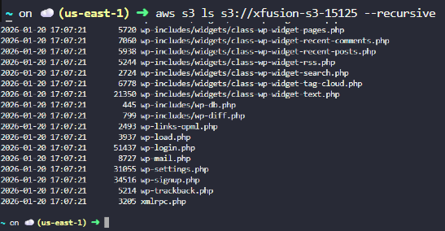
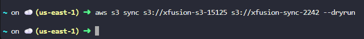

# Day 23 – Migrate Data Between S3 Buckets Using AWS CLI (AWS)

## Task Overview
As part of the **100 Days of Cloud (AWS)** challenge by KodeKloud, this task focuses on performing a **secure and accurate data migration** between two Amazon S3 buckets using the **AWS CLI**.

The objective was to create a new private S3 bucket named **`xfusion-sync-2242`** and migrate all data from the existing bucket **`xfusion-s3-15125`**, ensuring that both buckets contain identical data after migration.

---

## Concept
Amazon S3 data migration involves copying or synchronizing objects from one bucket to another while maintaining data integrity.

Using the AWS CLI provides a controlled, repeatable, and verifiable approach to migration, which is essential in DevOps and production environments.

---

## Real-World Use Case
S3 data migration is commonly used to:
- Move data between environments
- Create backup or replica buckets
- Reorganize storage architectures
- Support disaster recovery strategies
- Maintain compliance and data consistency

---

## Requirements
- **Source S3 Bucket:** `xfusion-s3-15125`
- **Destination S3 Bucket:** `xfusion-sync-2242`
- **Bucket Type:** Private
- **Region:** `us-east-1`
- **Tool Used:** AWS CLI
- **Goal:** Complete and verified data migration

---

## AWS Services Used
- Amazon S3
- AWS CLI

---

## Steps Performed

1. Verified that AWS CLI was operating in the **us-east-1** region.

   

2. Created a new private S3 bucket named **`xfusion-sync-2242`** in the required region.

   

3. Initiated the migration of all objects from the source bucket **`xfusion-s3-15125`** to the destination bucket using AWS CLI.

   

4. Observed the migration process to ensure that all objects were transferred successfully.

   

5. Listed the contents of the destination bucket to confirm that data was copied successfully.

   

---

## Verification

- Objects listed in the source bucket:

  

- Objects listed in the destination bucket:

  

- Verified that both buckets contain the same data structure and files:

  

---

## Outcome
All data from the source bucket **`xfusion-s3-15125`** was successfully migrated to the destination bucket **`xfusion-sync-2242`**.  
Data integrity and consistency were verified with no loss or corruption.

---

## Learnings
- AWS CLI is effective for controlled S3 data migrations
- Always verify the AWS region before creating resources
- Data validation is critical after migration
- Private S3 buckets enhance security
- CLI-based workflows are standard in DevOps operations

---

**Status:** Completed
