# Day 24 – Configure Application Load Balancer with EC2 (AWS)

## Task Overview
As part of the **100 Days of Cloud (AWS)** challenge by KodeKloud, this task focuses on setting up an **Application Load Balancer (ALB)** in front of an EC2 instance running an **Nginx server**.

The objective was to create an ALB named **`nautilus-alb`**, configure it to route HTTP traffic on port **80** to an EC2 instance (**`nautilus-ec2`**) using a target group, and ensure proper security group configuration for public access.

---

## Concept
An **Application Load Balancer (ALB)** works at **Layer 7 (HTTP/HTTPS)** and intelligently routes incoming requests to registered backend targets.

A **target group** defines the destination of traffic, while **security groups** control access at both the load balancer and EC2 levels.

This setup is foundational for building **highly available, scalable, and production-ready architectures** on AWS.

---

## Real-World Use Case
Application Load Balancers are widely used to:
- Distribute traffic across backend servers
- Improve fault tolerance and availability
- Act as a single entry point for applications
- Enable future auto-scaling
- Support rolling and zero-downtime deployments

---

## Requirements
- **Application Load Balancer name:** `nautilus-alb`
- **Target group name:** `nautilus-tg`
- **Security group name:** `nautilus-sg`
- **Listener port:** 80 (HTTP)
- **Target port:** 80
- **EC2 instance:** `nautilus-ec2`
- **Region:** As provided in the lab

---

## AWS Services Used
- Elastic Load Balancing (Application Load Balancer)
- Amazon EC2
- EC2 Security Groups

---

## Steps Performed

1. Navigated to **Services → EC2** from the AWS Management Console.

   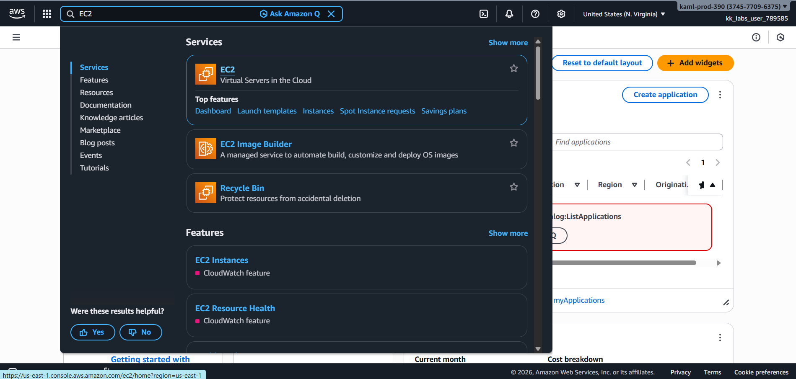

2. Created a new **security group** named **`nautilus-sg`** to allow inbound HTTP traffic.

   - Inbound rule:
     - Type: HTTP
     - Port: 80
     - Source: `0.0.0.0/0`

   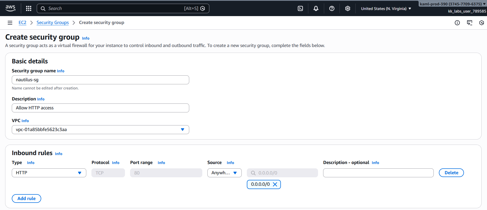

3. Navigated to **Load Balancers** and initiated creation of an **Application Load Balancer**.

   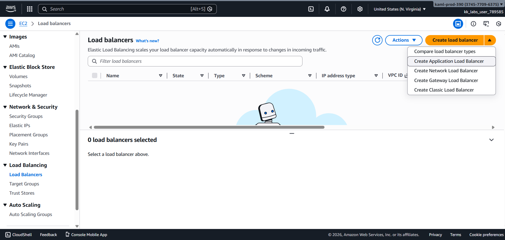

4. Configured the **Application Load Balancer** with the following settings:

   - **Name:** `nautilus-alb`
   - **Scheme:** Internet-facing
   - **IP address type:** IPv4
  
    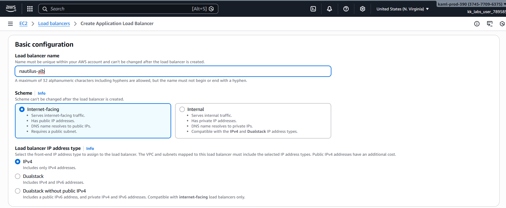

   - **VPC:** Selected the same VPC as the EC2 instance
   - **Availability Zones:** Selected at least two subnets

    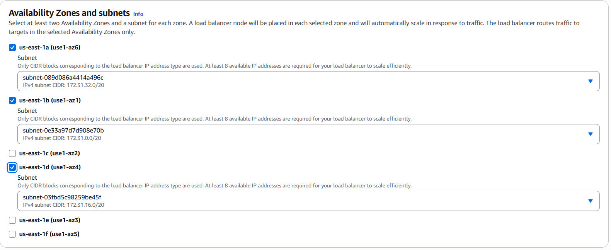

   - **Security Groups:** Removed default SG and attached **`nautilus-sg`**
   - **Listener:** HTTP on port 80

    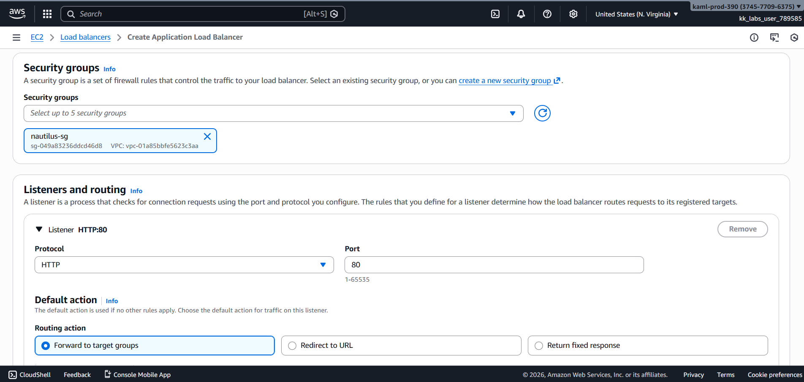

   - **Default action:** Forward to target group (to be created)

    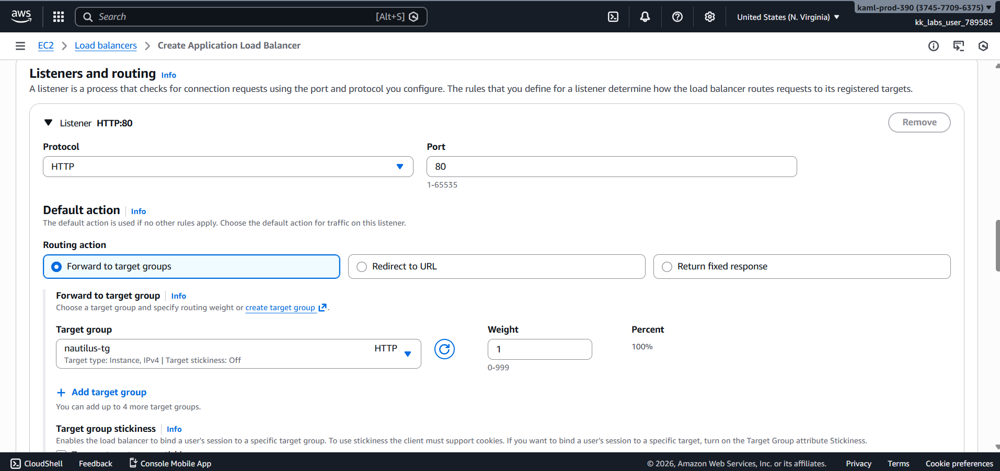

5. Created a **target group** named **`nautilus-tg`** with the following configuration:

    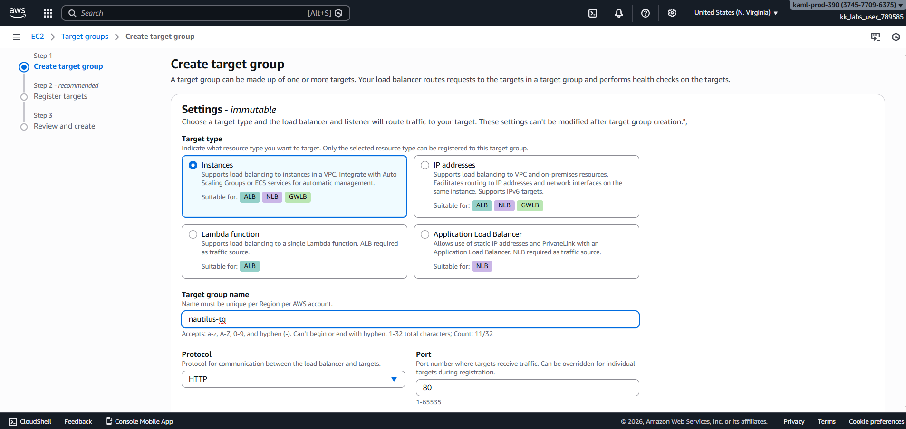

   - Target type: Instances
   - Protocol: HTTP
   - Port: 80
   - Health check path: `/`
   - VPC: Same as EC2

   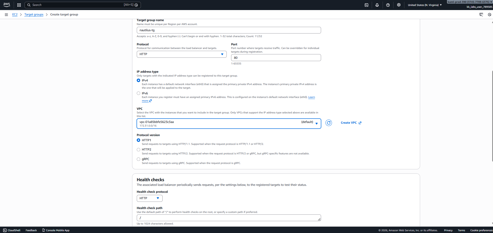

6. Registered the EC2 instance **`nautilus-ec2`** with the target group on port **80**.

   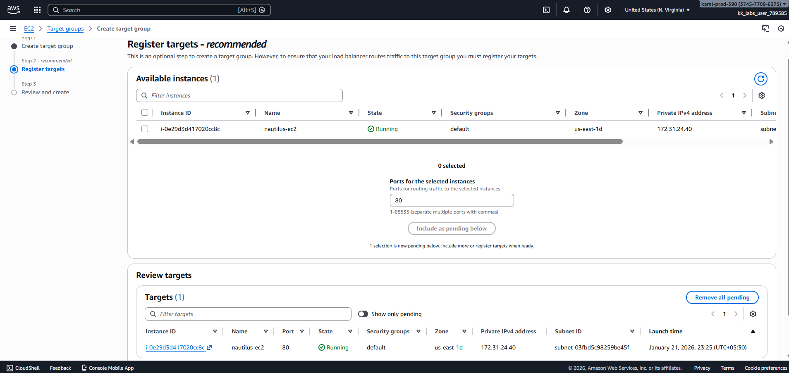

7. Verified and updated the EC2 instance’s **security group** to allow inbound HTTP traffic from the **ALB security group (`nautilus-sg`)** if required.

   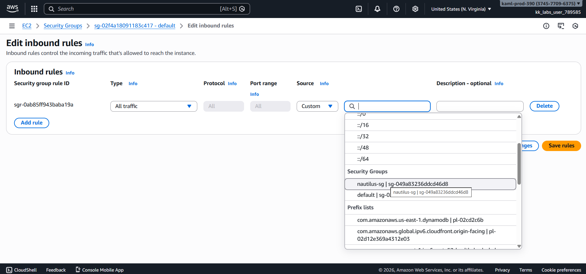

   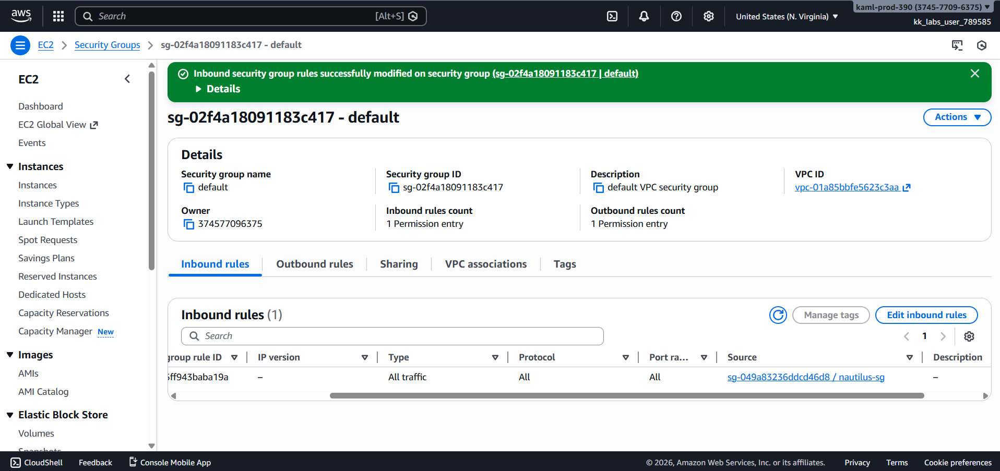

---

## Verification
The following screenshots confirm successful completion of the task:

- Application Load Balancer **`nautilus-alb`** in active state

  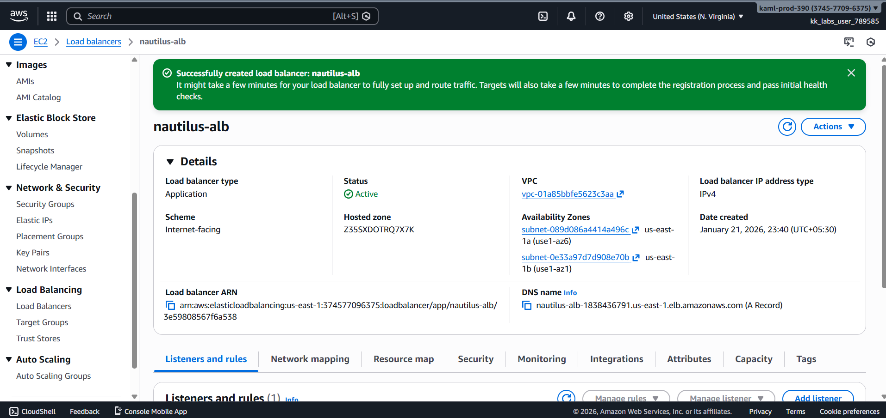

- Successful access to the Nginx sample page using the ALB DNS name

  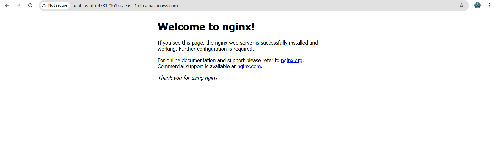

---

## Outcome
The **Application Load Balancer `nautilus-alb`** was successfully configured to route HTTP traffic on port **80** to the EC2 instance **`nautilus-ec2`** using the target group **`nautilus-tg`**, with all required security group rules correctly applied.

---

## Learnings
- Application Load Balancers operate at Layer 7
- Security groups must be configured at both ALB and EC2 levels
- Target groups define routing behavior and health checks
- ALBs enable scalable and fault-tolerant architectures
- Proper subnet and listener configuration is critical

---

**Status:** Completed
