# Day 25 – Monitor EC2 CPU Utilization with CloudWatch Alarm (AWS)

## Task Overview
As part of the **100 Days of Cloud (AWS)** challenge by KodeKloud, this task focuses on **monitoring an EC2 instance using Amazon CloudWatch**.

The objective was to launch an EC2 instance named **`nautilus-ec2`** and configure a **CloudWatch alarm** named **`nautilus-alarm`** that triggers when **CPU utilization exceeds 90% for one consecutive 5-minute period**, sending notifications via an existing **SNS topic**.

---

## Concept
**Amazon CloudWatch** provides real-time monitoring of AWS resources.  
By creating **CloudWatch alarms**, we can automatically react to metric thresholds and trigger actions such as **SNS notifications**.

Monitoring **CPU utilization** is critical to detect performance bottlenecks, unexpected traffic spikes, or inefficient application behavior.

---

## Real-World Use Case
CloudWatch alarms are commonly used to:
- Detect high CPU or memory usage
- Trigger alerts before outages occur
- Integrate with auto-scaling policies
- Monitor application performance
- Improve system reliability and observability

---

## Requirements
- **EC2 instance name:** `nautilus-ec2`
- **CloudWatch alarm name:** `nautilus-alarm`
- **Metric:** CPUUtilization
- **Statistic:** Average
- **Threshold:** ≥ 90%
- **Evaluation period:** 1 × 5 minutes
- **SNS topic:** `nautilus-sns-topic`
- **AMI:** Ubuntu
- **Region:** `us-east-1`

---

## AWS Services Used
- Amazon EC2
- Amazon CloudWatch
- Amazon SNS

---

## Steps Performed

1. Navigated to **Services → EC2** from the AWS Management Console.

   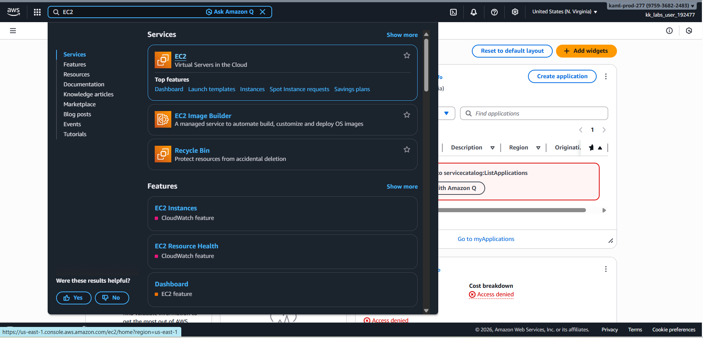

2. Launched a new EC2 instance with the following configuration:

   - **Name:** `nautilus-ec2`
   - **AMI:** Ubuntu

   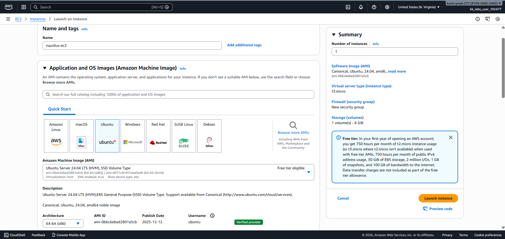 

   - **Instance type:** t3.micro
   - **Key pair:** Proceed Without KeyPair

   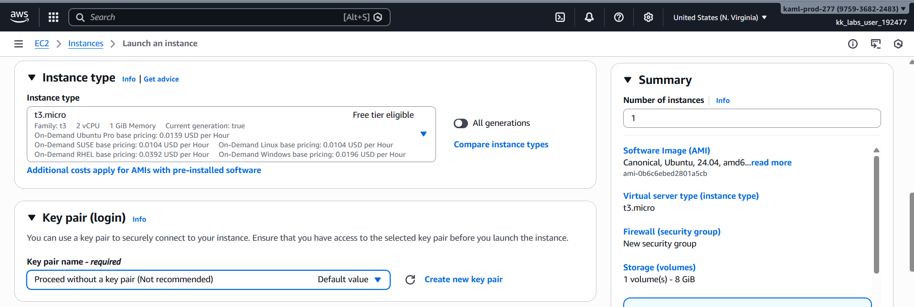

   - **Security group:** Create launch-wizard-1 and click launch instance

   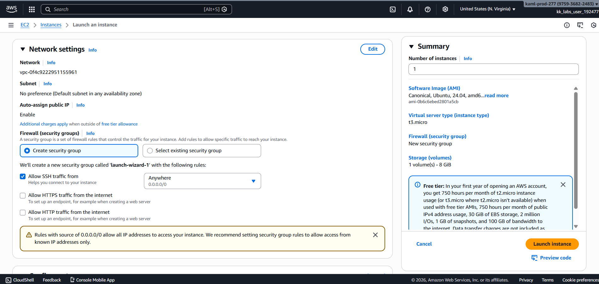

3. Verified that the EC2 instance was running successfully.

   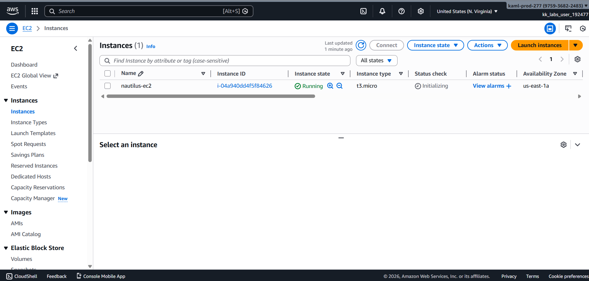

4. Navigated to **Services → CloudWatch → Metrics** and verified the **CPUUtilization** metric for the EC2 instance.

   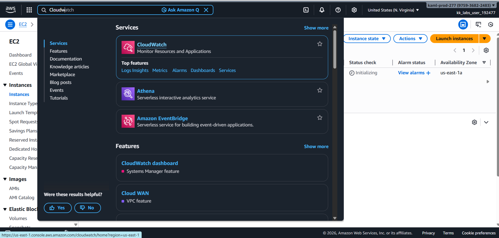 

   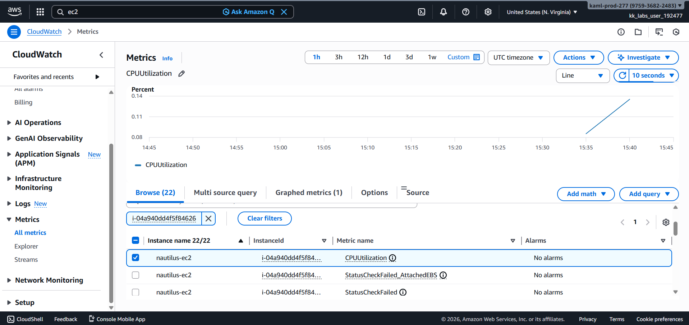

5. Navigated to **CloudWatch → Alarms** and clicked **Create alarm**.

   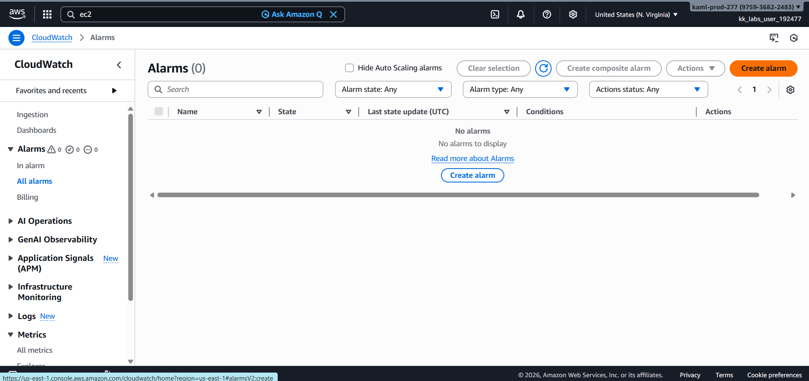

6. Selected the **EC2 → Per-Instance Metrics → CPUUtilization** metric.

   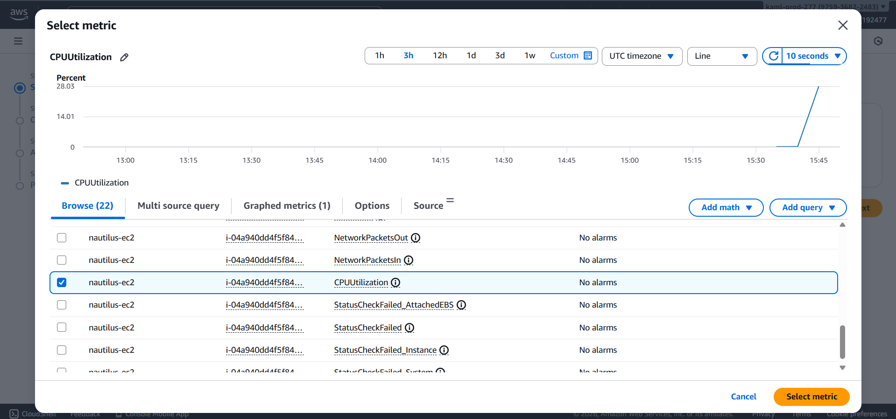

7. Configured the alarm conditions:

   - **Statistic:** Average
   - **Period:** 5 minutes

   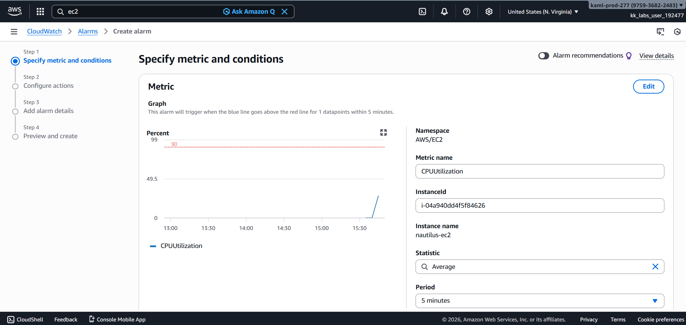 

   - **Threshold:** Greater than or equal to 90
   - **Datapoints to alarm:** 1 out of 1

   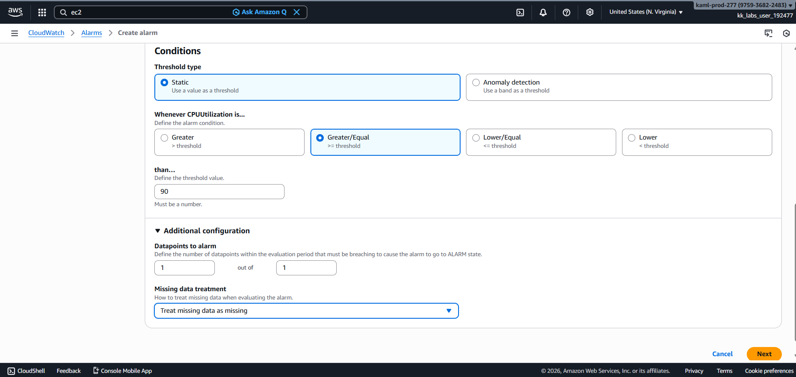

8. Configured the alarm action to send notifications to the SNS topic **`nautilus-sns-topic`**.

   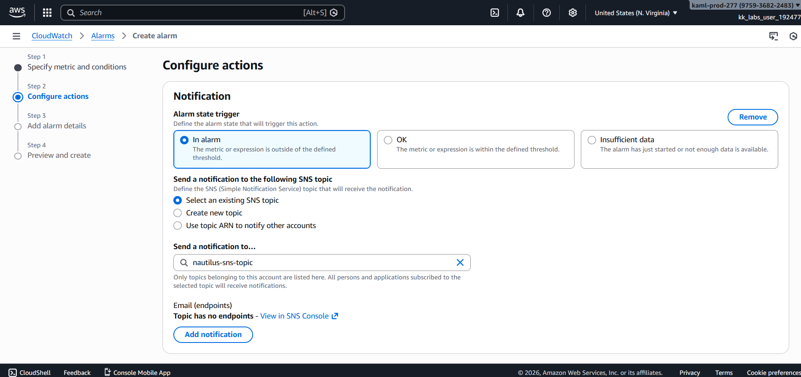

9. Named the alarm **`nautilus-alarm`** and created it.

   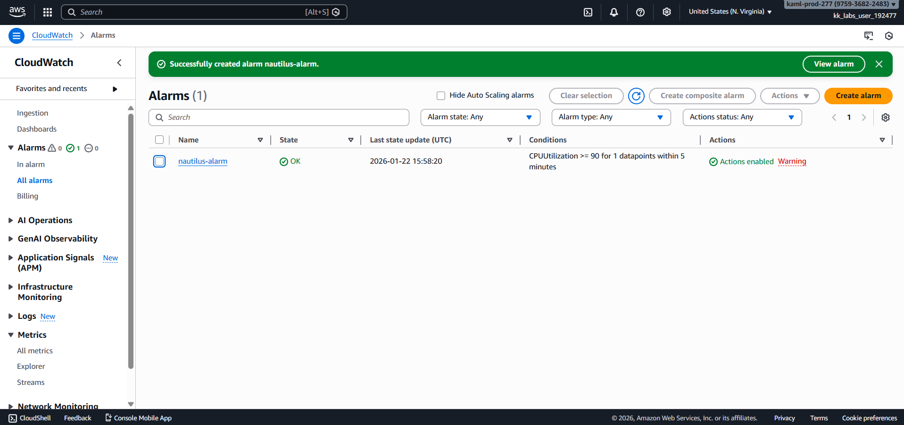

---

## Verification
The following screenshots confirm successful completion of the task:

- CloudWatch alarm **`nautilus-alarm`** created successfully

  

- Alarm in **OK** state while CPU utilization is below threshold

  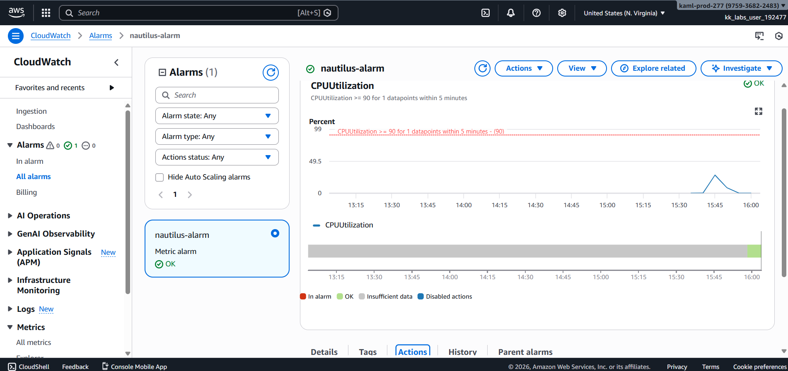

- SNS topic correctly attached to the alarm

  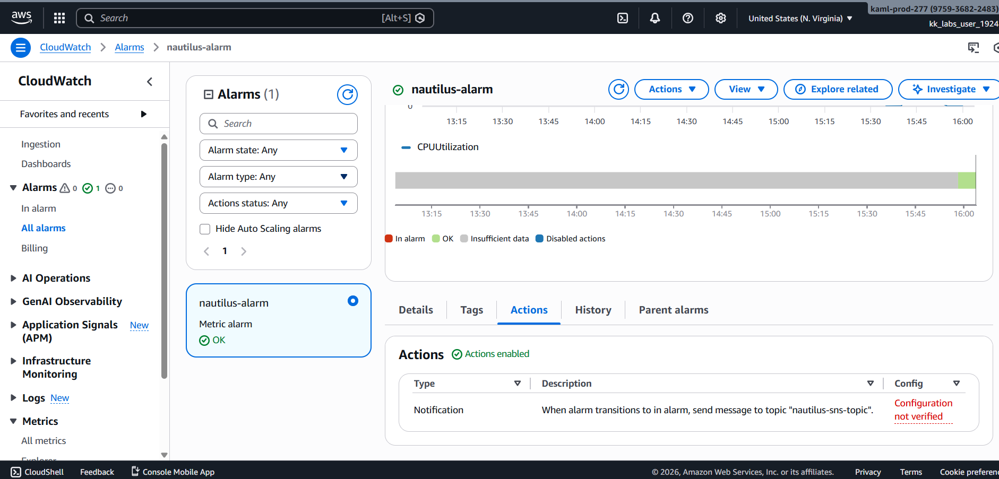

---

## Outcome
The EC2 instance **`nautilus-ec2`** is now actively monitored using **Amazon CloudWatch**, and the alarm **`nautilus-alarm`** will notify via **SNS** whenever CPU utilization exceeds **90% for 5 minutes**, enabling proactive monitoring and alerting.

---

## Learnings
- CloudWatch provides native monitoring for EC2 instances
- CPUUtilization is a critical performance metric
- Alarms can trigger automated notifications using SNS
- Proper thresholds help detect issues early
- Monitoring is essential for production-grade systems

---

**Status:** Completed
