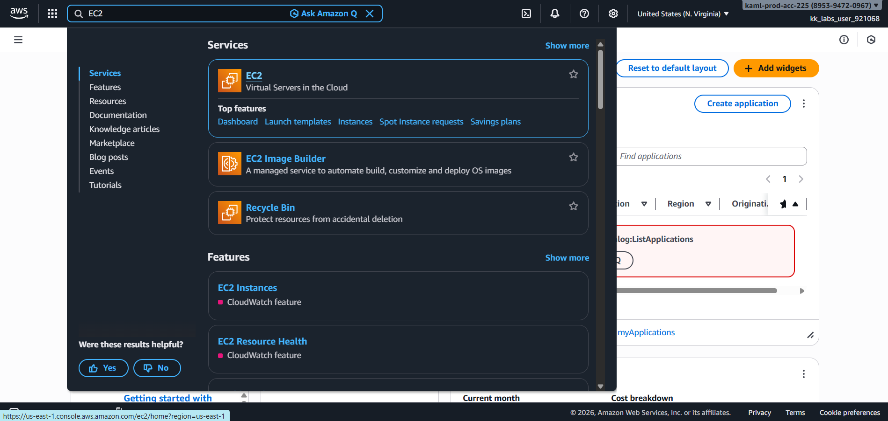
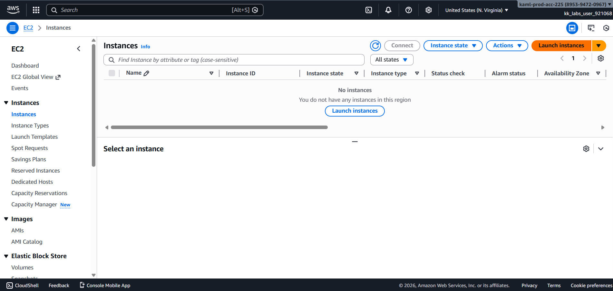
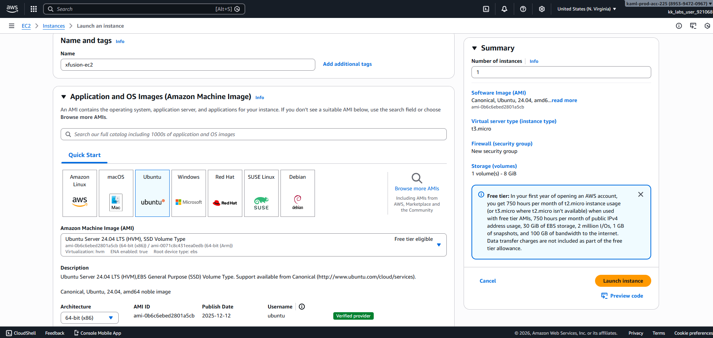
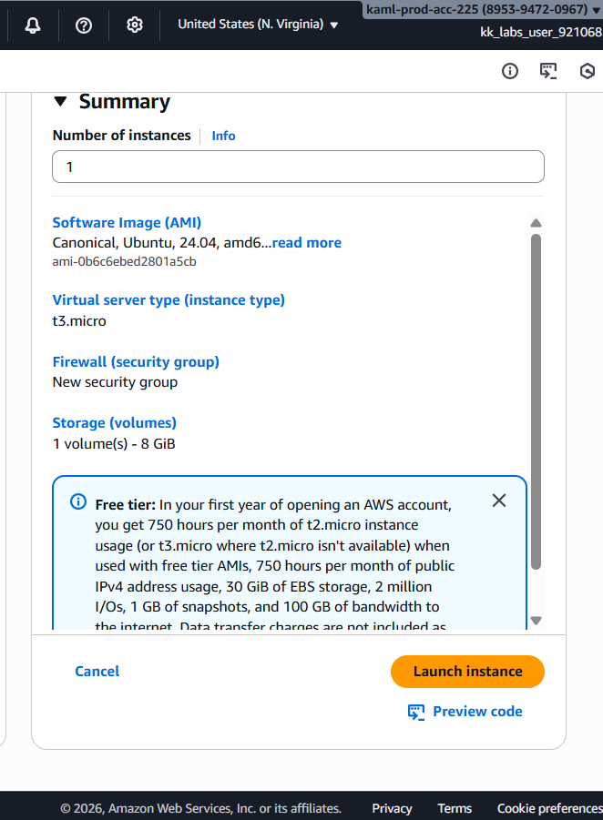

# Day 26 – Launch EC2 Web Server with Nginx using User Data (AWS)

## Task Overview
As part of the **100 Days of Cloud (AWS)** challenge by KodeKloud, this task focuses on **launching an EC2 instance configured as a web server** using a **User Data script**.

The objective was to create an EC2 instance named **`xfusion-ec2`**, install and start **Nginx automatically at launch**, and ensure the web server is **publicly accessible over HTTP (port 80)**.

---

## Concept
**User Data** allows us to run initialization scripts when an EC2 instance boots for the first time.  
This is commonly used to **install software, start services, and perform initial configuration automatically**.

Using **Nginx** as a web server enables lightweight, fast, and production-ready HTTP serving on EC2.

---

## Real-World Use Case
This setup is commonly used to:
- Bootstrap web servers automatically
- Avoid manual server configuration
- Ensure consistent server setup across environments
- Deploy simple web applications quickly
- Prepare infrastructure for scaling and automation

---

## Requirements
- **EC2 instance name:** `xfusion-ec2`
- **AMI:** Ubuntu
- **Web server:** Nginx
- **User Data:** Install and start Nginx at launch
- **Security Group:** Allow HTTP traffic
- **Port:** 80
- **Source:** `0.0.0.0/0`
- **Region:** `us-east-1`

---

## AWS Services Used
- Amazon EC2
- EC2 Security Groups

---

## Steps Performed

1. Navigated to **Services → EC2** from the AWS Management Console.

   

   - Clicked launch instance:

   

2. Launched a new EC2 instance with the following configuration:
   
   - **Name:** `xfusion-ec2`
   - **AMI:** Ubuntu

   

   - **Instance type:** t3.micro
   - **Key pair:** Created new key pair and named it `xfusion-kp`

   

3. Configured the **Security Group** to allow HTTP traffic:

   - **Type:** HTTP
   - **Port:** 80
   - **Source:** `0.0.0.0/0`

   

4. Added a **User Data script** under **Advanced Details** to install and start Nginx.

   

5. Reviewed the configuration and launched the EC2 instance.

   

---

## Verification
The following screenshots confirm successful completion of the task:

- EC2 instance **`xfusion-ec2`** in running state

  

- Nginx default welcome page accessible via public IP

  

---

## Outcome
The EC2 instance **`xfusion-ec2`** was successfully launched and configured as a **web server** using a **User Data script**.  
Nginx was installed and started automatically, and the application is **publicly accessible over HTTP**.

---

## Learnings
- User Data scripts automate EC2 initialization
- Nginx is a lightweight and efficient web server
- Security groups control inbound internet access
- Proper bootstrap configuration saves manual effort
- Automated setup is essential for scalable infrastructure

---

**Status:** Completed
