# Day 27 – Create Public VPC, Subnet, and EC2 Instance (AWS)

## Task Overview
As part of the **100 Days of Cloud (AWS)** challenge by KodeKloud, this task focuses on setting up a **public VPC** to host internet-facing resources.

The objective was to create a **public VPC** named **`datacenter-pub-vpc`**, a **public subnet** with automatic public IP assignment, and launch an **EC2 instance** named **`datacenter-pub-ec2`** with **SSH access enabled**.

---

## Concept
A **Virtual Private Cloud (VPC)** provides a logically isolated network in AWS.  
To make resources publicly accessible, the VPC must include:
- A **public subnet**
- **Automatic public IP assignment**
- An **Internet Gateway**
- Correct **route table and security group** configuration

This enables EC2 instances to communicate with the internet securely.

---

## Real-World Use Case
Public VPC setups are commonly used to:
- Host public-facing applications
- Enable SSH access for administrators
- Deploy web servers and APIs
- Separate public and private infrastructure
- Build scalable network architectures

---

## Requirements
- **VPC name:** `datacenter-pub-vpc`
- **Subnet name:** `datacenter-pub-subnet`
- **Subnet type:** Public
- **Auto-assign public IP:** Enabled
- **EC2 instance name:** `datacenter-pub-ec2`
- **Instance type:** `t2.micro`
- **Inbound access:** SSH
- **Port:** 22
- **Source:** `0.0.0.0/0`

---

## AWS Services Used
- Amazon VPC
- Amazon EC2
- Internet Gateway
- Route Tables
- EC2 Security Groups

---

## Steps Performed

1. Navigated to **Services → VPC** from the AWS Management Console.

   

2. Created a new **VPC** named **`datacenter-pub-vpc`**.

   

3. Created a subnet named **`datacenter-pub-subnet`** under the VPC.

   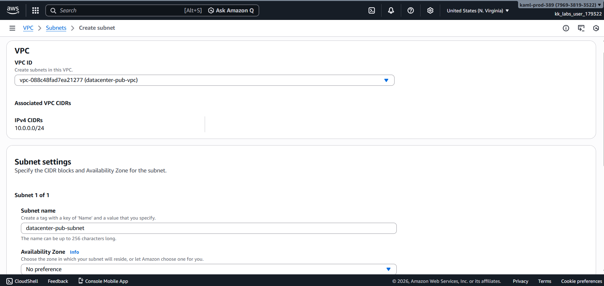 

   

4. Enabled **auto-assign public IPv4 address** for the subnet.

   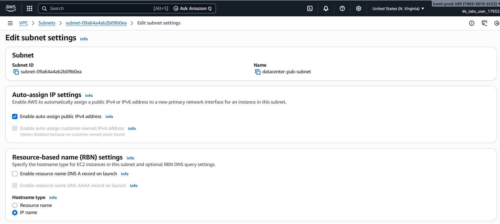

5. Created and attached an **Internet Gateway** to the VPC.

   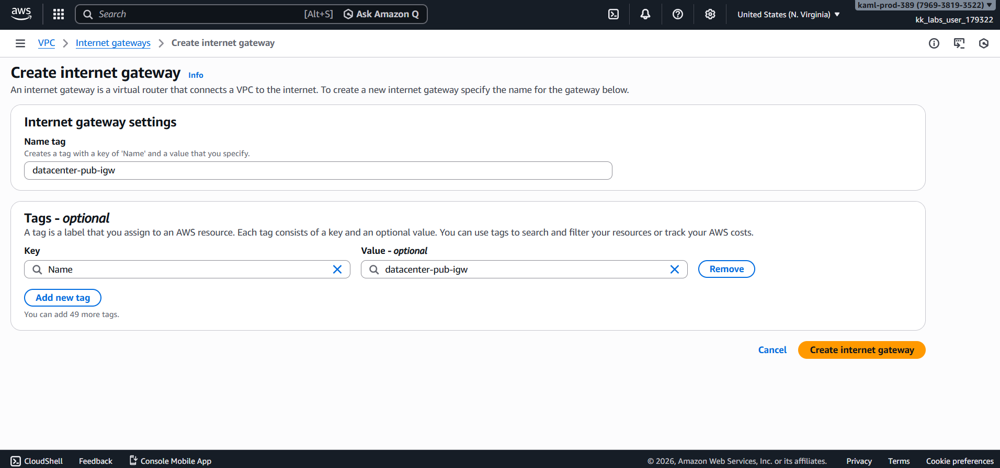

   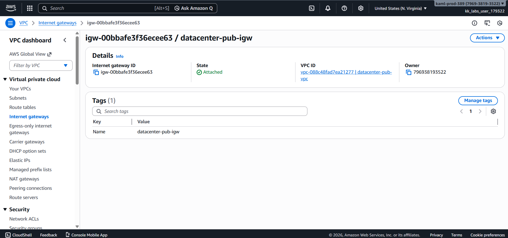

6. Updated the **route table** to allow internet traffic.

   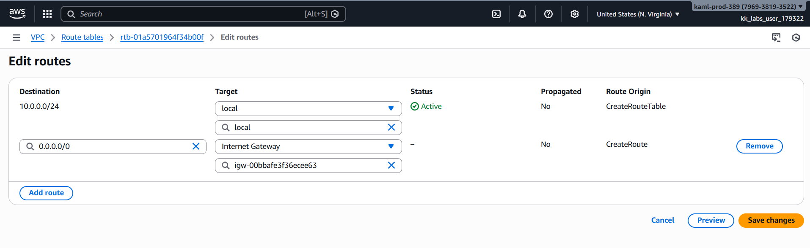

   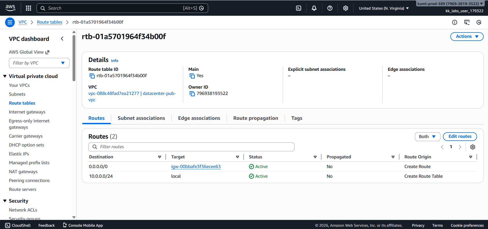 

7. Navigated to **Services → EC2** from the AWS Management Console.

   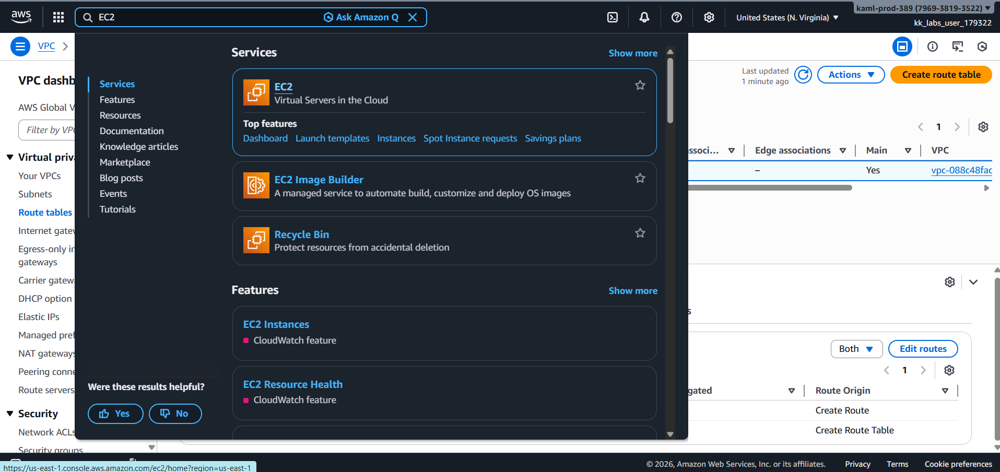

8. Launched an EC2 instance with the following configuration:

   - **Name:** `datacenter-pub-ec2`
   - **AMI:** Ubuntu

   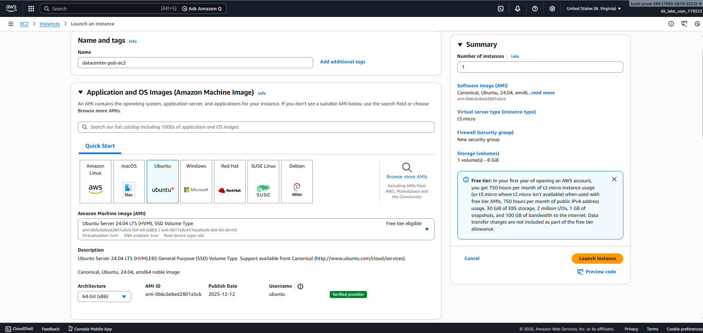 

   - **Instance type:** `t2.micro`
   - **Key pair:** Selected Proceed without a keypair

   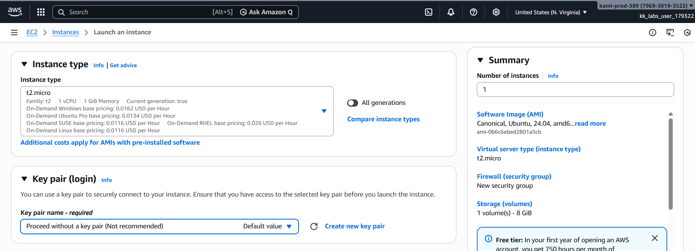 

   - **VPC:** `datacenter-pub-vpc`
   - **Subnet:** `datacenter-pub-subnet`

   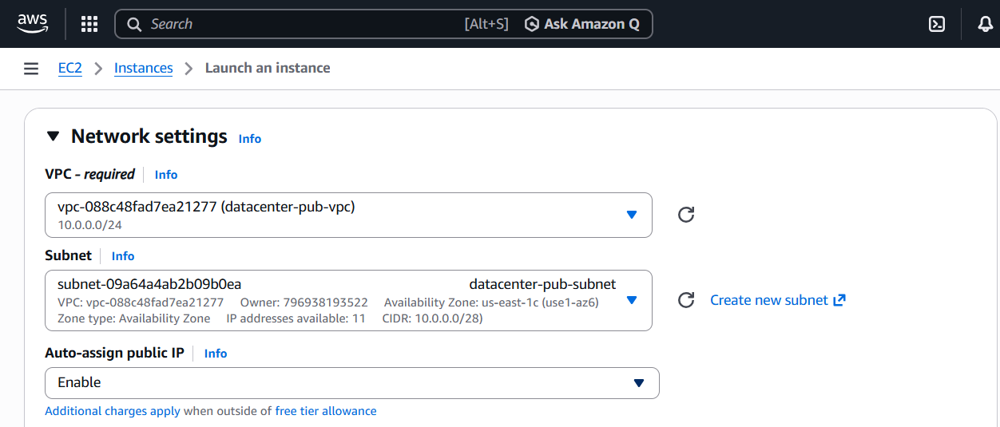

9. Configured the **security group** to allow SSH access:

   - **Type:** SSH  
   - **Port:** 22  
   - **Source:** `0.0.0.0/0`

   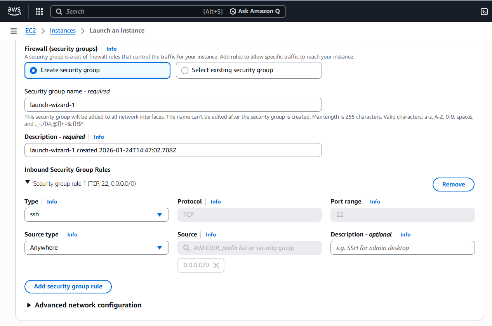

10.  Verified that the EC2 instance was in the **Running** state.

   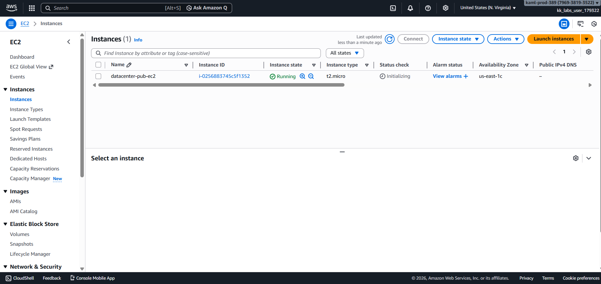

---

## Verification
The following screenshots confirm successful completion of the task:

- Public VPC **`datacenter-pub-vpc`** created successfully  
  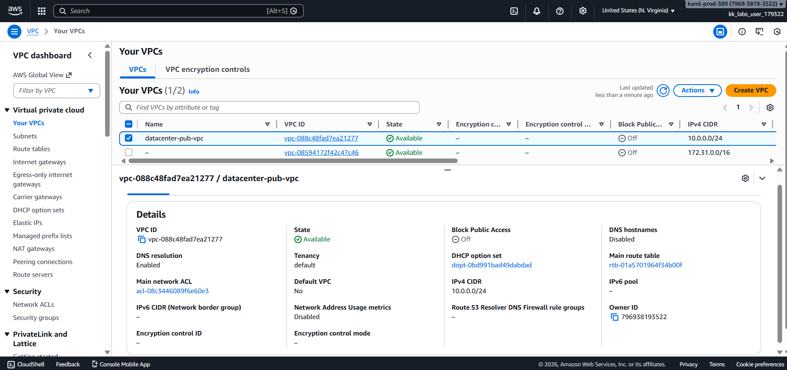

- Public subnet with auto-assign public IP enabled  
  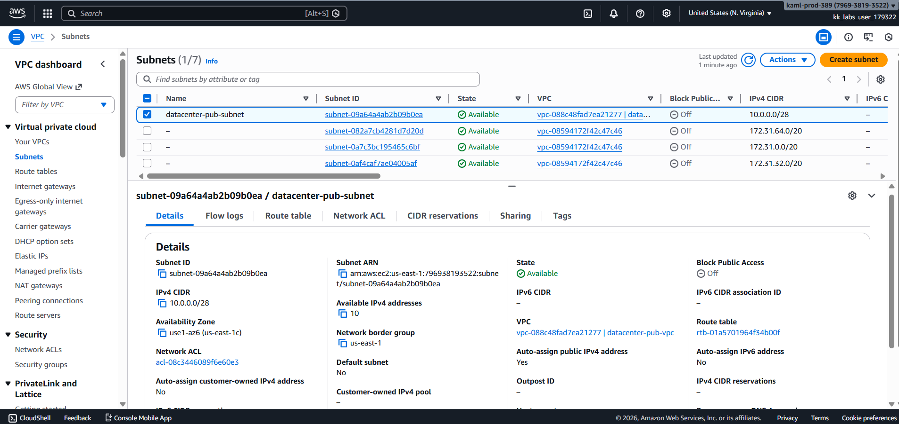

- EC2 instance **`datacenter-pub-ec2`** running with public IP  
  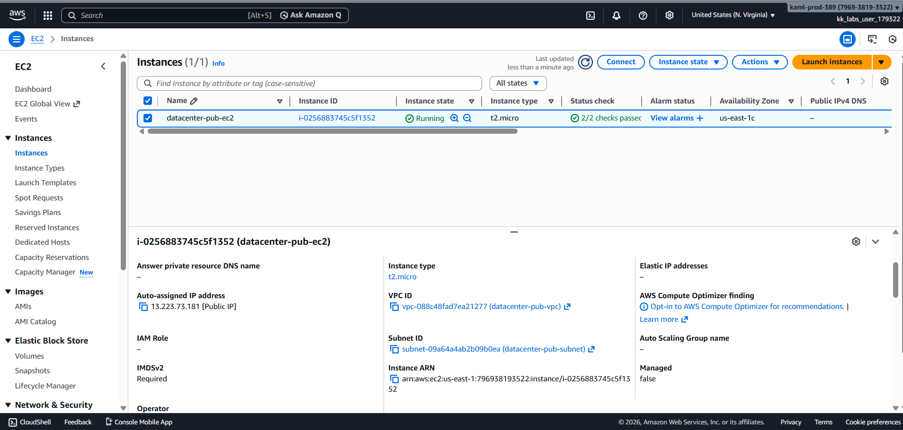

- SSH (port 22) allowed in security group  
  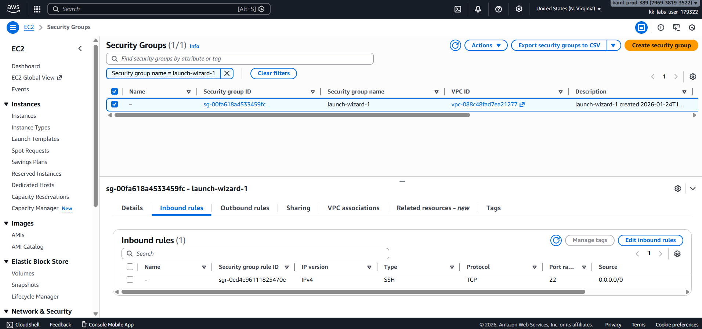

---

## Outcome
A public VPC infrastructure was successfully created with a public subnet and internet access.  
The EC2 instance **`datacenter-pub-ec2`** is publicly accessible via **SSH**, enabling deployment of public-facing applications.

---

## Learnings
- Public subnets require Internet Gateway and route table configuration
- Auto-assign public IP is essential for internet access
- Security groups control inbound connectivity
- SSH access should be tightly controlled in real environments
- Proper VPC design is critical for scalable architectures

---

**Status:** Completed
