# Day 29 – VPC Peering Between Public and Private EC2 Instances (AWS)

## Task Overview
As part of the 100 Days of Cloud (AWS) challenge by KodeKloud, this task focuses on creating a VPC Peering connection between a public Default VPC and a private VPC, configuring route tables and security groups, and verifying connectivity between EC2 instances.

The objective was to create a VPC peering connection named nautilus-vpc-peering between the Default VPC and nautilus-private-vpc, update route tables, configure security groups to allow ICMP traffic, and ensure that the private EC2 instance (nautilus-private-ec2) is accessible from the public EC2 instance (nautilus-public-ec2).

---

## Concept
VPC Peering is a networking connection between two Virtual Private Clouds (VPCs) that enables routing of traffic between them using private IP addresses.  
This allows instances in different VPCs to communicate securely without using the public Internet.

To make peered VPCs communicate successfully:
- VPC Peering connection must be active
- Route tables must direct traffic through the peering connection
- Security groups must allow traffic between the VPC CIDRs

---

## Real-World Use Case
VPC Peering is commonly used to:
- Connect different application tiers across VPCs
- Enable multi-account network communication
- Centralize shared services across VPCs
- Facilitate secure cross-VPC communication without public Internet exposure

---

## Requirements
- Public EC2 instance: nautilus-public-ec2 (Default VPC)
- Private EC2 instance: nautilus-private-ec2 (nautilus-private-vpc)
- Private VPC CIDR: 10.1.0.0/16
- Private subnet CIDR: 10.1.1.0/24
- VPC Peering connection name: nautilus-vpc-peering
- Allow ICMP (ping) from public VPC to private EC2
- SSH from aws-client to public EC2 for verification
- Region: us-east-1

---

## AWS Services Used
- Amazon VPC
- Amazon EC2
- Route Tables
- Security Groups
- AWS CLI

---

## Steps Performed

1. Navigated to Services → VPC → Peering Connections in the AWS Management Console.

   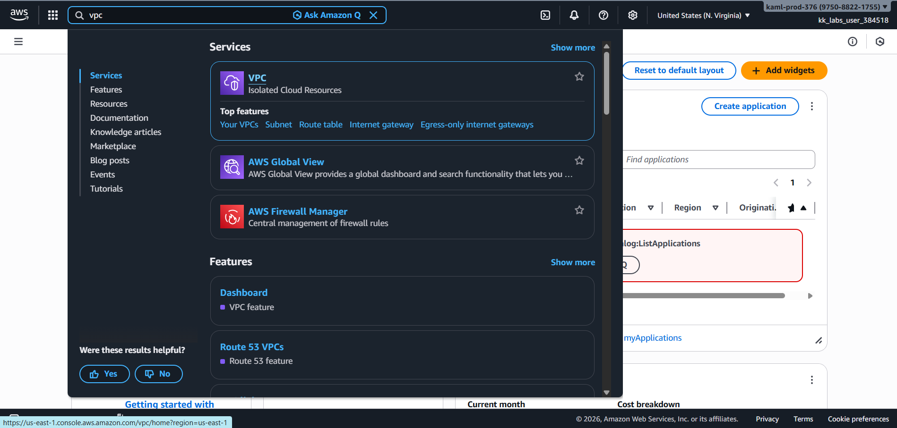 

   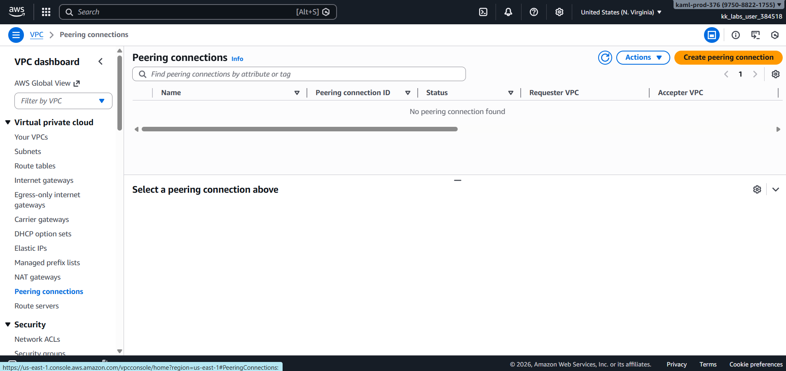

2. Created a VPC Peering connection named nautilus-vpc-peering between the Default VPC and nautilus-private-vpc.

   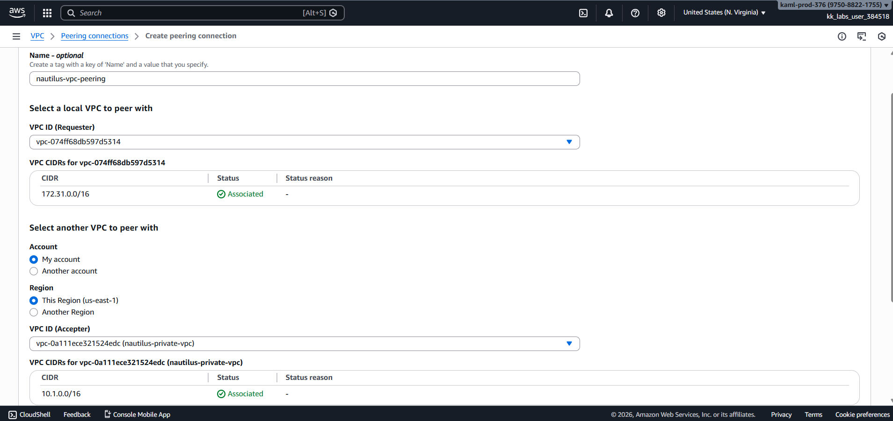

   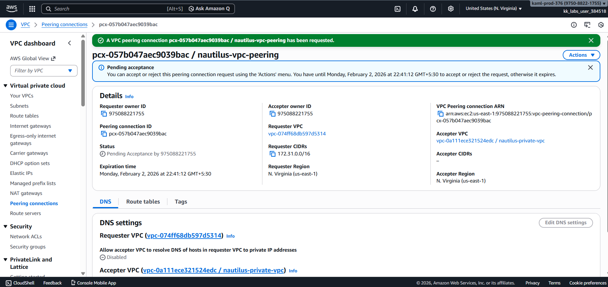

3. Accepted the VPC Peering connection request from the accepter VPC.

   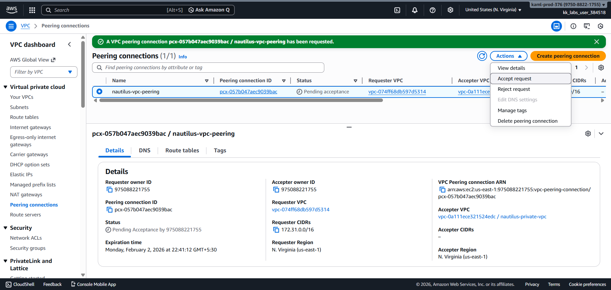

   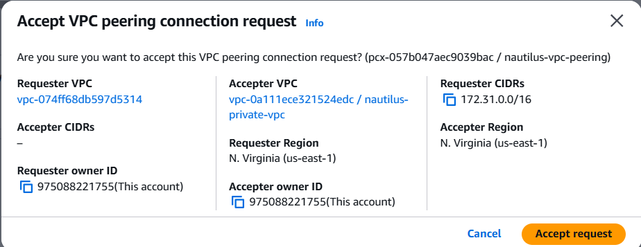

4. Updated the route table of the Default VPC to route traffic destined for the private VPC CIDR (10.1.0.0/16) via the peering connection.

   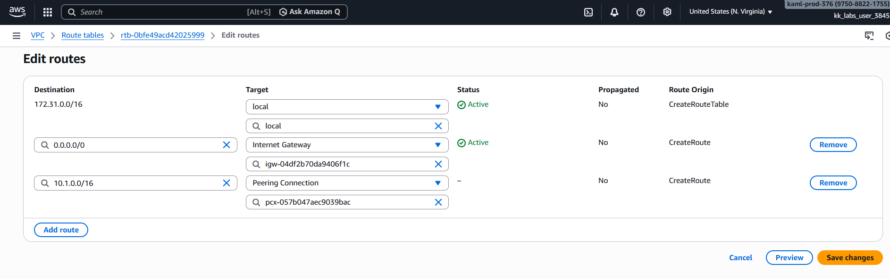

5. Updated the route table of the Private VPC to route traffic destined for the Default VPC CIDR via the peering connection.

   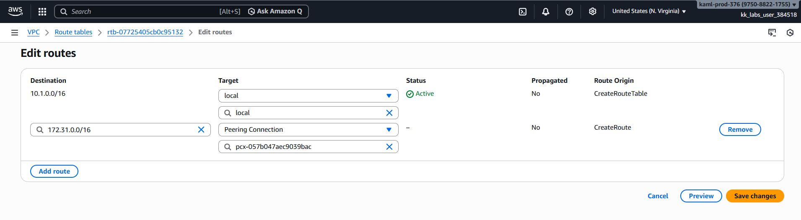

6. Updated the security group of the private EC2 instance to allow ICMP (ping) traffic from the Default VPC CIDR.

   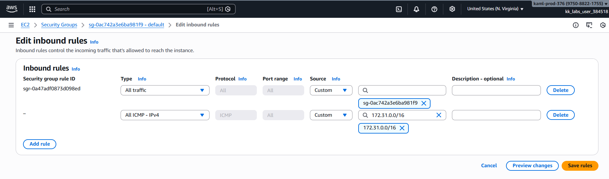

7. Retrieved the public SSH key from the aws-client host:

   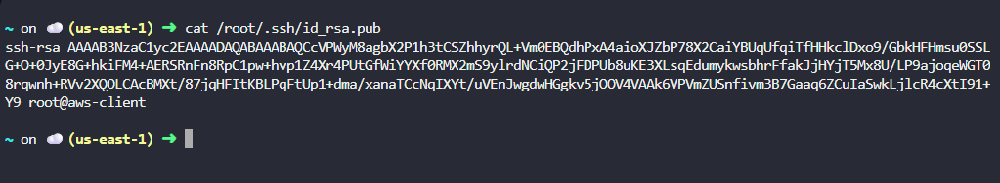

8. Added the retrieved public key to the authorized_keys file of the ec2-user on the public EC2 instance (nautilus-public-ec2) and set proper permissions:

   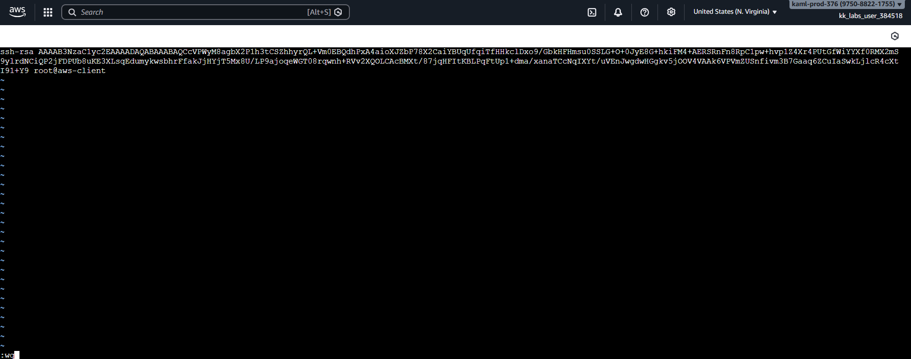

   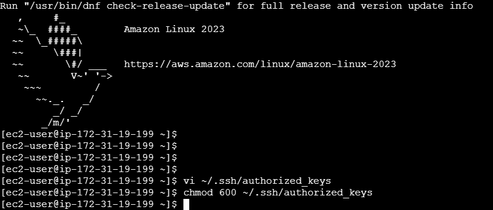 

9. SSHed into the public EC2 instance from aws-client and tested connectivity by pinging the private EC2 instance:

   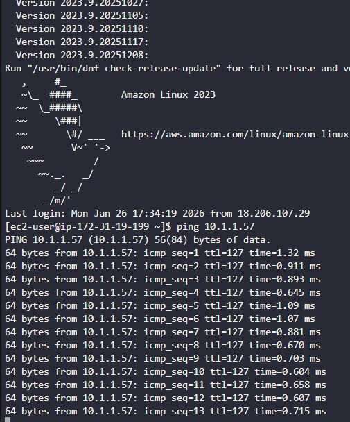

---

## Verification
The following screenshots confirm successful completion of the task:

- VPC Peering connection is Active  
  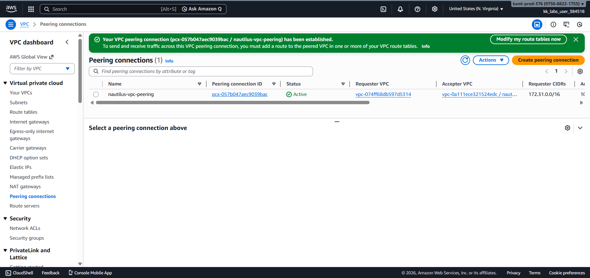

- Routes configured in both Default and Private VPCs  
  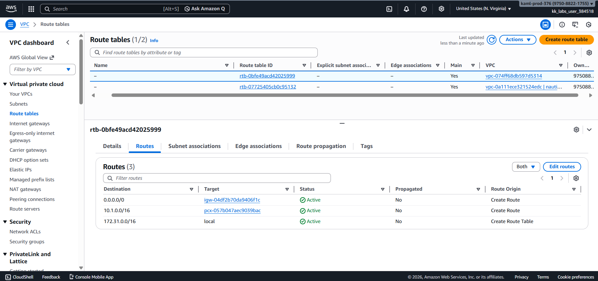

  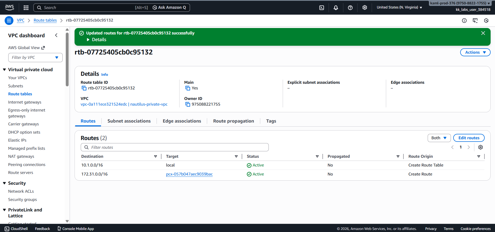  

- Security group allows ICMP traffic from Default VPC to private EC2  
  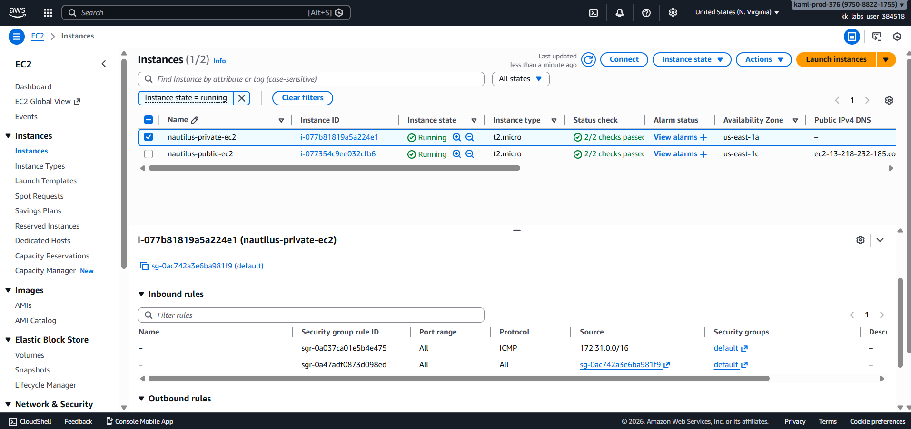

- SSH access to public EC2 successful and Ping from public EC2 to private EC2 successful  
  

---

## Outcome
A VPC Peering connection named nautilus-vpc-peering was successfully created between the Default VPC and nautilus-private-vpc.  
Route tables were updated, ICMP traffic was allowed, and connectivity from public EC2 to private EC2 was verified.  
The private EC2 instance is now accessible from the public EC2 instance.

---

## Learnings
- How to create and accept VPC Peering connections
- How to configure route tables for cross-VPC communication
- How to update security groups to allow ICMP and SSH traffic
- How to verify connectivity between EC2 instances across VPCs
- Practical use of SSH key-based access for EC2 instances

---

Status: Completed
