# Day 30 – Enable Internet Access for Private EC2 Using NAT Instance (AWS)

## Task Overview
As part of the **100 Days of Cloud (AWS)** challenge by **KodeKloud**, this task focuses on enabling **outbound internet access for an EC2 instance running in a private subnet** using a **NAT Instance**.

The private EC2 instance is configured with a cron job that uploads a test file to an S3 bucket. The upload only succeeds once internet connectivity is properly established through the NAT Instance.

---

## Concept
A **NAT Instance** allows instances in a private subnet to access the internet while remaining unreachable from inbound public traffic.

Key concepts involved:
- Public and private subnet architecture
- NAT Instance setup and configuration
- Route table modifications
- Source/Destination check handling
- IP forwarding and NAT behavior
- Verification using S3 uploads

---

## Real-World Use Case
NAT Instances are commonly used when:
- Cost optimization is required over NAT Gateways
- Custom NAT configuration is needed
- Learning and troubleshooting AWS networking
- Operating in lab or controlled environments

---

## Existing Resources (Pre-Created)
The following resources were already available in the environment:

- **VPC:** `datacenter-priv-vpc`
- **Private Subnet:** `datacenter-priv-subnet`
- **Private EC2 Instance:** `datacenter-priv-ec2`
- **S3 Bucket:** `datacenter-nat-10177`
- **Cron Job:** Uploads `datacenter-test.txt` every minute (fails until internet access is enabled)

---

## Requirements
- Create a **public subnet** named `datacenter-pub-subnet`
- Launch a **NAT Instance** named `datacenter-nat-instance`
- Use **Amazon Linux 2 AMI**
- Configure a **custom security group**
- Enable internet access for the private EC2 instance
- Verify successful S3 upload

---

## AWS Services Used
- Amazon VPC
- Amazon EC2
- Route Tables
- Security Groups
- Amazon S3

---

## Steps Performed

### 1. Opened the VPC Console
Navigated to **Services → VPC** from the AWS Management Console.

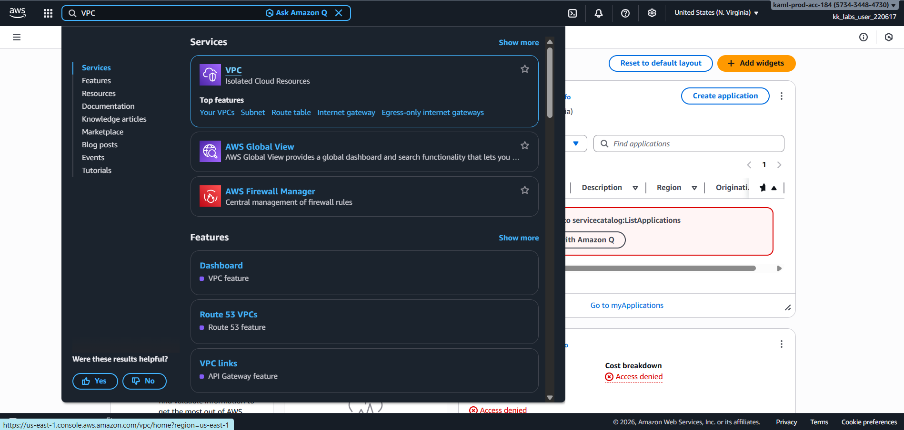

---

### 2. Created a Public Subnet
Created a **public subnet** named **`datacenter-pub-subnet`** inside the existing VPC **`datacenter-priv-vpc`**.

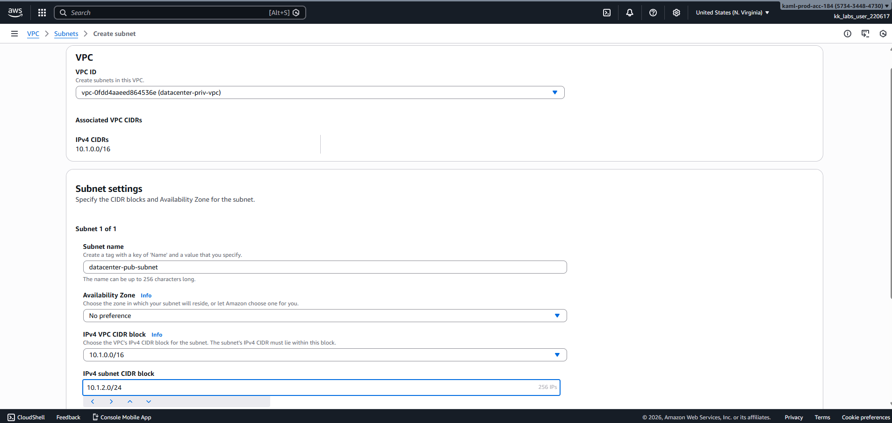

---

### 3. Enabled Auto-Assign Public IPv4
Enabled **auto-assign public IPv4 address** for the public subnet to allow instances launched in it to receive public IPs.

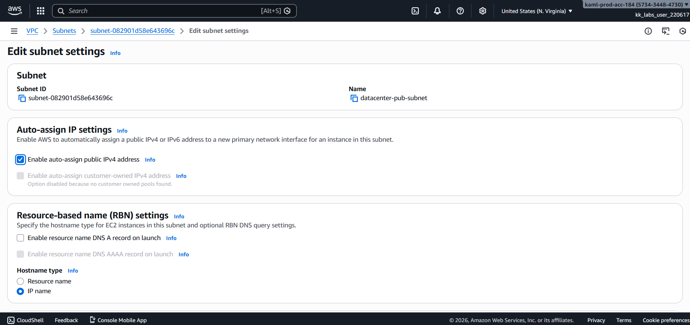

---

### 4. Created and attached custom internet gateway
Created and attached a **custom internet gateway** named **datacenter-igw**

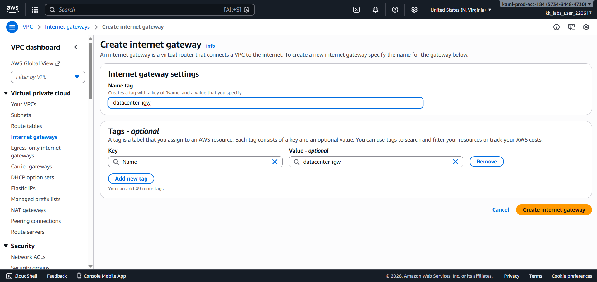

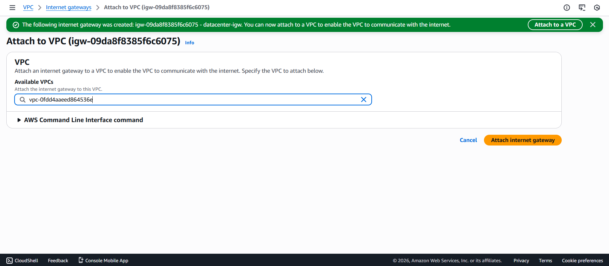

---

### 5. Created a Custom Security Group for NAT Instance
Created a **custom security group** allowing outbound internet traffic and inbound traffic from the private subnet.

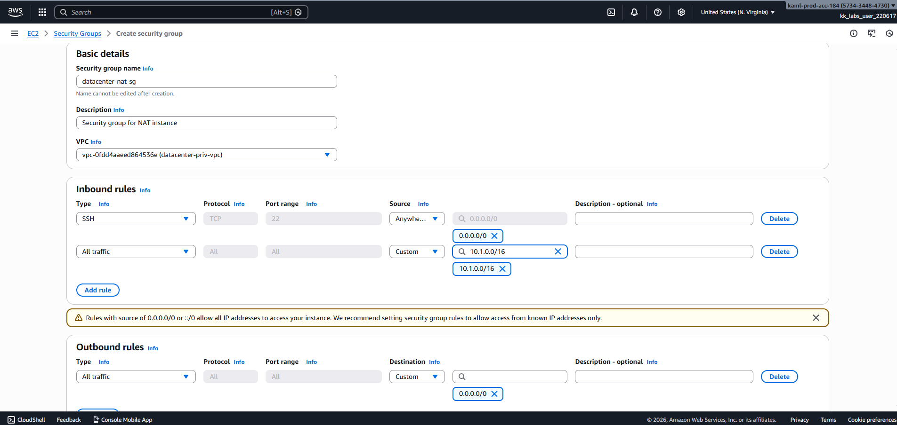

---

### 6. Launched the NAT Instance
Launched an EC2 instance using **Amazon Linux 2 AMI** with the following configuration:

- **Name:** `datacenter-nat-instance`

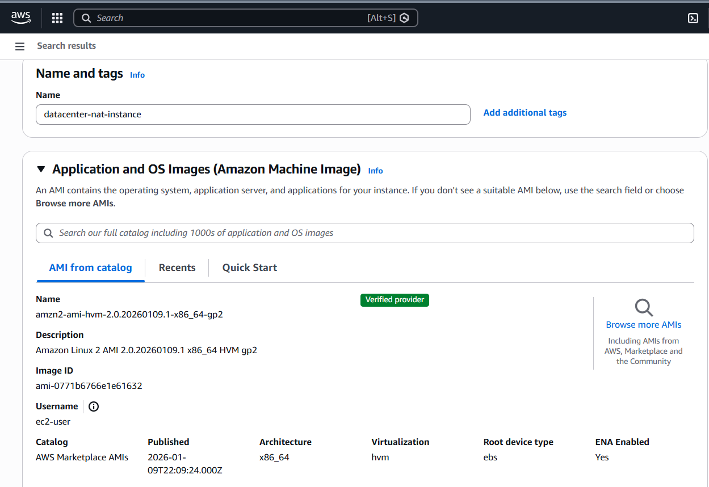

- **Instance type:** `t3.micro`
- **Key pair:** Selected Proceed without a keypair

   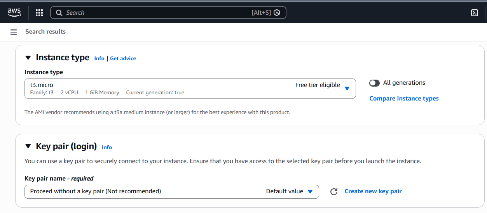 

- **Subnet:** `datacenter-pub-subnet`
- **Security Group:** Selected Existing NAT security group

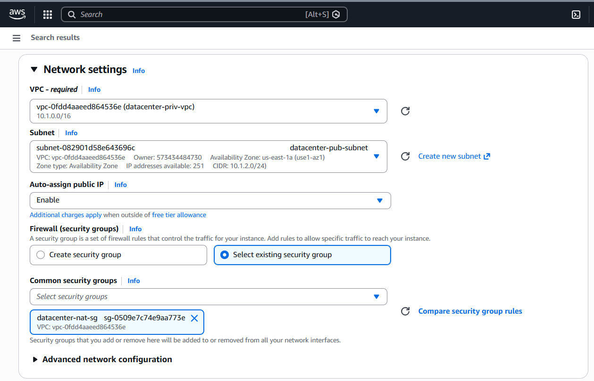

---

### 7. Disabled Source/Destination Check
Disabled **Source/Destination Check** on the NAT Instance's ENI to allow it to forward traffic on behalf of private instances.

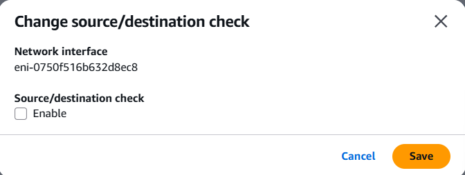

---

### 8. Updated Private Subnet Route Table
Updated the route table associated with **`datacenter-priv-subnet`** to route all internet-bound traffic (`0.0.0.0/0`) via the NAT Instance.

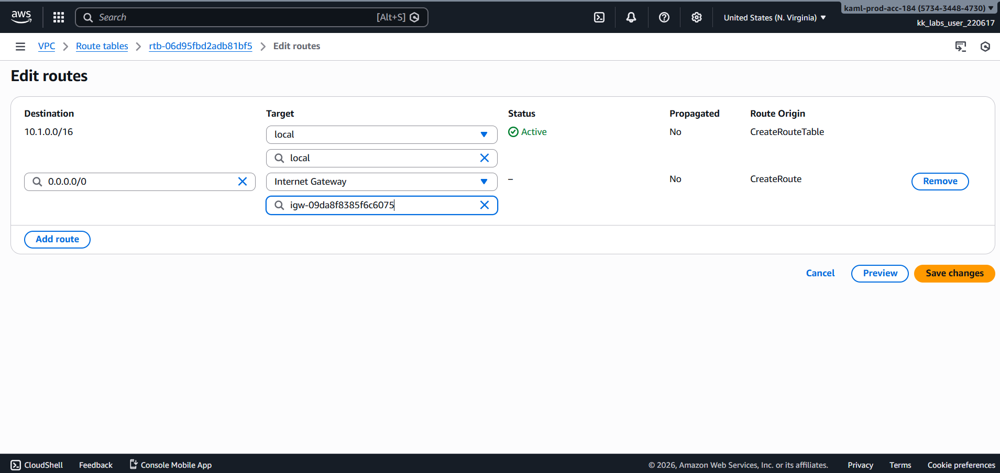

---

### 9. Configured NAT Instance for Forwarding
After connecting to the NAT Instance, additional system-level configuration was performed to:

- Enable IPv4 forwarding
- Configure NAT masquerading for outbound traffic
- Persist firewall rules to survive reboots

This ensured proper traffic translation and forwarding from the private subnet to the internet.

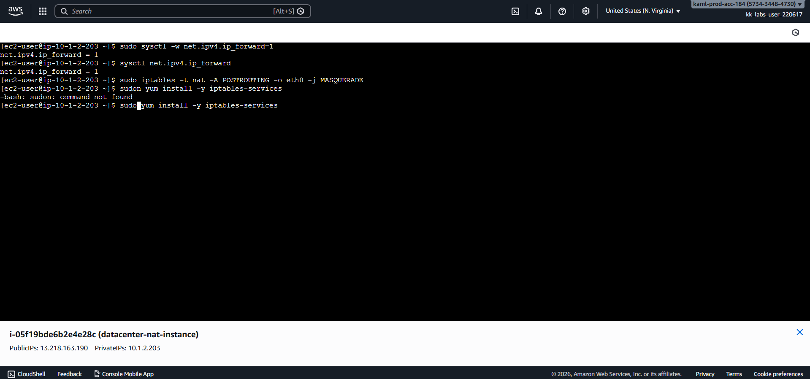  

---

### 10. Verified Private EC2 Internet Access
Verified that the private EC2 instance **`datacenter-priv-ec2`** was able to access the internet through the NAT Instance.

---

### 11. Verified S3 Upload
Confirmed that the cron job successfully uploaded **`datacenter-test.txt`** to the S3 bucket **`datacenter-nat-10177`**.

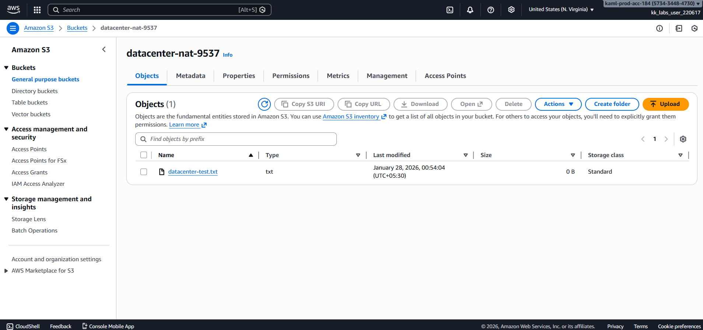

---

## Verification
The following validations confirm successful completion of the task:

- NAT Instance **`datacenter-nat-instance`** running in the public subnet  
  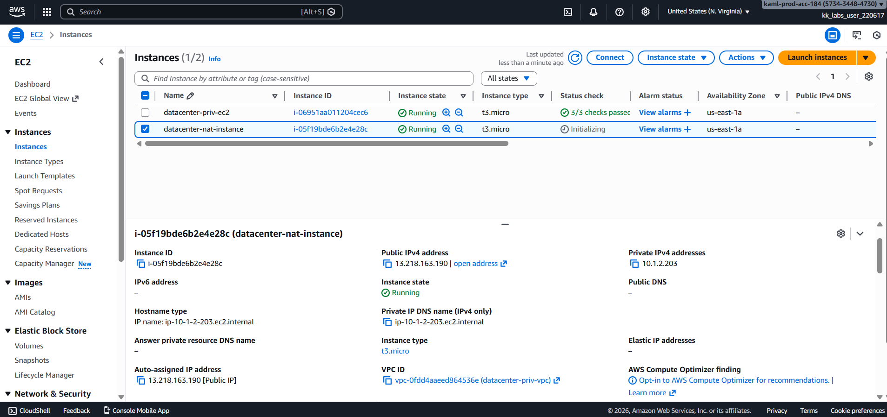

- Private subnet route table correctly pointing to NAT Instance  
  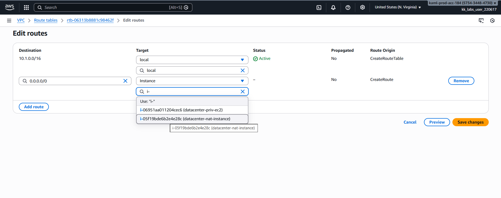

- `datacenter-test.txt` visible in S3 bucket **`datacenter-nat-10177`**  
  
---

## Outcome
Successfully enabled internet access for a private EC2 instance using a **NAT Instance**, validating outbound connectivity via S3 uploads and reinforcing core AWS networking concepts.

---

**Status:** Completed
