# Day 31 – Provision Private RDS MySQL Instance (AWS)

## Task Overview
As part of the **100 Days of Cloud (AWS)** challenge by **KodeKloud**, this task focuses on provisioning a **private Amazon RDS instance** for application development and testing.

The goal was to create a **cost-effective, secure, and scalable RDS instance** using the **AWS Free Tier**, ensuring it is private, properly configured, and available for use by the development team.

---

## Concept
**Amazon RDS (Relational Database Service)** is a fully managed database service that simplifies database setup, operation, and scaling.

Key concepts involved:
- Private RDS deployment
- MySQL engine configuration
- Free-tier instance sizing
- Storage autoscaling
- Database availability and readiness
- Secure infrastructure for application data

---

## Real-World Use Case
Private RDS instances are commonly used to:
- Store critical application data securely
- Support backend services in private networks
- Enable scalable database growth without downtime
- Reduce operational overhead using managed services
- Provide reliable data storage for development and testing environments

---

## Requirements
- **RDS instance name:** `devops-rds`
- **Instance class:** `db.t3.micro`
- **Database engine:** MySQL
- **Engine version:** `8.4.x`
- **Network:** Private (not publicly accessible)
- **Storage autoscaling:** Enabled
- **Autoscaling threshold:** `50 GB`
- **Availability state:** Available

---

## AWS Services Used
- Amazon RDS
- Amazon VPC
- Security Groups

---

## Steps Performed

### 1. Opened the RDS Console
Navigated to **Services → RDS** from the AWS Management Console.

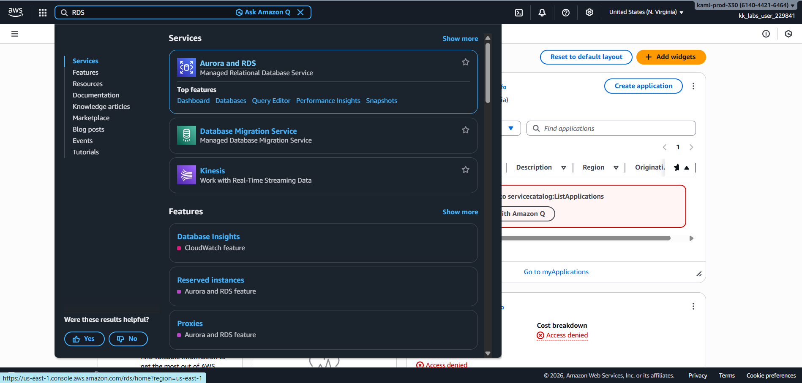

---

### 2. Created a New RDS Database
Clicked **Create database** and selected the **Full Configuration** option.

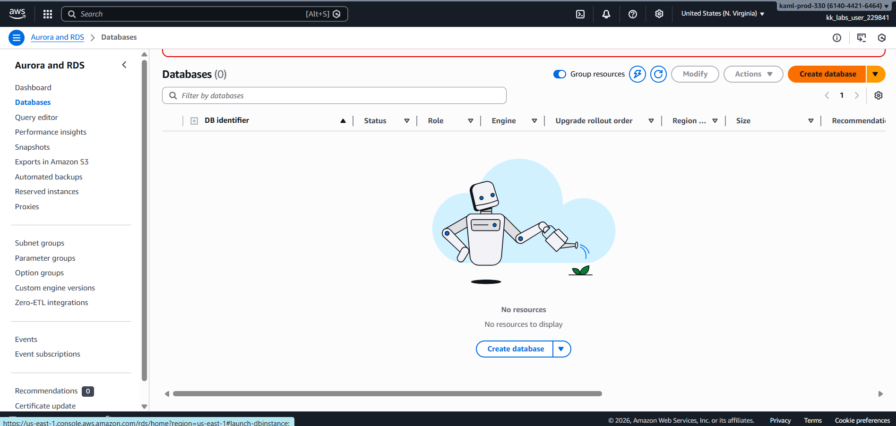

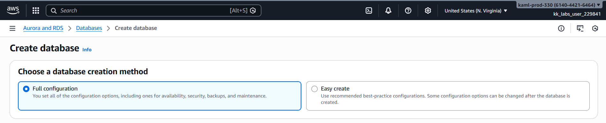

---

### 3. Selected Engine Configuration
Configured the database engine with the following details:
- **Engine:** MySQL
- **Version:** `8.4.7`

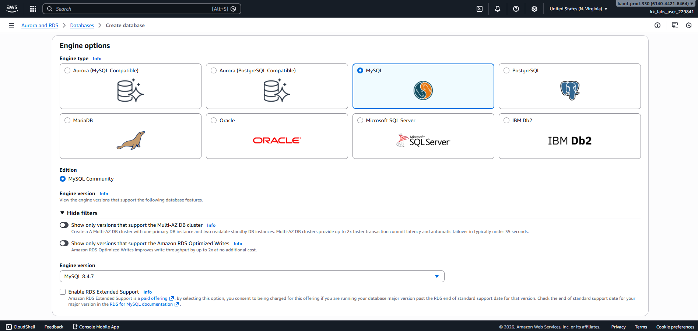

---

### 4. Selected Free Tier Template
Chose the **Sandbox / Free Tier template** to ensure cost optimization during development.

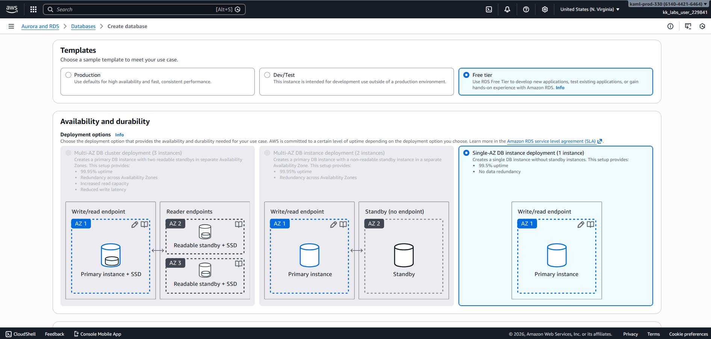

---

### 5. Configured DB Credential Settings and Instance Settings
Configured the instance with:
- **DB instance identifier:** `devops-rds`
- **Master Username:** `admin`
- **Credentials Management:** `Self managed`
- Checked `Auto generate password`

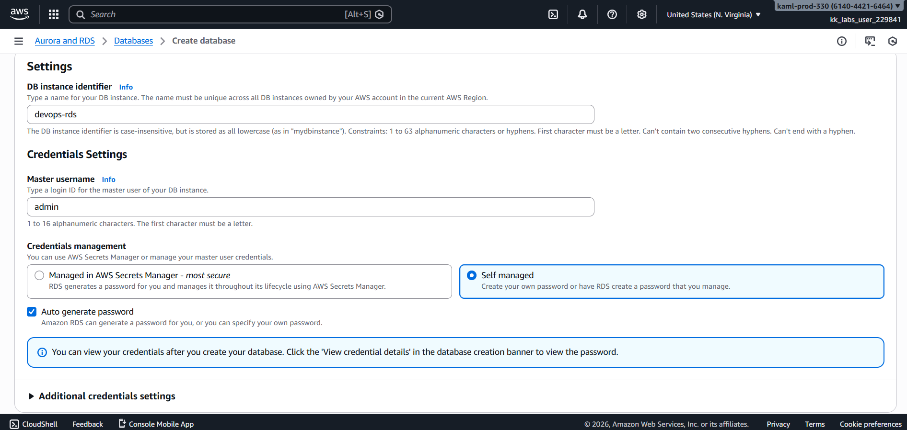

- **Instance class:** `db.t3.micro`

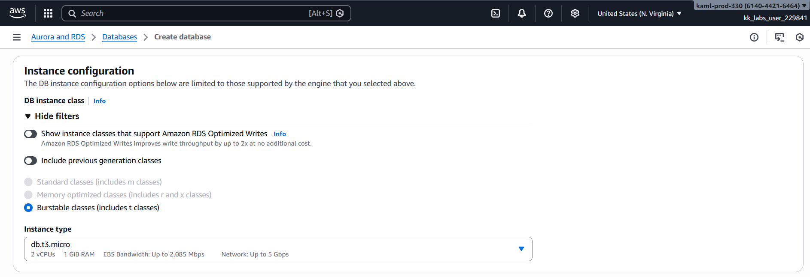

---

### 6. Configured Storage and Autoscaling
Enabled **storage autoscaling** and set the **maximum storage threshold to 50 GB**, keeping the remaining settings as default.

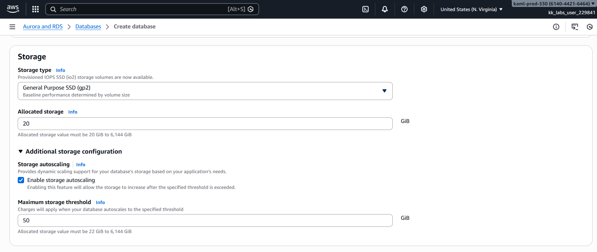

---

### 7. Configured Network and Accessibility
Ensured the database was deployed in a **private subnet** with **public access disabled**, keeping default VPC and security group settings.

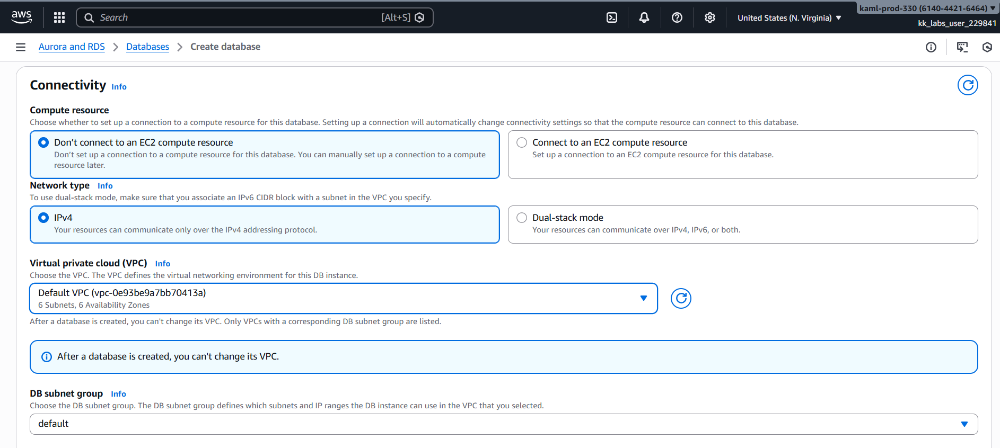

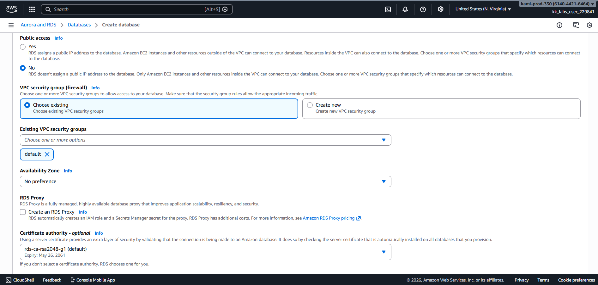

---

### 8. Created the RDS Instance
Reviewed all configurations and created the RDS instance.

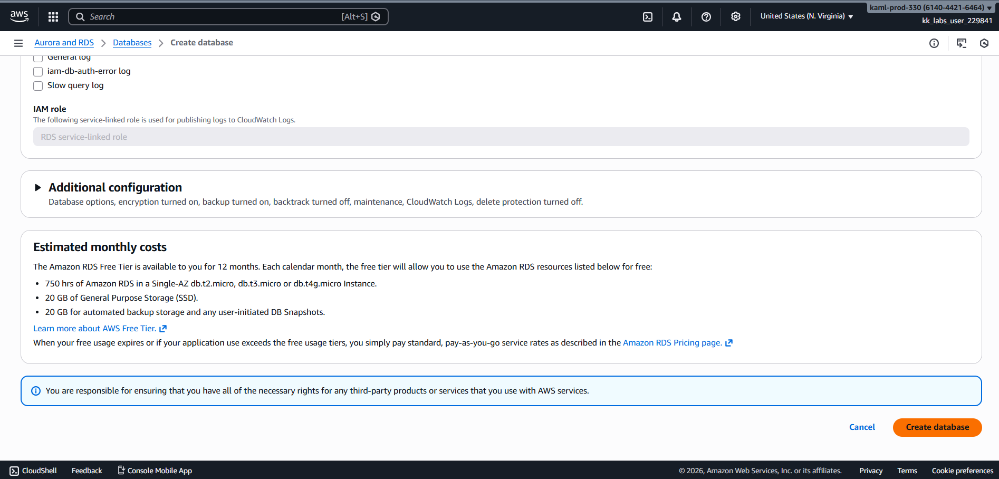

---

### 9. Verified Instance Availability
Waited for the RDS instance **`devops-rds`** to reach the **Available** state, confirming successful provisioning.

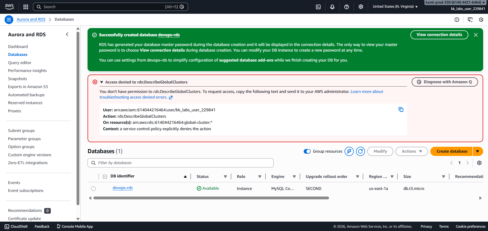

---

## Verification
The following validations confirm successful completion of the task:

- RDS instance **`devops-rds`** is in **Available** state
  
  

- RDS instance **`devops-rds`** details:
	- Instance class set to **db.t3.micro**  
	- MySQL engine version **8.4.x** configured  
	- Storage autoscaling enabled with **50 GB threshold**  
  
  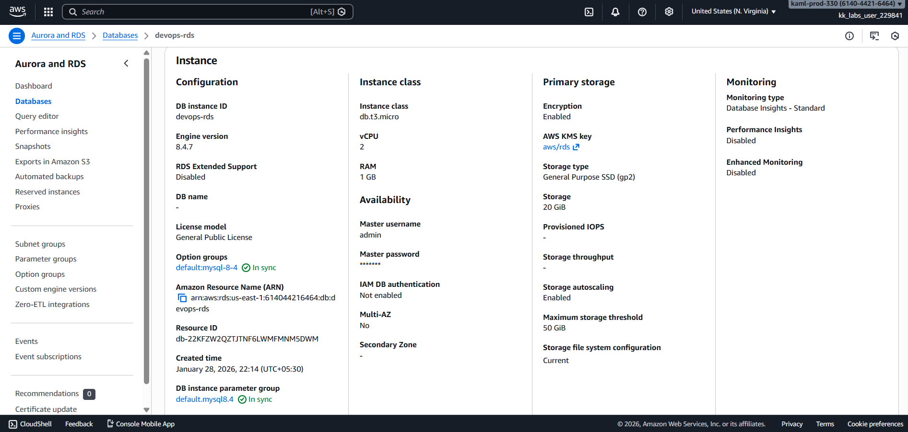

---

## Outcome
A **private Amazon RDS MySQL instance** was successfully provisioned using the **AWS Free Tier**, with storage autoscaling enabled and the instance fully available for application development and testing.

---

## Learnings
- Amazon RDS simplifies database provisioning and management
- Private RDS deployments enhance security
- Free Tier resources are ideal for development environments
- Storage autoscaling prevents manual capacity planning
- Instance availability is critical before application integration

---

**Status:** Completed
