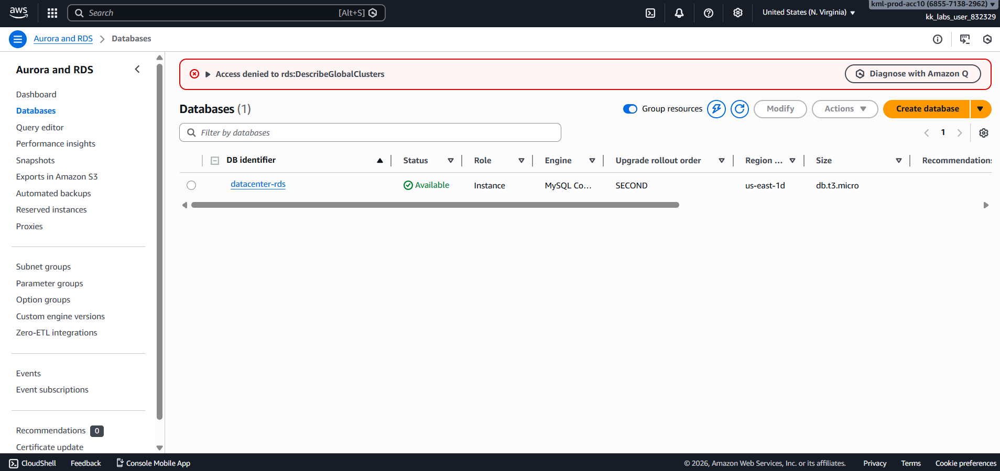
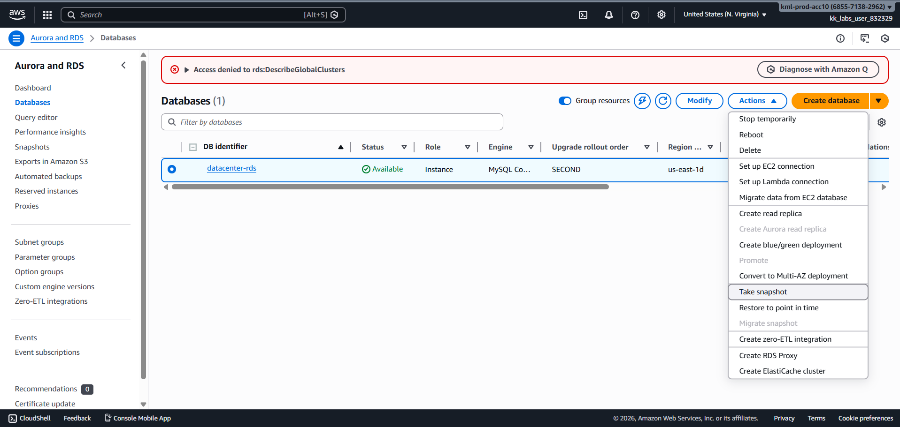
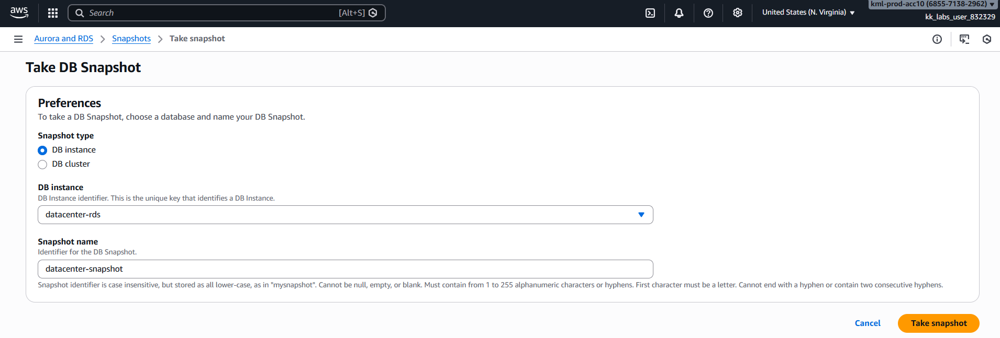
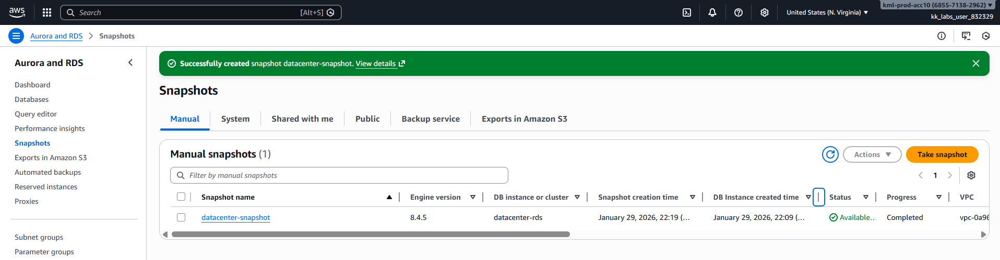
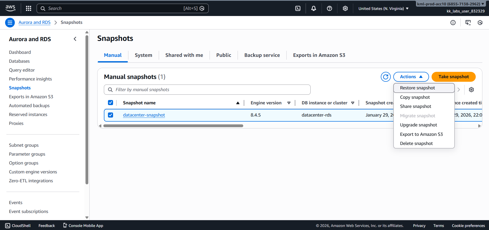
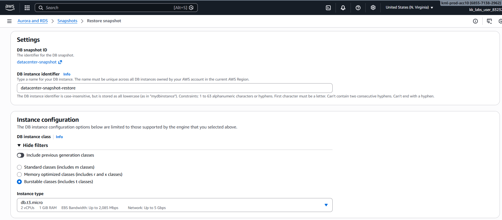
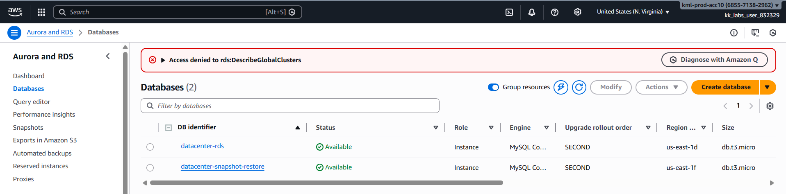
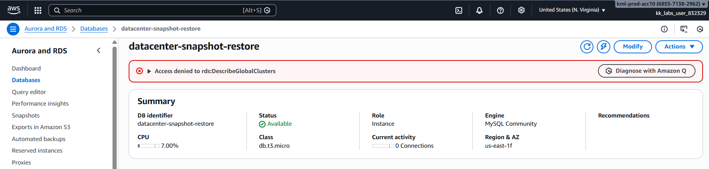

# Day 32 – RDS Snapshot and Restore (AWS)

## Task Overview
As part of the **100 Days of Cloud (AWS)** challenge, this task focuses on creating a snapshot of an existing RDS instance and restoring it into a new instance for backup verification and testing purposes.

The goal was to ensure that the database backup process works correctly and that a restored database instance can be brought back into an **Available** state.

---

## Concept
An **RDS Snapshot** is a point-in-time backup of an RDS instance stored securely by AWS.

Key concepts involved:
- Manual RDS snapshots
- Snapshot restoration
- Instance class configuration
- Database availability states
- Backup and recovery validation

---

## Real-World Use Case
RDS snapshot and restore is commonly used to:
- Test disaster recovery strategies
- Validate database backups
- Create testing or staging environments
- Safely roll back failed deployments
- Ensure data durability

---

## Existing Resources
- **RDS Instance:** `datacenter-rds`

---

## Requirements
- **Snapshot name:** `datacenter-snapshot`
- **Source RDS instance:** `datacenter-rds`
- **Restored RDS instance:** `datacenter-snapshot-restore`
- **Instance class:** `db.t3.micro`
- **Final state:** Available

---

## AWS Services Used
- Amazon RDS
- RDS Snapshots

---

## Steps Performed

1. Opened **AWS Console → RDS → Databases**.

   

2. Verified that **`datacenter-rds`** was in the **Available** state.

   

3. Created a manual snapshot named **`datacenter-snapshot`**.

   

   

4. Waited for the snapshot to reach the **Available** state.

   

5. Selected **Restore Snapshot** from snapshot actions.

   

6. Configured the restored instance:
   - **DB identifier:** `datacenter-snapshot-restore`
   - **Instance class:** `db.t3.micro`
   - Other settings kept default

   

7. Waited until the restored RDS instance became **Available**.

   

---

## Verification
- Snapshot **`datacenter-snapshot`** created successfully
  
  

- RDS instance **`datacenter-snapshot-restore`** restored from snapshot  

  

- Instance running with **db.t3.micro** and **Available** state  
  
  

---

## Key Learnings
- RDS snapshots provide reliable backups
- Snapshots can be restored into new instances
- Instance class can be modified during restore
- Availability state is critical for snapshot operations

---

## Status

**Status:** Completed
