# Day 33 – AWS Lambda Basic Function (Serverless)

## Task Overview
As part of the **100 Days of Cloud (AWS)** challenge, this task focuses on creating a **basic AWS Lambda function** to demonstrate the fundamentals of serverless computing.

The objective was to deploy a simple Lambda function that returns a custom greeting message with a successful HTTP status code, highlighting **rapid deployment, scalability, and zero server management** using AWS Lambda.

---

## Concept
**AWS Lambda** is a serverless compute service that allows you to run code without provisioning or managing servers.

Key concepts involved:
- Serverless architecture
- AWS Lambda functions
- Lambda runtime (Python)
- IAM execution roles
- HTTP response handling
- Status codes

---

## Real-World Use Case
AWS Lambda is commonly used to:
- Build event-driven microservices
- Create lightweight APIs
- Automate operational tasks
- Handle backend logic without managing infrastructure
- Scale applications automatically based on demand

---

## Requirements
- **IAM role name:** `lambda_execution_role`
- **Lambda function name:** `nautilus-lambda`
- **Runtime:** Python
- **Response body:** `Welcome to KKE AWS Labs!`
- **Status code:** `200`

---

## AWS Services Used
- AWS IAM
- AWS Lambda

---

## Steps Performed

1. Opened **AWS Console → IAM → Roles**.

   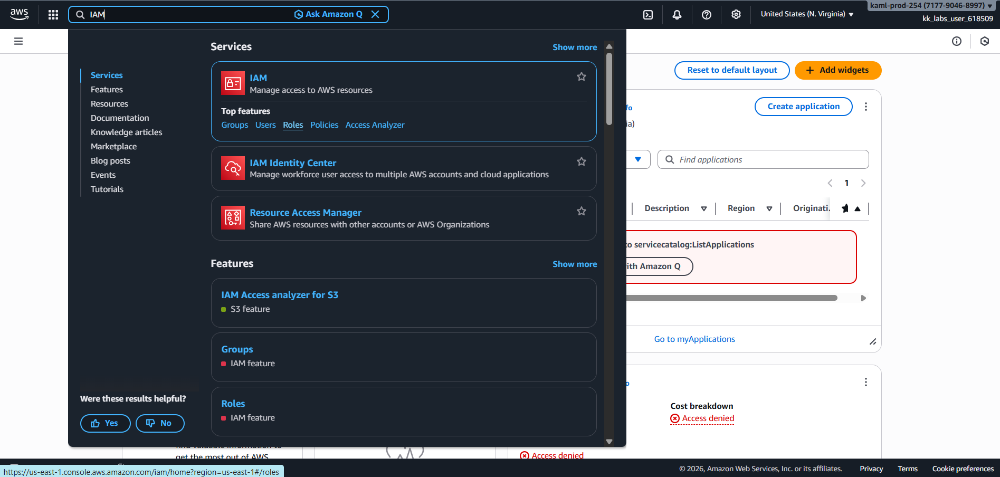

2. Clicked **Create role**

   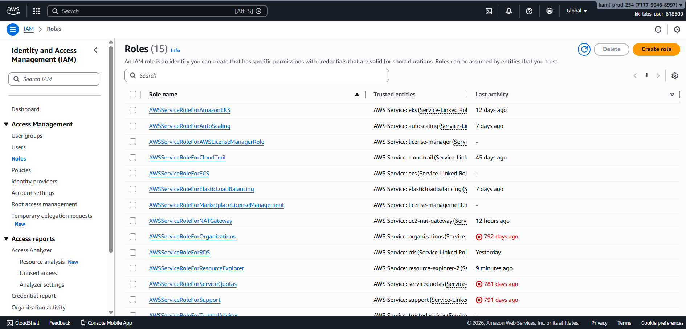

3. Selected **AWS service** as the trusted entity and Chose **Lambda** as the use case.

   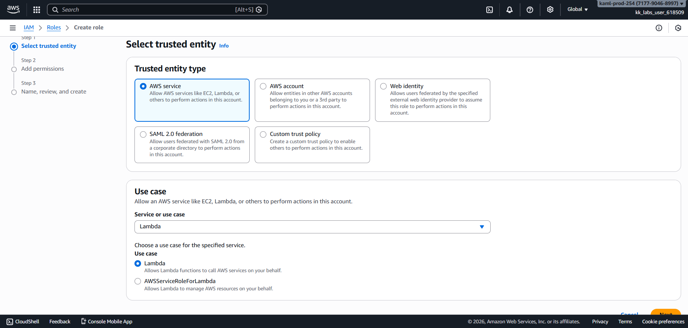

4. Attached the policy **`AdministratorAccess`** to allow lambda function to call AWS Services on my behalf.

   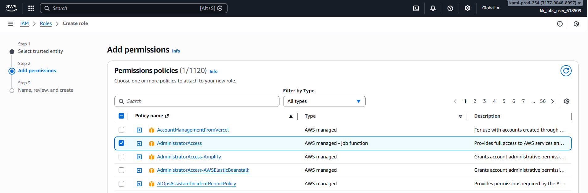

5. Named the role **`lambda_execution_role`** and created it successfully.

   

   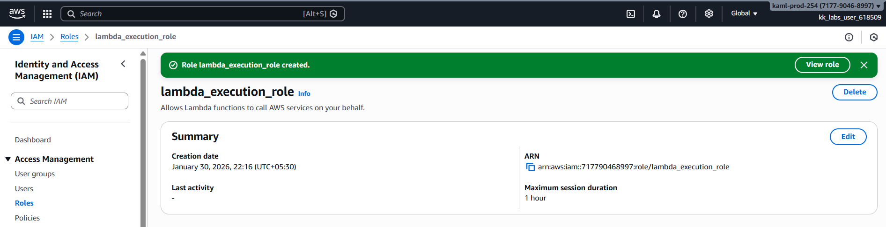

6. Opened **AWS Console → Lambda**.

   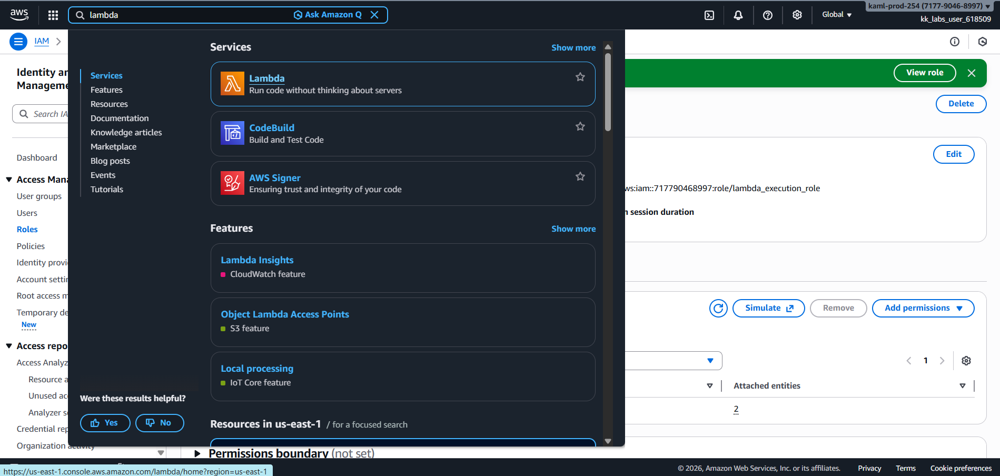

7. Clicked **Create function** and selected **Author from scratch**.

   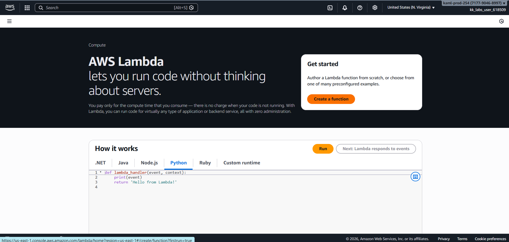

   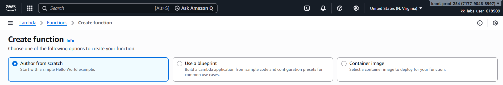

8. Configured the function:
   - **Function name:** `nautilus-lambda`
   - **Runtime:** Python
   - **Execution role:** Use existing role
   - **IAM role:** `lambda_execution_role`

   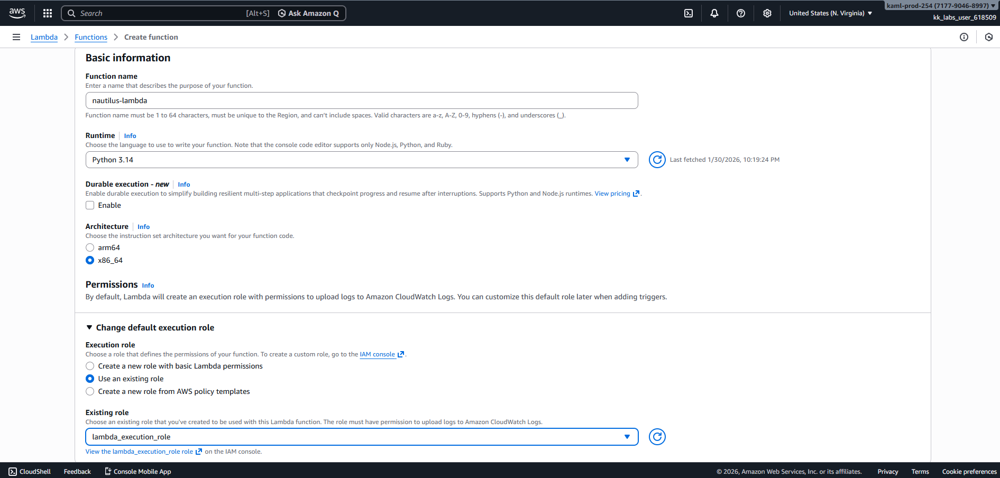

9. Created the Lambda function successfully and Added Python code to return the `Welcome to KKE AWS Labs!` message with status code `200`.

    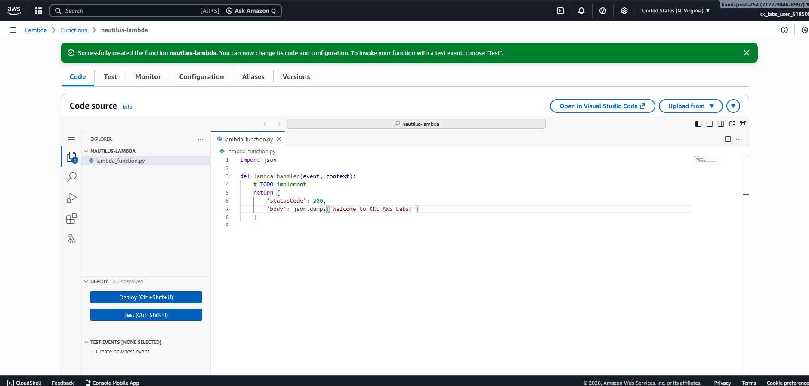

10. Clicked **Deploy** to save the changes.

    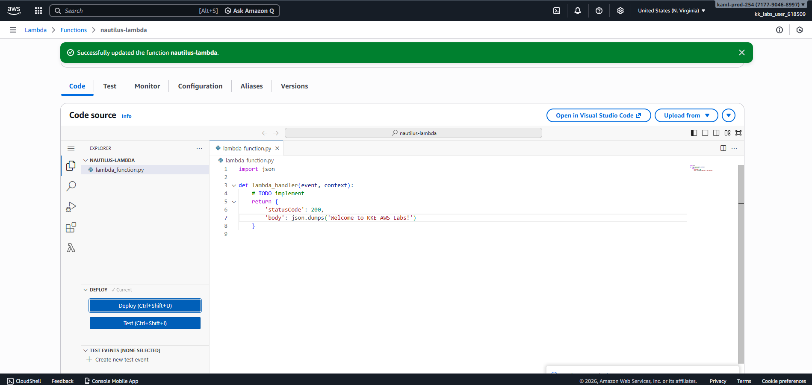

11. Created a test event and executed the function.

    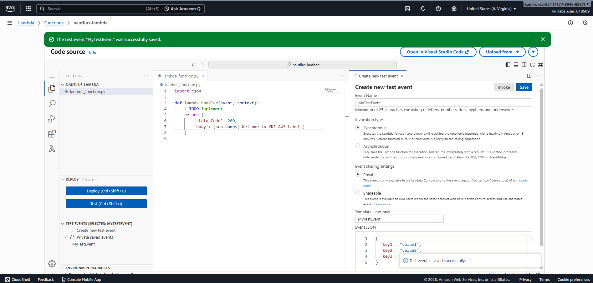

    

---

## Verification
- IAM role **`lambda_execution_role`** created successfully  

  

- Lambda function **`nautilus-lambda`** created successfully  

  

- Function returned response body **`Welcome to KKE AWS Labs!`** and status **200**

  

---

## Key Learnings
- IAM execution roles are mandatory for Lambda permissions
- Lambda requires CloudWatch access for logging
- Serverless architecture simplifies deployment
- Python is ideal for quick Lambda prototypes
- Proper sequencing (IAM → Lambda) is critical in AWS

---

**Status:** Completed 
