# Day 34 – AWS Lambda Deployment Using AWS CLI (Without Console Access)

## Task Overview
As part of the **100 Days of Cloud (AWS)** challenge by **KodeKloud**, this task focuses on deploying an AWS Lambda function **entirely using the AWS CLI**, without accessing the AWS Management Console.

The objective was to create a Python Lambda function, package it as a ZIP file, deploy it using AWS CLI, and attach an existing IAM execution role. This task simulates real-world DevOps environments where console access is restricted and automation is preferred.

---

## Concept
AWS Lambda enables serverless execution of code. Using the AWS CLI to manage Lambda functions is a core DevOps skill, especially in restricted or automated environments.

Key concepts involved:
- AWS Lambda (serverless compute)
- ZIP-based Lambda deployment
- AWS CLI usage
- IAM execution roles
- Python Lambda handler structure

---

## Real-World Use Case
CLI-based Lambda deployment is used in:
- CI/CD pipelines
- Infrastructure automation
- Restricted-access production environments
- Cloud-native DevOps workflows
- Version-controlled deployments

---

## Requirements
- **Lambda Function Name:** `devops-lambda-cli`
- **Runtime:** Python
- **Handler:** `lambda_function.lambda_handler`
- **IAM Role:** `lambda_execution_role`
- **Deployment Method:** AWS CLI only
- **Response Body:** `Welcome to KKE AWS Labs!`
- **Status Code:** `200`

---

## AWS Services Used
- AWS Lambda
- AWS IAM
- AWS CLI

---

## Files Created
- **Python script:** `lambda_function.py`
- **Deployment package:** `function.zip`

---

## Steps Performed (CLI Only)

1. Created a Python script named **`lambda_function.py`** containing the Lambda handler function.

   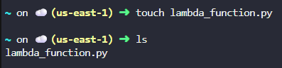

2. Added logic in the handler to return a response body and status code.

   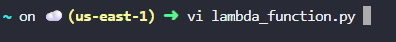

   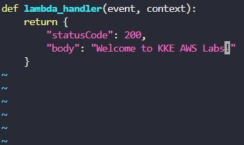

   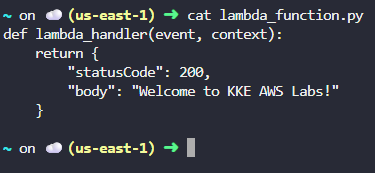

3. Zipped the Python script into a deployment package named **`function.zip`**.

   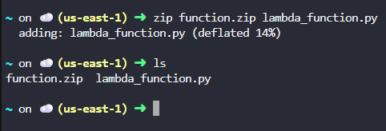

4. Retrieved account id from aws cli which will be required to create a lambda function:

   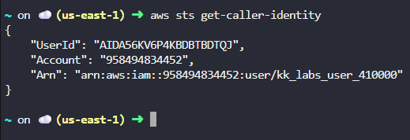

5. Created the Lambda function **`devops-lambda-cli`** using the AWS CLI, specifying:
   - Python runtime
   - Handler name
   - ZIP file
   - IAM execution role `lambda_execution_role`

   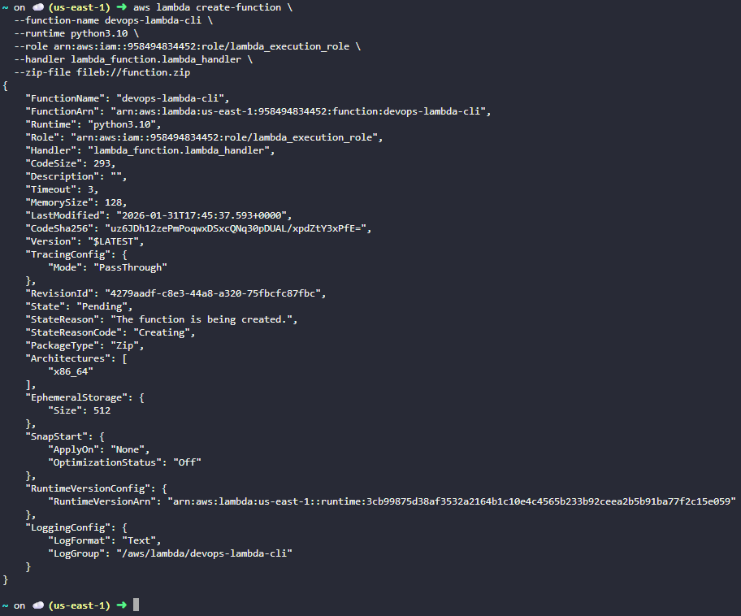

6. Verified the Lambda function creation using AWS CLI.

   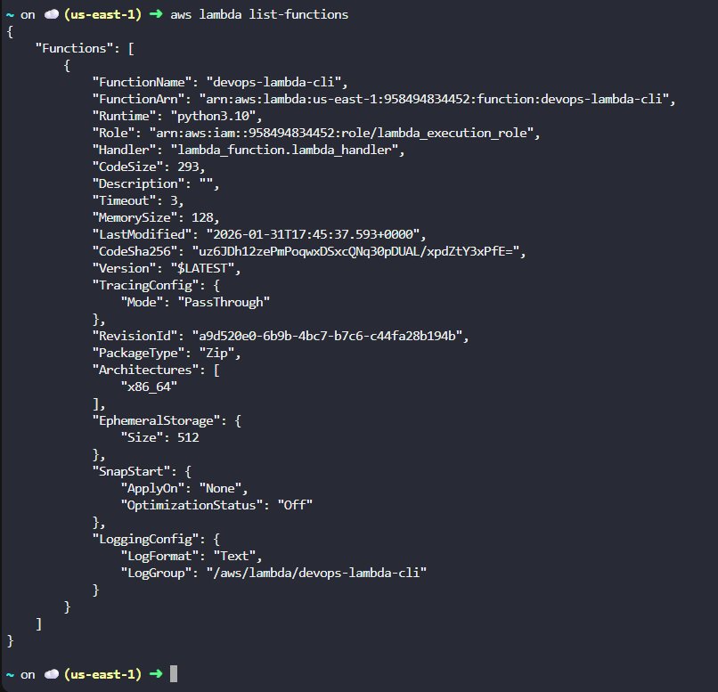

7. Retrieved Lambda configuration details to confirm:
   - Runtime is Python
   - Correct handler is set
   - IAM role is attached

   

8. Executed the Lambda function:

   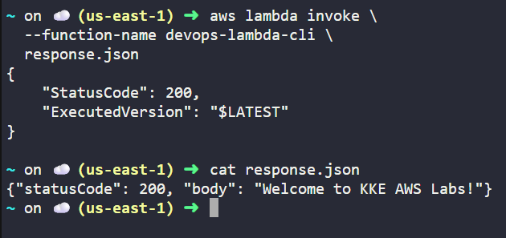

---

## Verification
The following confirms successful completion of the task:

- Lambda function **`devops-lambda-cli`** exists  
  
  

- Runtime is set to **Python**  
  
  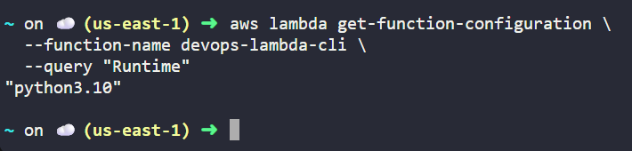

- IAM role **`lambda_execution_role`** is attached  
  
  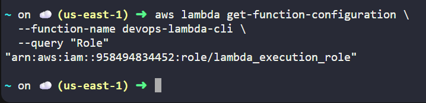

- Successfully executed **`devops-lambda-cli`** lambda function and got desired output
  
   

---

## Outcome
The Lambda function was successfully deployed using **AWS CLI only**, without any access to the AWS Management Console. The function configuration meets all task requirements and is ready for invocation.

---

## Key Takeaways
- AWS CLI enables full Lambda lifecycle management
- ZIP-based deployment is widely used in automation
- IAM roles must exist before Lambda creation
- Console access is not mandatory for serverless deployments

---

## Status

**Status:** Completed 
