# Day 39 – Host a Static Website Using Amazon S3

## Task Overview
As part of the **100 Days of Cloud (AWS)** challenge by **KodeKloud**, this task focuses on hosting a **static website** using **Amazon S3**.

The objective was to create an **S3 bucket**, configure it for **static website hosting**, allow **public access**, upload an `index.html` file from the aws-client host, and verify that the website is accessible via the **S3 website endpoint**.

---

## Concept
This task demonstrates how Amazon S3 can be used as a **serverless web hosting platform** for static content.

Key concepts involved:
- Amazon S3 bucket creation
- Static website hosting configuration
- Public access permissions
- Bucket policies
- Hosting HTML content without servers

---

## Real-World Use Case
Hosting static websites on S3 is commonly used for:
- Company landing pages
- Documentation portals
- Personal blogs
- Error pages for applications
- Lightweight public websites with low cost and high availability

---

## Requirements
- **AWS Region:** `us-east-1`
- **S3 Bucket Name:** `devops-web-328`
- **Index Document:** `index.html`
- **Source File Location:** `/root/index.html` (aws-client host)
- **Public Access:** Enabled
- **Website Access:** Via S3 website URL

---

## AWS Services Used
- Amazon S3
- AWS CLI

---

## Steps Performed

### 1. Navigated to Amazon S3
Logged in to the AWS Management Console and navigated to the **Amazon S3** service.

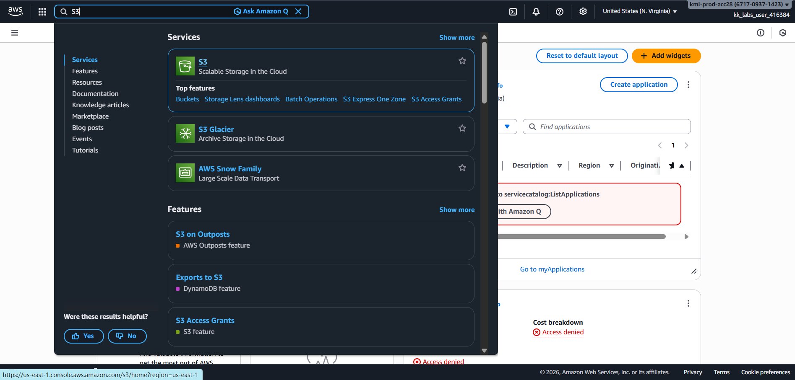

---

### 2. Created an S3 Bucket
Clicked **Create bucket** and selected:
- Bucket type: **General purpose**
- Bucket name: `devops-web-328`

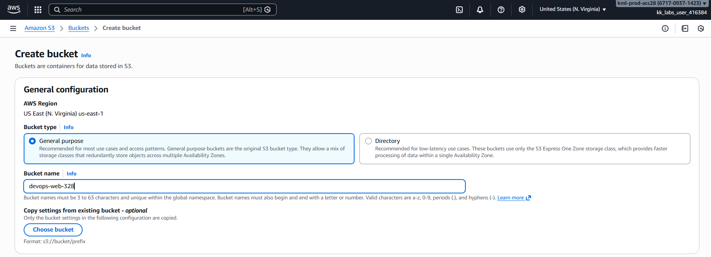

Disabled **Block all public access** to allow public website hosting.

Successfully created the bucket.

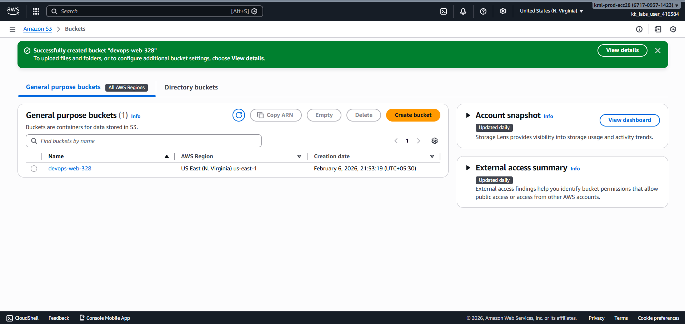

---

### 3. Enabled Static Website Hosting
Navigated to the **Properties** tab of the bucket.

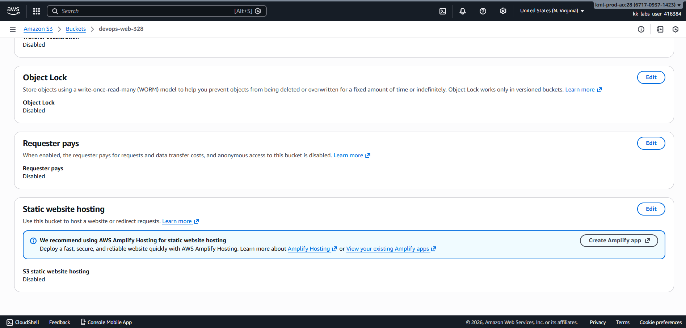

Edited **Static website hosting** settings and enabled it with:
- Index document: `index.html`

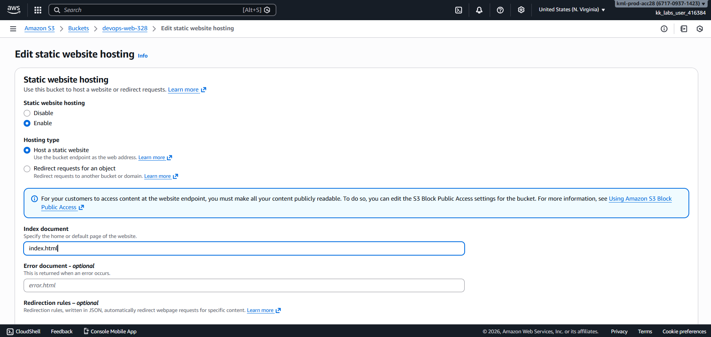

Verified the static website configuration and copied the **bucket website endpoint**.

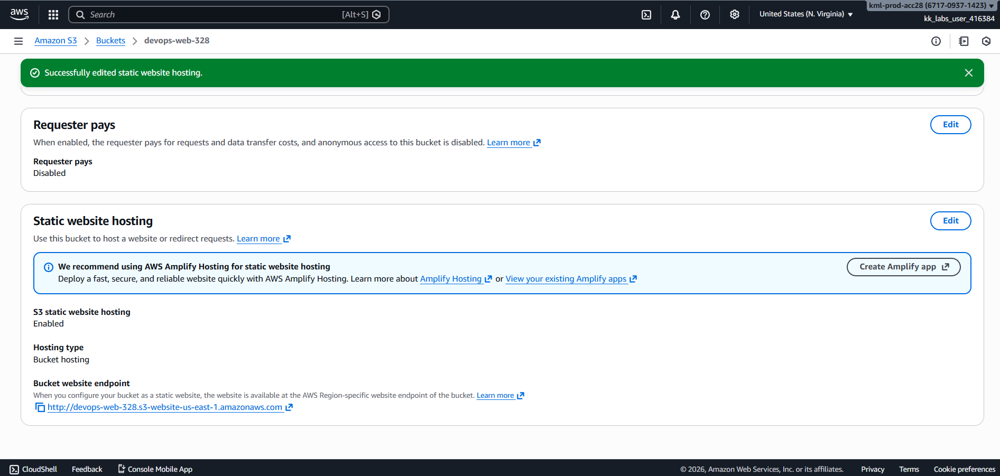

---

### 4. Configured Bucket Policy for Public Access
Navigated to the **Permissions** tab and edited the bucket policy to allow public read access.

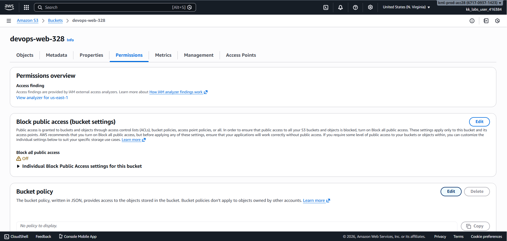

Added a policy allowing `s3:GetObject` on all objects in the bucket.

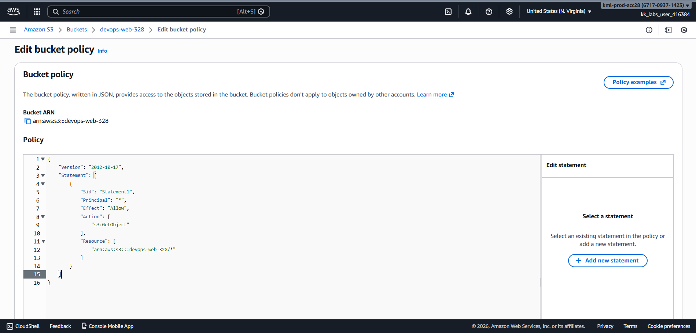

---

### 5. Uploaded index.html File
Copied the `index.html` file from `/root/` directory of the aws-client host to the S3 bucket.

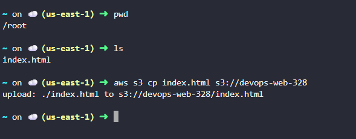

Verified that the file was successfully uploaded.

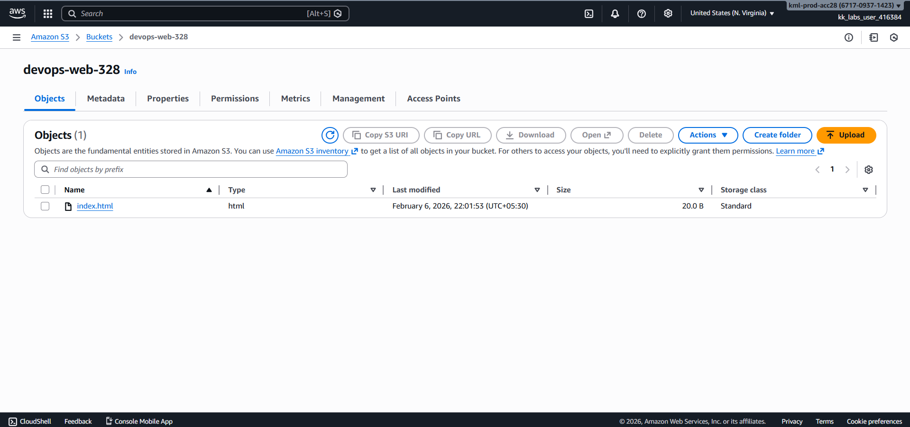

---

## Verification
The following steps confirm successful completion of the task:

- S3 bucket `devops-web-328` created successfully.

  

- Static website hosting enabled with `index.html` as the index document.

  

- Public bucket policy applied allowing read access.

  

- `index.html` file uploaded successfully to the bucket.

  

- Website accessible via S3 website endpoint and displaying expected content.

  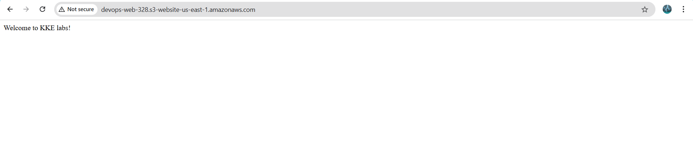

---

## Outcome
A static website was successfully hosted using **Amazon S3**, making the content publicly accessible without using any servers or compute services.

---

## Learnings
- S3 can host static websites efficiently
- Public access must be explicitly allowed
- Bucket policies control object-level permissions
- Static website hosting is cost-effective and highly available
- S3 website endpoints differ from standard S3 object URLs

---

**Status:** Completed
