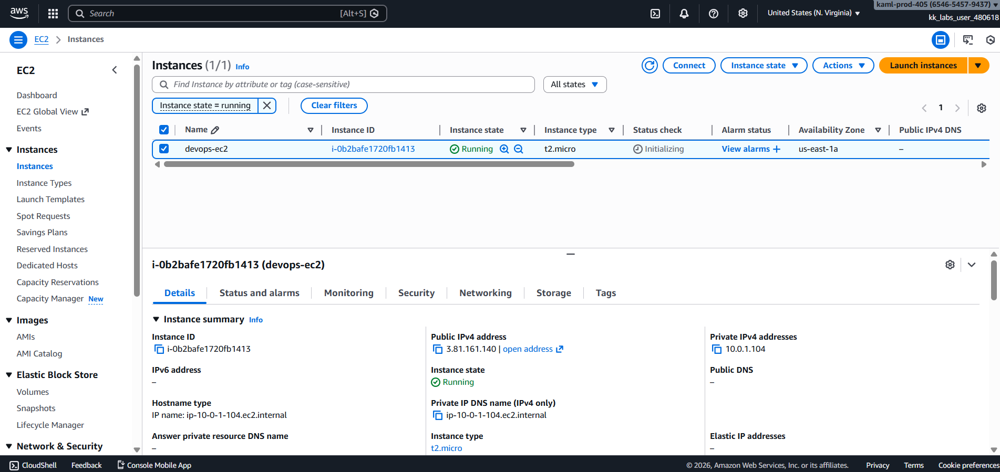
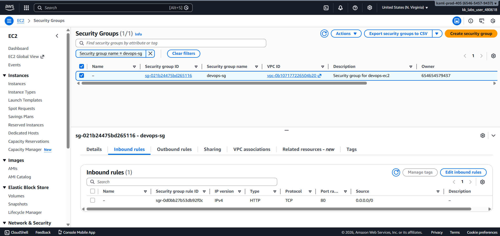
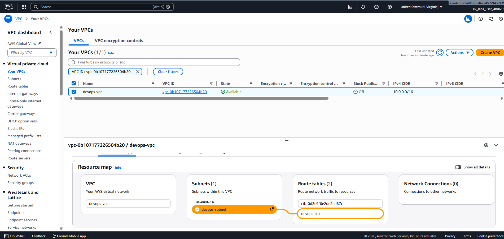
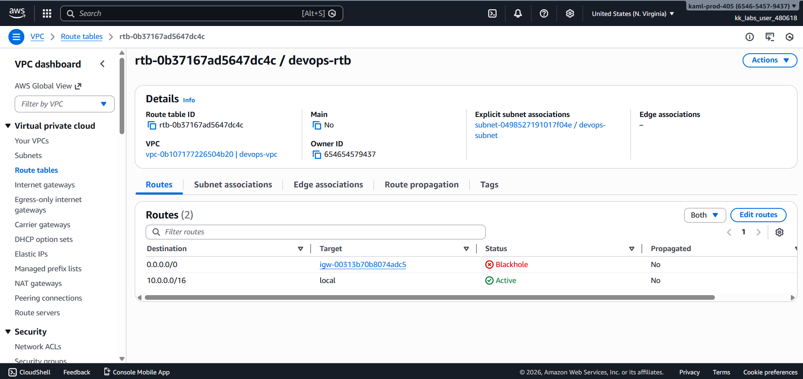
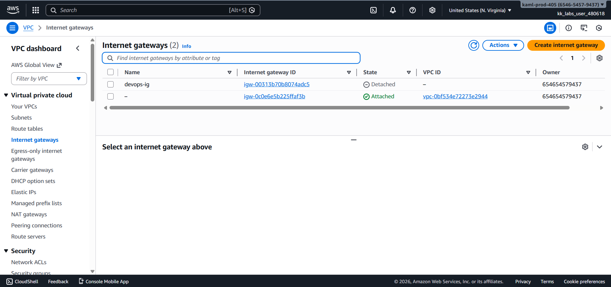
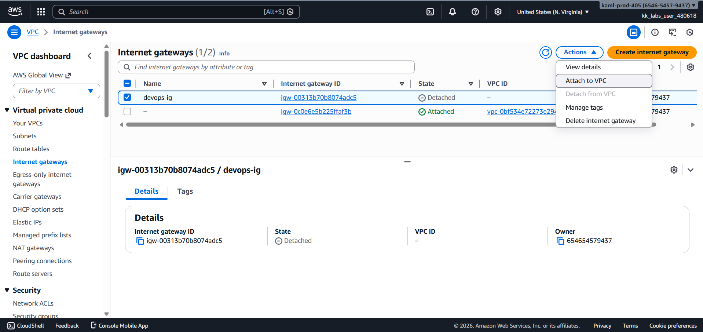
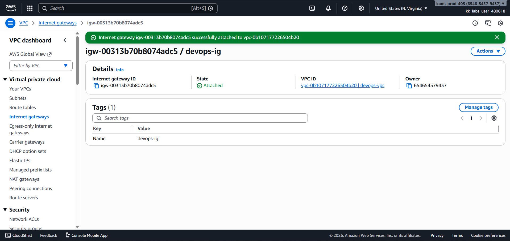
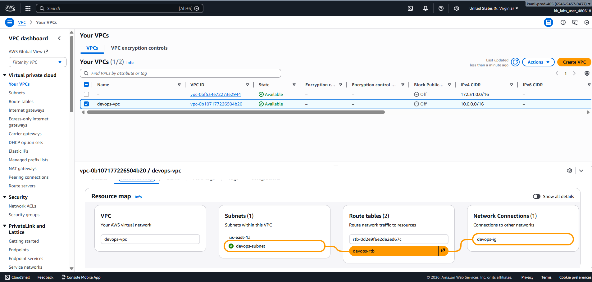
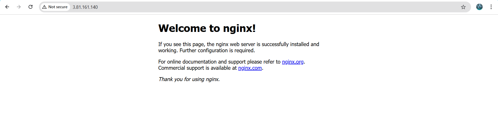

# Day 40 – Troubleshooting Internet Access for an EC2 Instance in a Public VPC

## Task Overview
As part of the **100 Days of Cloud (AWS)** challenge by **KodeKloud**, this task focuses on **troubleshooting and resolving internet connectivity issues** for a web application hosted on an **EC2 instance**.

The Nautilus Development Team deployed an **Nginx-based web application** on an EC2 instance named `devops-ec2` inside a public VPC called `devops-vpc`.  
Although the **security group** allowed inbound HTTP traffic on **port 80**, the application was **not accessible from the internet**.

The goal was to **verify the VPC configuration**, identify the networking issue, and ensure the application became publicly accessible.

---

## Concept
This task highlights how **AWS VPC networking components** must be correctly configured to allow internet access.

Key concepts involved:
- Public VPC and subnet design
- Internet Gateway (IGW)
- Route Tables and default routes
- Blackhole route troubleshooting
- EC2 internet accessibility

---

## Real-World Use Case
In real-world environments, applications may become unreachable due to:
- Detached Internet Gateways
- Misconfigured route tables
- False assumption that a subnet is public
- Over-reliance on security groups alone

This task reflects a common **production outage scenario** faced by DevOps and Cloud engineers.

---

## Requirements
- **VPC Name:** `devops-vpc`
- **EC2 Instance:** `devops-ec2`
- **Security Group:** `devops-sg`
- **Web Server:** Nginx
- **Port:** 80 (HTTP)
- **Internet Gateway:** `devops-ig`
- **Route Table:** `devops-rtb`

---

## AWS Services Used
- Amazon EC2
- Amazon VPC
- Internet Gateway
- Route Tables
- Security Groups

---

## Steps Performed

### 1. Navigated to Amazon EC2
Opened the AWS Management Console and navigated to the **EC2** service.

---

### 2. Verified EC2 Instance Status
Confirmed that `devops-ec2` was in the **running** state.  
Attempted to access its **public IPv4 address**, which resulted in a timeout.

---

### 3. Verified Security Group Rules
Checked the security group `devops-sg` associated with the instance and verified:
- Inbound rule allowing **HTTP (port 80)**
- Source set to **Anywhere (0.0.0.0/0)**

---

### 4. Inspected VPC Resource Map
Viewed the resource map for `devops-vpc` and noticed:
- `devops-subnet` was associated with `devops-rtb`
- The route table showed **no active network connections**

---

### 5. Checked Route Table Status
Opened `devops-rtb` and found that:
- The default route to the Internet Gateway was in **blackhole** state

---

### 6. Verified Internet Gateway State
Navigated to Internet Gateways and observed that `devops-ig` was **detached**.

---

### 7. Attached Internet Gateway to VPC
Attached `devops-ig` to `devops-vpc` using **Actions → Attach to VPC**.

---

### 8. Confirmed Internet Gateway Attachment
Verified that the Internet Gateway status changed to **Attached**.

---

### 9. Validated Updated VPC Resource Map
Rechecked the VPC resource map and confirmed:
- `devops-rtb` now had an **active connection** to `devops-ig`

---

### 10. Verified Application Accessibility
Accessed the public IPv4 address of `devops-ec2` and successfully received the **Nginx welcome page**.

---

## Verification
The following checks confirm successful completion of the task:

- Security group `devops-sg` allowed inbound HTTP traffic on port 80.

  

- Internet Gateway `devops-ig` was successfully attached to `devops-vpc`.

  

- Route table `devops-rtb` showed an active route to the Internet Gateway.

  

- EC2 instance `devops-ec2` was accessible from the internet and displayed the Nginx welcome page.

  

---

## Outcome
The issue was resolved by attaching the **Internet Gateway** to the VPC, which restored proper routing and allowed the EC2 instance to serve traffic publicly on **port 80**.

---

## Learnings
- Internet access requires correct VPC routing, not just security groups
- A detached IGW results in blackhole routes
- Public subnets must have an active IGW route
- VPC resource maps simplify troubleshooting
- Always verify networking components end-to-end

---

**Status:** Completed
