# Day 41 – Encrypting and Decrypting Sensitive Data Using AWS KMS

## Task Overview
As part of the **100 Days of Cloud (AWS)** challenge by **KodeKloud**, this task focuses on **securing sensitive data using AWS Key Management Service (KMS)**.

The Nautilus DevOps team aimed to improve data security by creating a **customer-managed KMS key** and using it to **encrypt and decrypt a sensitive file** stored on an EC2 instance.  
The task also required validating that encrypted data could be safely decrypted back to its original form using the same KMS key.

---

## Concept
This task demonstrates how **AWS KMS** enables secure data encryption and controlled access to cryptographic keys.

Key concepts involved:
- Symmetric encryption using AWS KMS
- Customer-managed KMS keys
- Key aliases and key policies
- Encryption and decryption workflows
- Data integrity verification after decryption

---

## Real-World Use Case
In production environments, sensitive data such as:
- Configuration secrets
- Credentials
- Customer records
- Internal reports

must be encrypted at rest and decrypted only by authorized entities.  
AWS KMS is widely used to meet **security, compliance, and audit requirements** while centralizing encryption key management.

---

## Requirements
- **KMS Key Type:** Symmetric
- **Key Usage:** Encrypt and Decrypt
- **Key Alias:** `devops-KMS-Key`
- **Sensitive File:** `SensitiveData.txt`
- **Encrypted Output:** `EncryptedData.bin`
- **Region:** us-east-1

---

## AWS Services Used
- AWS Key Management Service (KMS)
- AWS CLI

---

## Steps Performed

### 1. Navigated to AWS KMS
Opened the AWS Management Console and navigated to **Key Management Service (KMS)**.

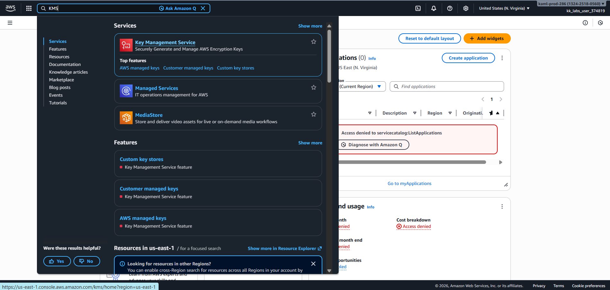

---

### 2. Initiated Key Creation
Moved to **Customer managed keys** and clicked on **Create key**.

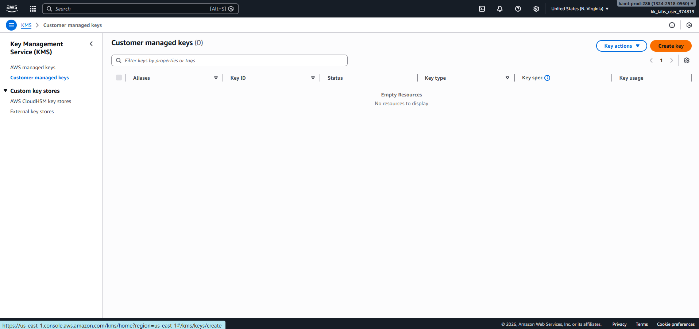

---

### 3. Configured Key Type and Usage
Selected:
- **Key type:** Symmetric  
- **Key usage:** Encrypt and Decrypt  

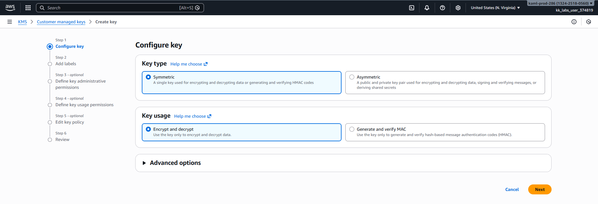

---

### 4. Added Key Alias
Assigned the alias **`devops-KMS-Key`** to the KMS key.

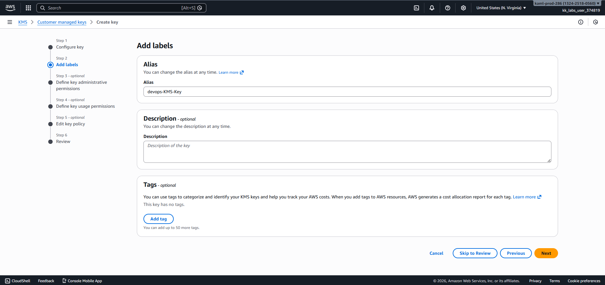

---

### 5. Assigned Key Administrator
Configured **kk_labs_user_374819** as the key administrator.

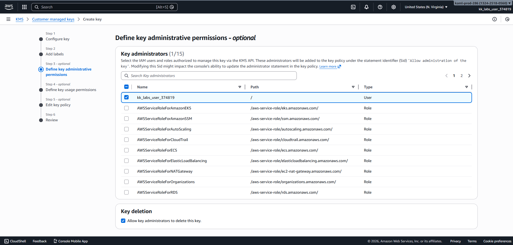

---

### 6. Assigned Key Users
Granted **kk_labs_user_374819** permission to use the key for encryption and decryption.

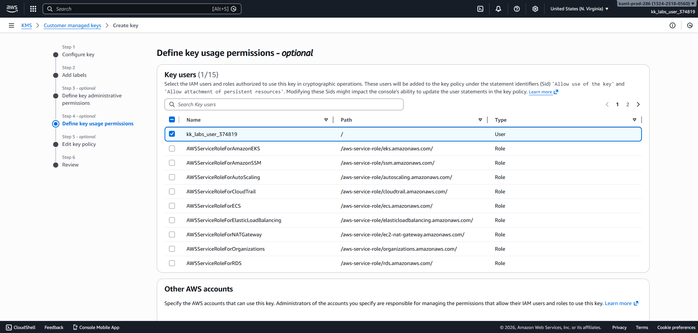

---

### 7. Reviewed Key Policy
Reviewed the automatically generated key policy before proceeding.

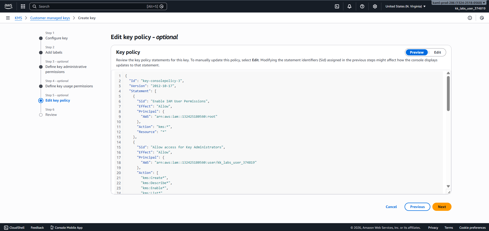

---

### 8. Reviewed and Created Key
Reviewed all configurations and completed the key creation process.

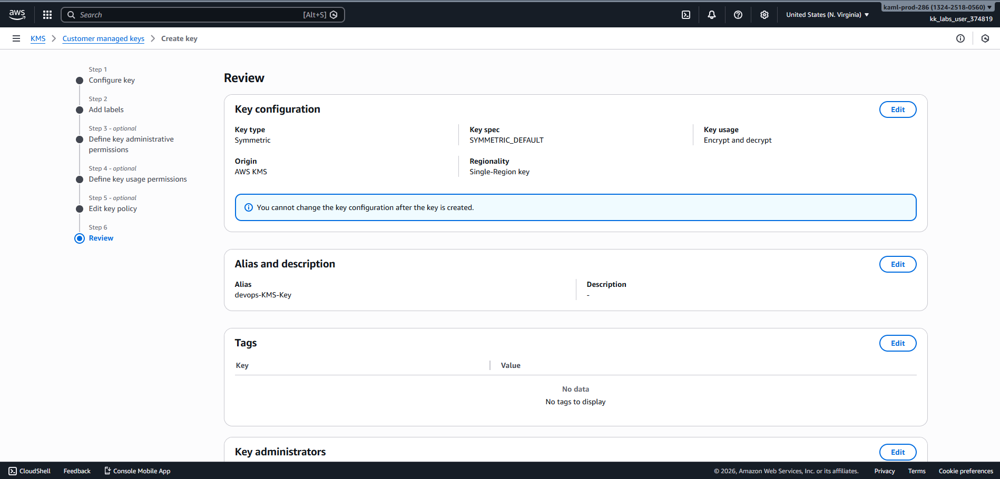

---

### 9. Verified KMS Key Creation
Confirmed that the KMS key was created successfully.

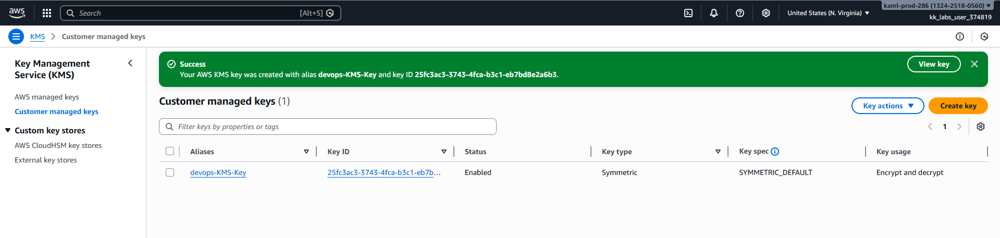

---

### 10. Encrypted Sensitive Data
Verified the existence and contents of `SensitiveData.txt` and encrypted it using the KMS key.  
The encrypted, base64-encoded output was saved as `EncryptedData.bin`.

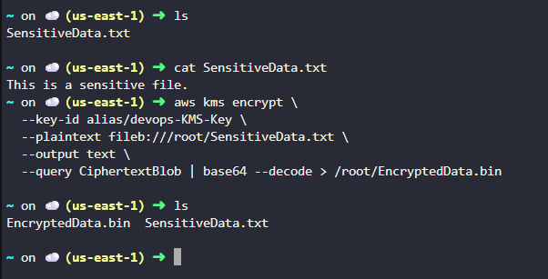

---

### 11. Decrypted Encrypted File
Decrypted `EncryptedData.bin` and generated `DecryptedData.txt`.

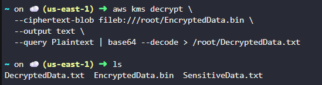

---

### 12. Verified Data Integrity
Compared the original and decrypted files to confirm data integrity.

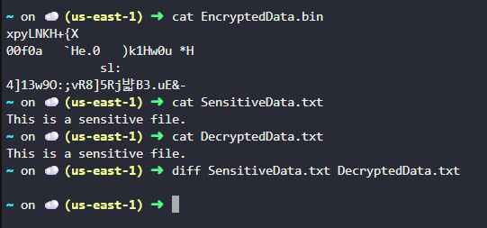

---

## Verification
The following validations confirm successful task completion:

- KMS key `devops-KMS-Key` was created successfully

    

- Sensitive data was encrypted using AWS KMS

  

- Encrypted data was decrypted using the same key

  

- Decrypted content matched the original file

  

---

## Outcome
The task successfully demonstrated **secure encryption and decryption of sensitive data using AWS KMS**, ensuring correct key configuration and access control.

---

## Learnings
- AWS KMS provides centralized and secure encryption key management
- Symmetric keys are commonly used for application-level encryption
- Proper key policies are essential for secure access
- AWS CLI simplifies interaction with encryption services
- Official AWS documentation is crucial when working with KMS encryption workflows

---

**Status:** Completed
