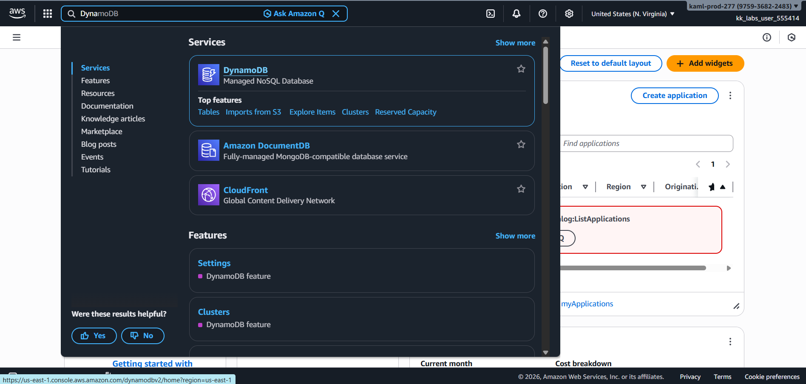
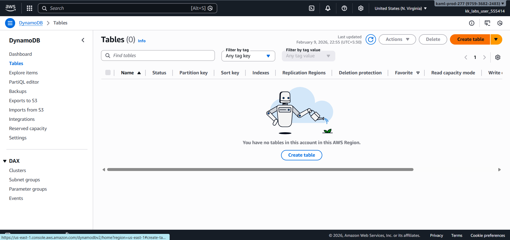
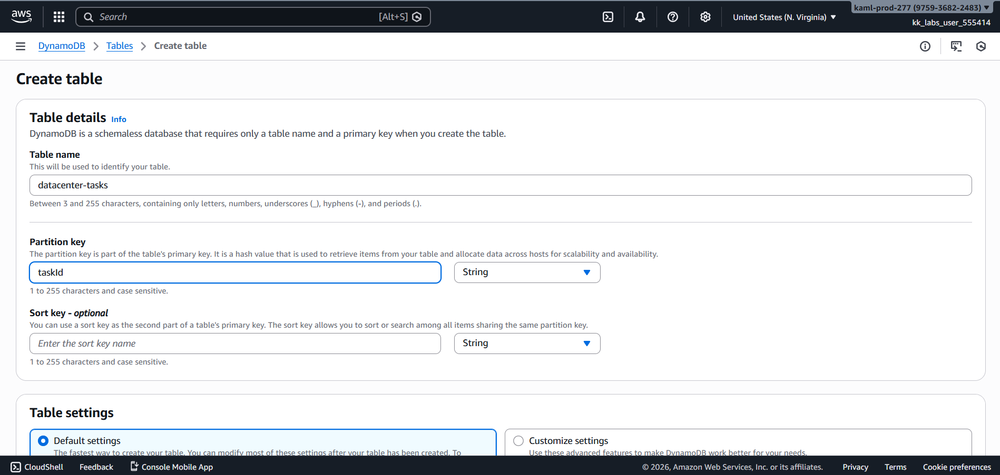
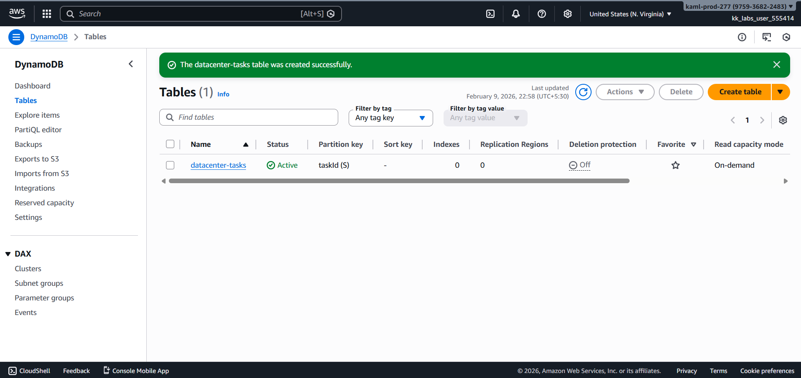
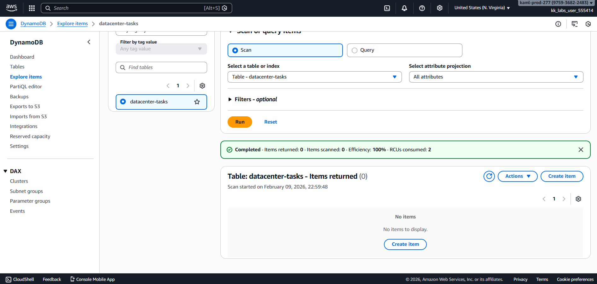
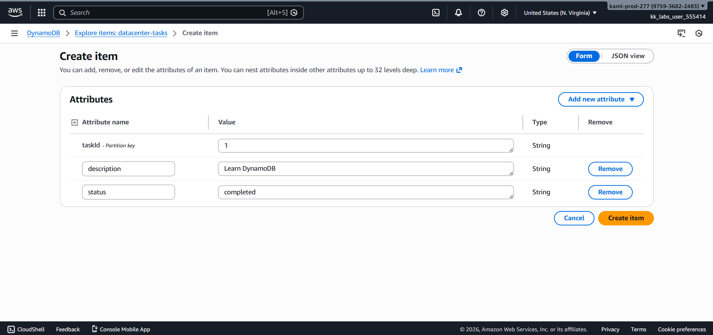
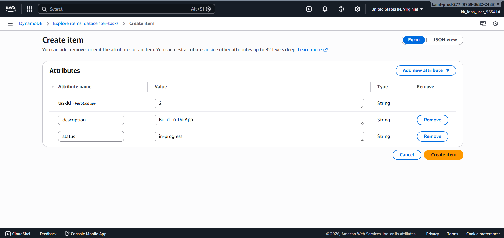
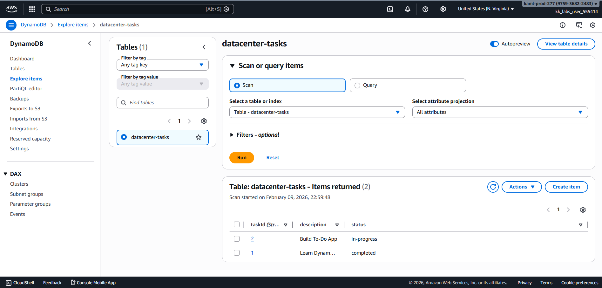

# Day 42 – Building a To-Do Application Backend Using Amazon DynamoDB

## Task Overview
As part of the **100 Days of Cloud (AWS)** challenge by **KodeKloud**, this task focuses on using **Amazon DynamoDB** to store and manage application data.

The Nautilus DevOps team is developing a simple **To-Do application** where tasks are stored in a DynamoDB table.  
Each task is identified by a unique task ID and contains a description and a status indicating its progress.

The goal was to create a DynamoDB table, insert tasks into it, and verify that the data was stored correctly.

---

## Concept
This task demonstrates how **Amazon DynamoDB**, a fully managed NoSQL database service, can be used to store and retrieve structured application data with low latency and high scalability.

Key concepts involved:
- DynamoDB tables and items
- Partition keys
- Attribute definitions
- Item creation and verification
- Status-based task tracking

---

## Real-World Use Case
DynamoDB is commonly used in real-world applications such as:
- To-do and task management apps
- User profile storage
- Session management
- Serverless application backends

Its scalability and managed nature make it ideal for applications that require fast and reliable data access without managing servers.

---

## Requirements
- **Table Name:** `datacenter-tasks`
- **Primary Key:** `taskId` (String)
- **Attributes:**
  - description (String)
  - status (String)
- **Tasks Inserted:**
  - Task 1: Learn DynamoDB – completed
  - Task 2: Build To-Do App – in-progress

---

## AWS Services Used
- Amazon DynamoDB

---

## Steps Performed

### 1. Navigated to Amazon DynamoDB
Opened the AWS Management Console and navigated to the **DynamoDB** service.

---

### 2. Initiated Table Creation
Went to **Tables** and clicked on **Create table**.

---

### 3. Configured Table Details
Provided the following details:
- **Table name:** `datacenter-tasks`
- **Partition key:** `taskId`
- **Key type:** String  

Kept all other settings as default and proceeded to create the table.

---

### 4. Verified Table Creation
Confirmed that the DynamoDB table was created successfully and appeared in the tables list.

---

### 5. Opened Explore Items
Opened the **Explore items** section for the `datacenter-tasks` table and clicked on **Create item**.

---

### 6. Inserted Task 1
Created the first item with:
- **taskId:** 1  
- **description:** Learn DynamoDB  
- **status:** completed  

---

### 7. Inserted Task 2
Created the second item with:
- **taskId:** 2  
- **description:** Build To-Do App  
- **status:** in-progress  

---

### 8. Verified Inserted Items
Verified that both tasks were present in the table with the correct descriptions and statuses.

---

## Verification
The following validations confirm successful task completion:

- DynamoDB table `datacenter-tasks` was created successfully

  

- Task 1 was stored with status **completed**

  

- Task 2 was stored with status **in-progress**

  

- Both items were visible and correctly stored in the table

  

---

## Outcome
The task successfully demonstrated how to create a DynamoDB table, insert items, and verify stored data, forming the backend foundation for a simple **To-Do application**.

---

## Learnings
- DynamoDB uses partition keys to uniquely identify items
- NoSQL databases are well-suited for flexible application data
- DynamoDB provides fast, scalable, and fully managed storage
- The AWS Console simplifies table and item management
- Proper data modeling is essential for efficient NoSQL design

---

**Status:** Completed
