# Day 43 – Creating a Private Amazon EKS Cluster with Custom Configuration

## Task Overview
As part of the **100 Days of Cloud (AWS)** challenge by **KodeKloud**, this task focuses on provisioning a secure and highly available **Amazon EKS (Elastic Kubernetes Service)** cluster.

The Nautilus DevOps team is preparing infrastructure for a Kubernetes-based application. The requirement was to create an EKS cluster using the **latest stable Kubernetes version**, restrict external exposure by keeping the **cluster endpoint private**, and deploy the cluster in the **default VPC** across multiple availability zones for high availability.

---

## Concept
This task highlights how **Amazon EKS** enables organizations to run Kubernetes clusters securely and reliably without managing the control plane infrastructure.

Key concepts involved:
- Amazon EKS cluster creation
- Custom cluster configuration
- IAM roles for EKS
- Kubernetes version selection
- Private cluster endpoint access
- Multi-AZ high availability
- Managed EKS add-ons

---

## Real-World Use Case
In real-world production environments:
- Kubernetes control planes are often kept private for security reasons
- Clusters are deployed across multiple availability zones for fault tolerance
- IAM roles are used to securely grant permissions to AWS-managed services

This setup reflects **enterprise-grade Kubernetes deployments** where security, scalability, and reliability are critical.

---

## Requirements
- **Cluster Name:** `xfusion-eks`
- **Cluster Configuration:** Custom
- **IAM Role:** `eksClusterRole`
- **Kubernetes Version:** 1.30
- **VPC:** Default VPC
- **Availability Zones:** a, b, c
- **Cluster Endpoint Access:** Private
- **EKS Auto Mode:** Disabled

---

## AWS Services Used
- Amazon Elastic Kubernetes Service (EKS)
- AWS Identity and Access Management (IAM)

---

## Steps Performed

### 1. Navigated to Amazon EKS
Opened the AWS Management Console and navigated to **Elastic Kubernetes Service (EKS)**.

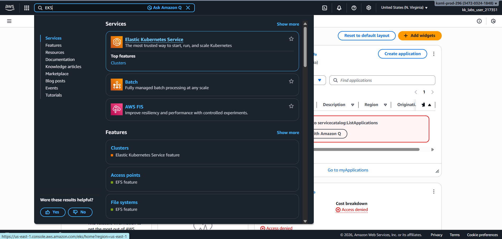

---

### 2. Initiated Cluster Creation
Navigated to **Clusters** and clicked on **Create cluster**.

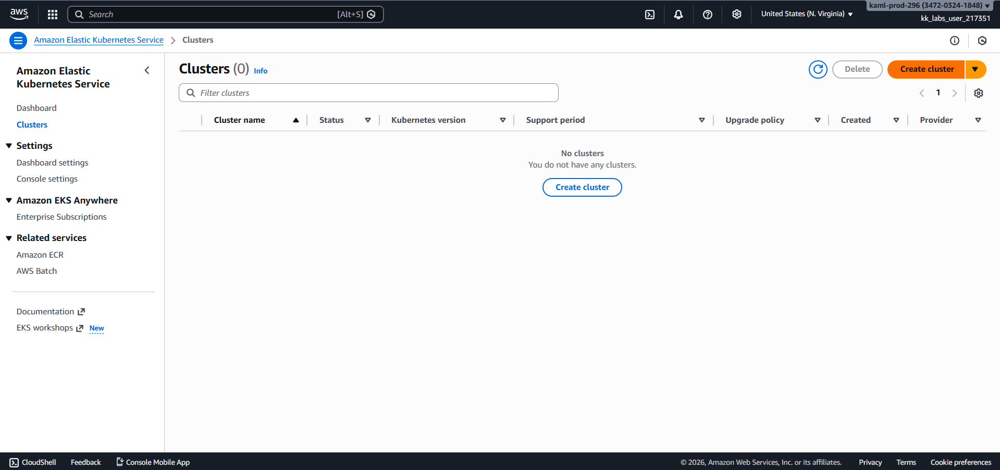

---

### 3. Selected Custom Configuration
Chose **Custom configuration**, disabled **EKS Auto Mode**, and provided the cluster name as `xfusion-eks`.

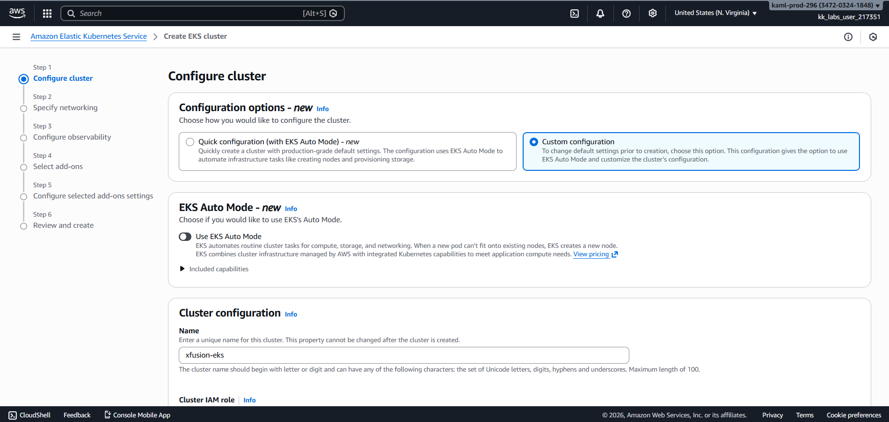

---

### 4. Started IAM Role Creation
Clicked on **Create IAM role** to define permissions for the EKS cluster.

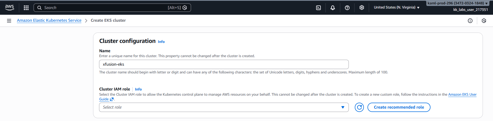

---

### 5. Selected Trusted Entity
Selected **AWS Service** as the trusted entity and chose **EKS** with the use case **EKS-Cluster**.

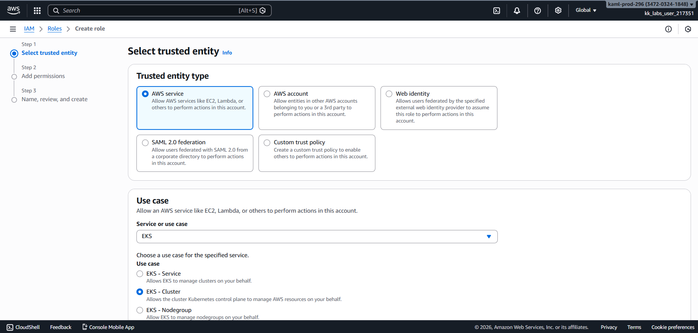

---

### 6. Attached Required Policy
Attached the **AmazonEKSClusterPolicy** permission policy to the role.

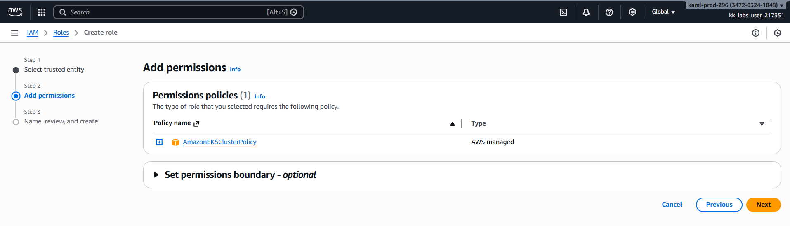

---

### 7. Named the IAM Role
Provided the role name as `eksClusterRole` along with a suitable description.

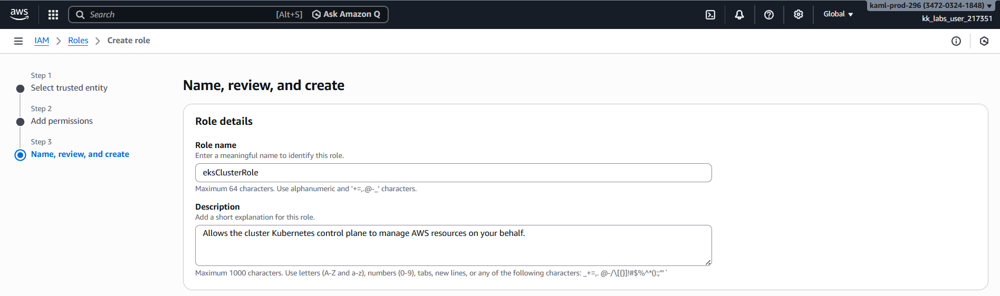

---

### 8. Verified IAM Role Creation
Confirmed that the IAM role `eksClusterRole` was created successfully.

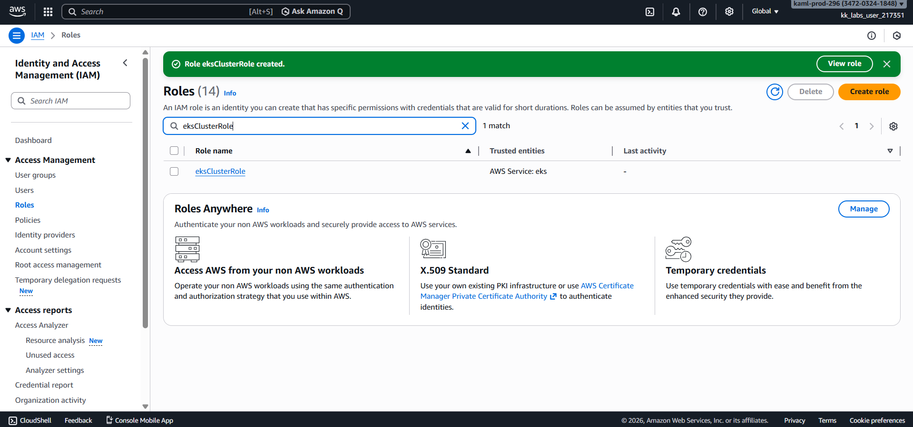

---

### 9. Selected Cluster IAM Role
Returned to the EKS cluster creation wizard and selected **eksClusterRole** as the cluster IAM role.

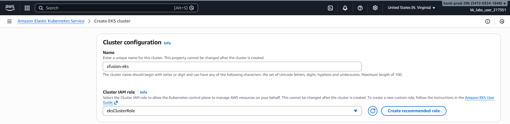

---

### 10. Selected Kubernetes Version
Chose **Kubernetes version 1.30**, as mentioned in the instructions.

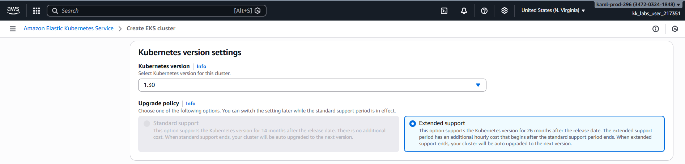

---

### 11. Configured Network Settings
Under network configuration, retained only the subnets belonging to **availability zones a, b, and c**.

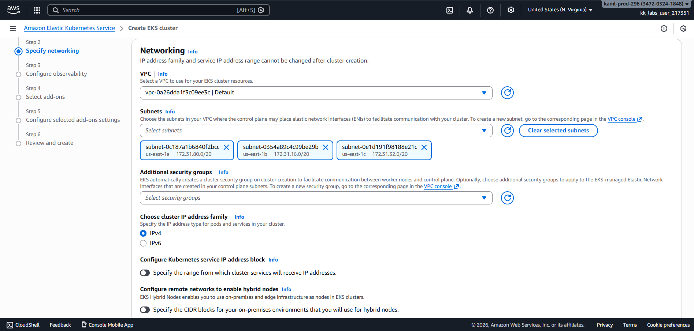

---

### 12. Set Cluster Endpoint Access
Configured the cluster endpoint access to **Private** to restrict public exposure.

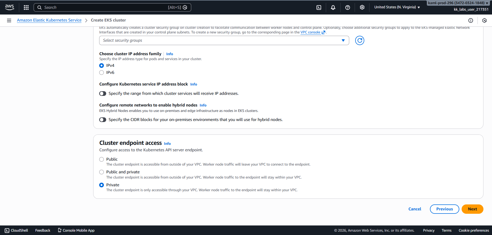

---

### 13. Configured Add-ons
Deselected all add-ons except:
- kube-proxy
- CoreDNS
- AWS VPC CNI

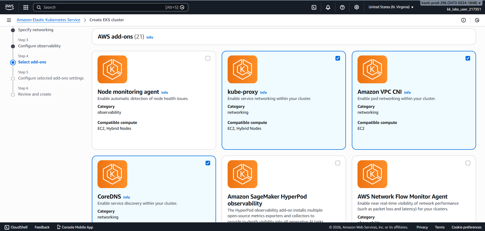

---

### 14. Reviewed and Created Cluster
Reviewed all cluster details and initiated cluster creation.

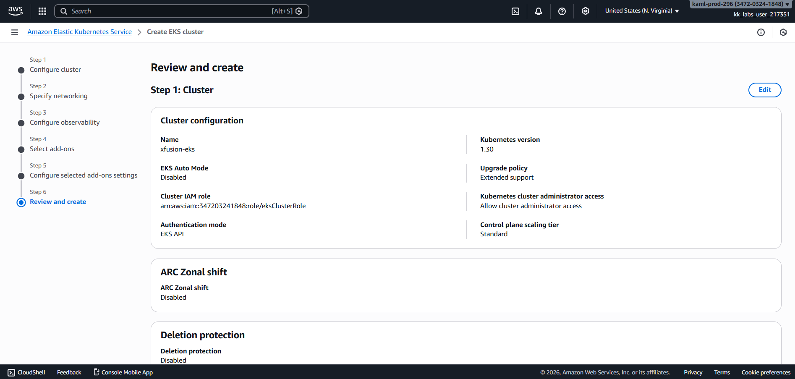

---

### 15. Verified Cluster Status
Confirmed that the EKS cluster `xfusion-eks` was created successfully and reached the **Active** state.

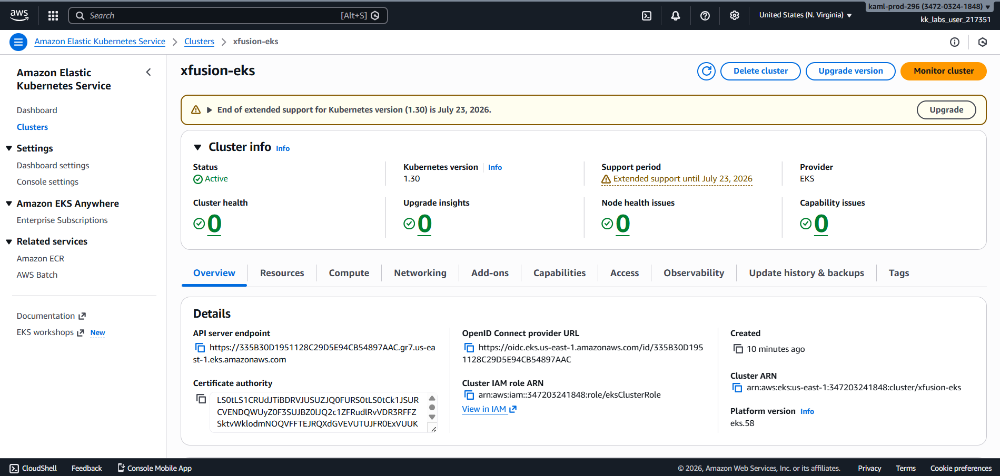

---

## Verification
The following validations confirm successful task completion:

- EKS cluster `xfusion-eks` was created successfully

  

- Cluster endpoint access was set to **Private**

  

- Cluster was deployed across multiple availability zones

  

- Correct IAM role `eksClusterRole` was attached to the cluster

  

---

## Outcome
The task successfully provisioned a **secure, private, and highly available Amazon EKS cluster** using a custom configuration, meeting all internal security and scalability requirements.

---

## Learnings
- Custom EKS configuration provides greater control over security settings
- Private cluster endpoints reduce external attack surfaces
- IAM roles are mandatory for EKS control plane operations
- Multi-AZ deployments improve fault tolerance
- Choosing the latest Kubernetes version ensures access to new features and security updates

---

**Status:** Completed
