# Day 47 – Implementing Priority Queuing Using SQS, SNS, Lambda and CloudFormation

## Task Overview
As part of the **100 Days of Cloud (AWS)** challenge by **KodeKloud**, this task focuses on implementing a priority-based message processing system using Amazon SQS, Amazon SNS, AWS Lambda, and AWS CloudFormation.

The Nautilus DevOps team required an Infrastructure as Code solution that:

- Creates two SQS queues for different priorities  
- Creates an SNS topic for publishing messages  
- Deploys a Lambda function to consume messages  
- Uses an IAM role to grant required permissions  
- Ensures high-priority messages are processed before low-priority messages  

The CloudFormation template was created at:

/root/nautilus-priority-stack.yml  

Stack Name: nautilus-priority-stack  

---

## Concept

This task demonstrates:

- Infrastructure as Code (IaC) using CloudFormation  
- Event-driven architecture with SNS and SQS  
- Priority-based message handling  
- Serverless compute using Lambda  
- Secure IAM role-based permissions  

The architecture ensures high-priority messages are always processed before low-priority ones.

---

## Real-World Use Case

In real production environments:

- Critical alerts must be processed before background jobs  
- Payment transactions take priority over reporting tasks  
- Security incidents must be handled before informational logs  

Priority queuing ensures intelligent workload handling and faster response to critical events.

---

## Requirements

- Stack Name: `nautilus-priority-stack`  
- SQS Queues:
  - `nautilus-High-Priority-Queue`
  - `nautilus-Low-Priority-Queue`
- SNS Topic: `nautilus-Priority-Queues-Topic`
- Lambda Function: `nautilus-priorities-queue-function`
- IAM Role: `lambda_execution_role`
- Lambda Code Location: `/root/index.py`
- CloudFormation Template Path: `/root/nautilus-priority-stack.yml`

---

## AWS Services Used

- AWS CloudFormation  
- Amazon SNS  
- Amazon SQS  
- AWS Lambda  
- AWS IAM  
- Amazon S3  

---

# Steps Performed

---

## CloudFormation Template Preparation

### 1. Created CloudFormation Template File
Created the file `nautilus-priority-stack.yml` inside the `/root` directory and verified its existence.

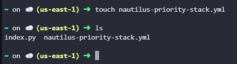

---

### 2. Prepared Resource Definitions
Created a separate YAML file containing all required resource definitions including:

- High Priority SQS Queue  
- Low Priority SQS Queue  
- SNS Topic and subscriptions
- Queue Policies 
- IAM Role with necessary permissions  
- Lambda Function

YAML file : [nautilus-priority-stack](./nautilus-priority-stack.yaml)

---

### 3. Opened Main Template File
Edited `nautilus-priority-stack.yml` to insert the prepared CloudFormation configuration.

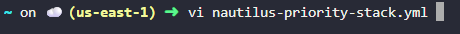

---

### 4. Pasted Configuration into Template
Copied the complete resource configuration into `nautilus-priority-stack.yml` and saved the file.

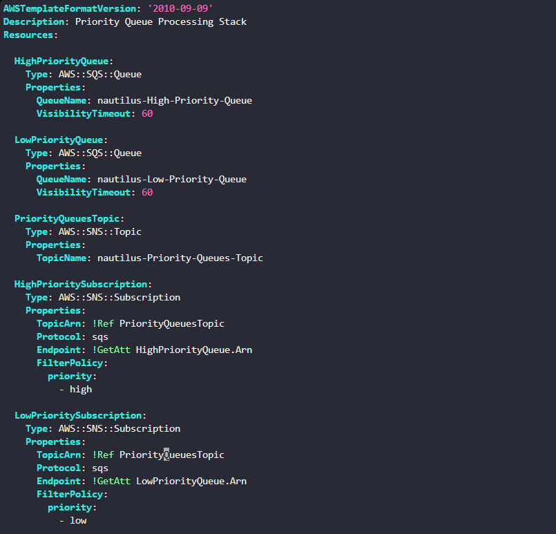

---

### 5. Verified Template Content
Verified the updated template content to ensure correctness before deployment.

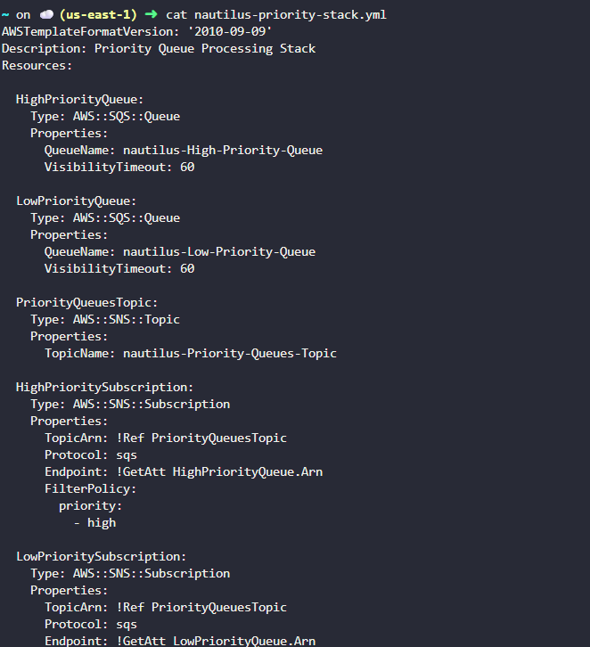

---

## Lambda Deployment Preparation

### 6. Created S3 Bucket for Lambda Code
Created a new S3 bucket to upload the Lambda deployment package.

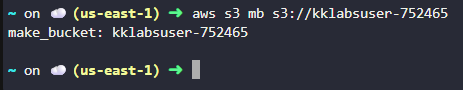

---

### 7. Packaged Lambda Code
Compressed the provided `index.py` file into a zip archive for Lambda deployment.

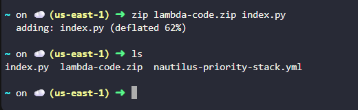

---

### 8. Uploaded Lambda Package to S3
Uploaded the Lambda zip file to the newly created S3 bucket and verified the upload.

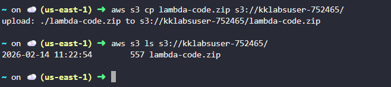

---

## CloudFormation Stack Deployment

### 9. Created CloudFormation Stack
Deployed the stack using the `nautilus-priority-stack.yml` template and specified the stack name as `nautilus-priority-stack`.

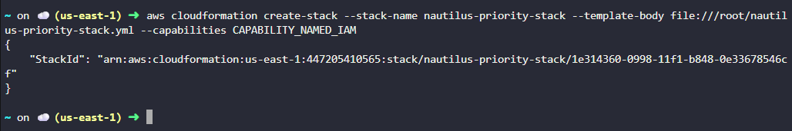

---

### 10. Navigated to CloudFormation Console
Opened AWS Console → Services → CloudFormation.

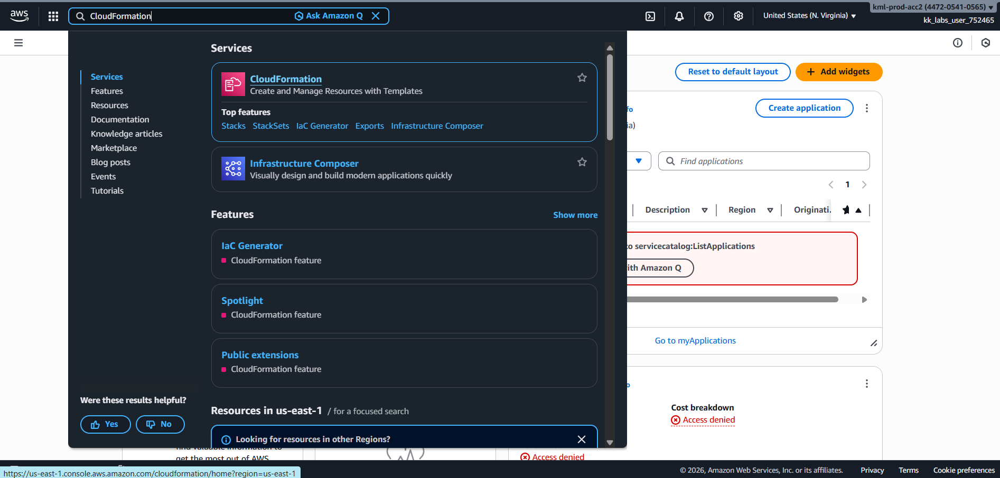

---

### 11. Verified Stack Status
Confirmed that the stack status displayed **CREATE_COMPLETE**.

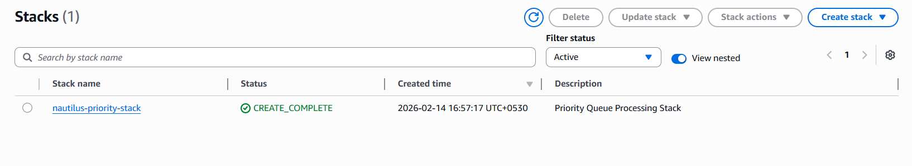

---

### 12. Verified Created Resources
Under the **Resources tab**, verified creation of all the resources

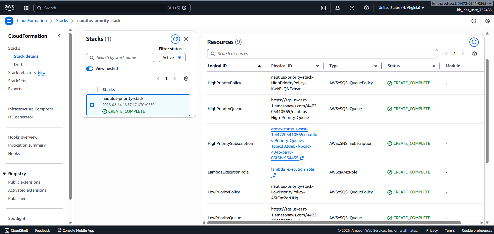

---

### 13. Verified Lambda Function Creation
Navigated to the created Lambda function and confirmed successful deployment.

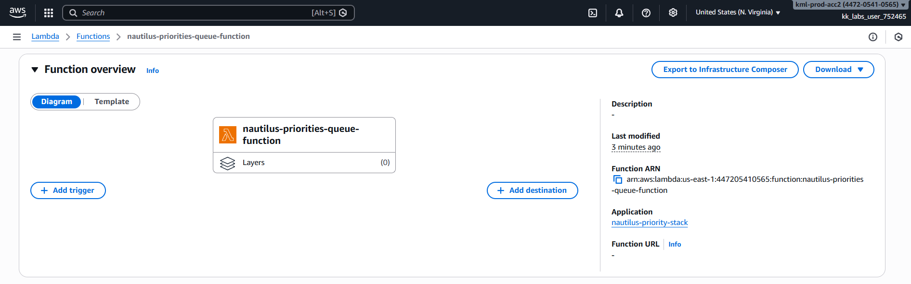

---

### 14. Verified Lambda Code
Confirmed that the Lambda function contained the code from `index.py`.

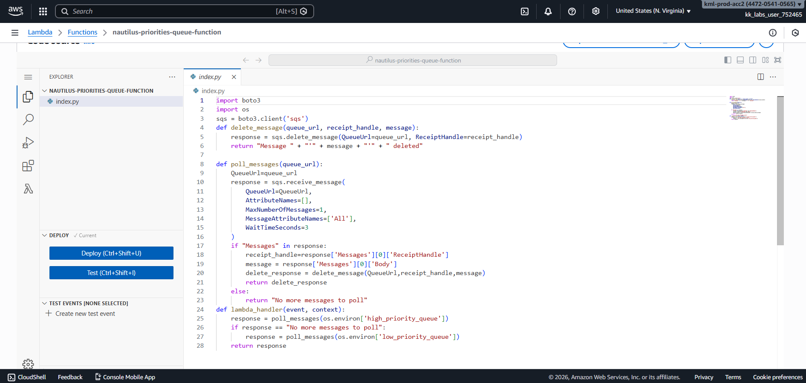

---

### 15. Verified Environment Variables
Under Lambda configuration, confirmed the presence of two environment variables:

- high_priority_queue  
- low_priority_queue  

---

### 16. Published Messages to SNS Topic
Published four messages to the SNS topic using message attributes:

- Two messages marked as high priority  
- Two messages marked as low priority  

This is called **Publishing SNS messages with message attributes**.

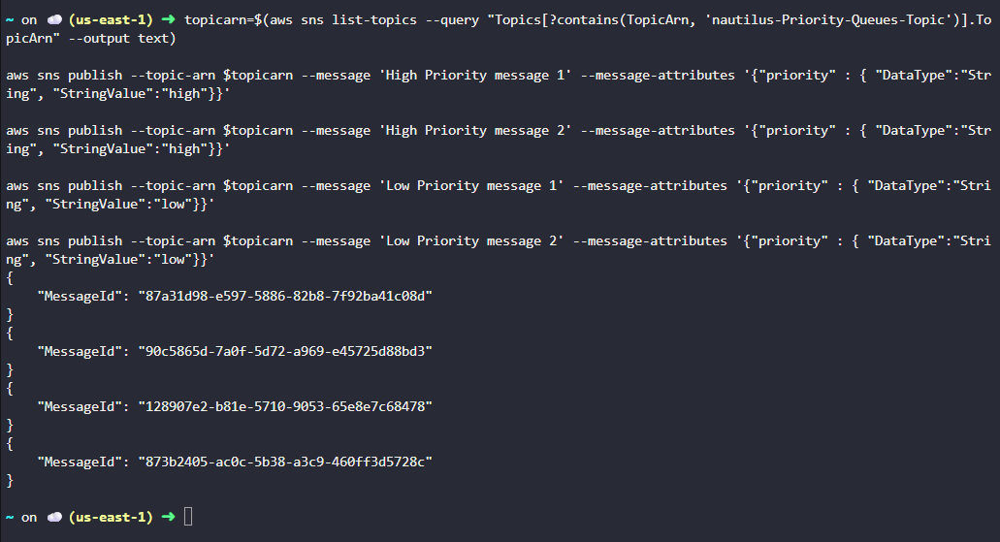

---

### 17. Navigated to SQS
Opened AWS Console → Services → SQS.

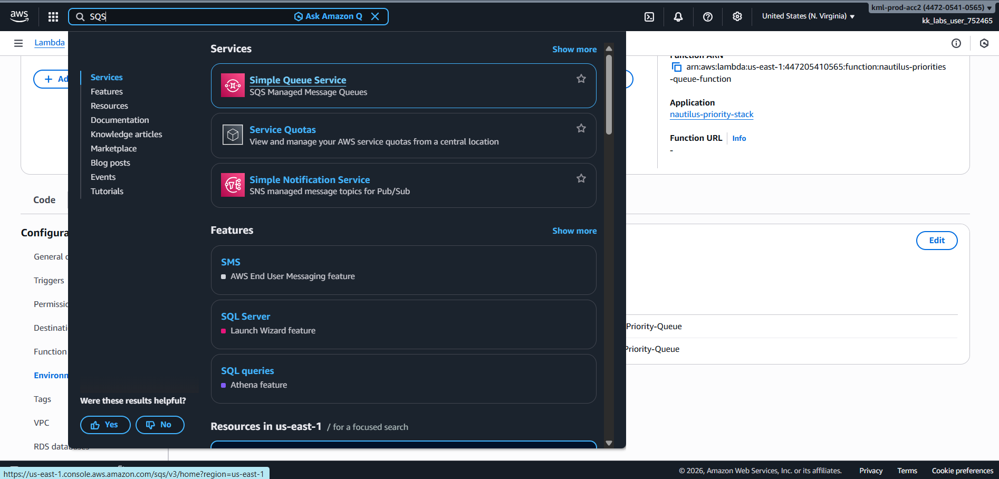

---

### 18. Verified Messages in Queues
Confirmed:

- 2 messages available in High Priority Queue  
- 2 messages available in Low Priority Queue  

---

## Verification
The following validations confirm successful task completion:

- Invoked the Lambda function manually and observed that a message from the High Priority Queue was processed first.

    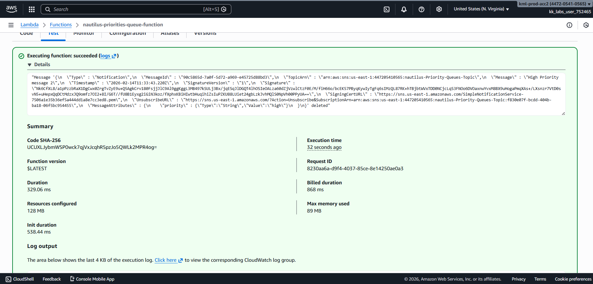

- Refreshed SQS and confirmed High Priority Queue now showed 1 available message.

    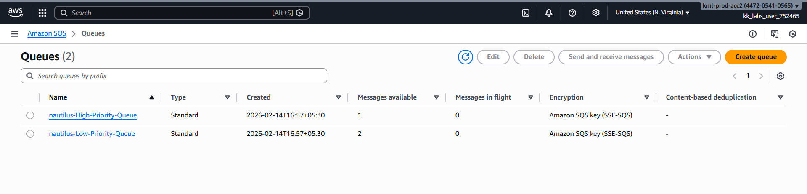

- Invoked Lambda again and observed that the remaining High Priority message was processed.

    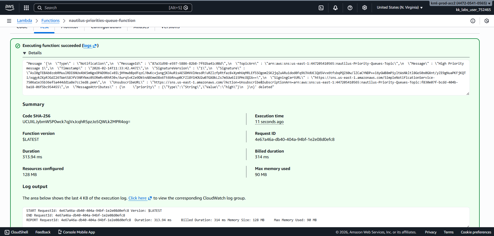

- Refreshed SQS and confirmed High Priority Queue showed 0 available messages.

    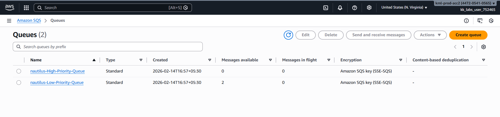

- Invoked Lambda again since High Priority Queue was empty, a Low Priority message was processed.

    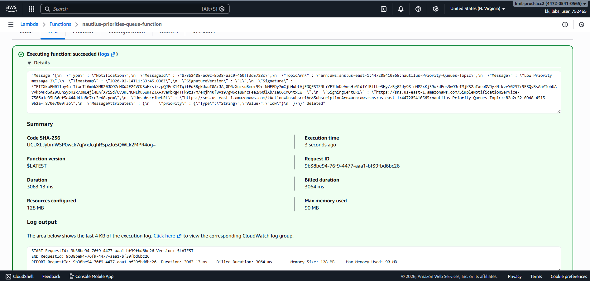

- Refreshed SQS and confirmed Low Priority Queue now showed 1 available message.

    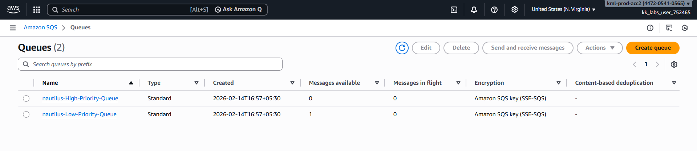

---

## Outcome

Successfully implemented a **priority-based message queuing system** using:

- SNS for message publishing  
- SQS for queue separation by priority  
- Lambda for message consumption  
- CloudFormation for Infrastructure as Code  

The system ensures:

- High-priority messages are processed first  
- Low-priority messages are processed only after high-priority queue is empty  
- Infrastructure is fully reproducible  

---

## Learnings

- CloudFormation enables automated infrastructure deployment  
- SNS supports message attributes for intelligent routing  
- SQS enables queue isolation by priority  
- Lambda can consume and process multiple queues  
- Priority-based systems are critical in production-grade architectures  

---

**Status:** Completed 
