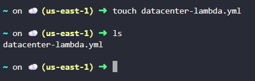
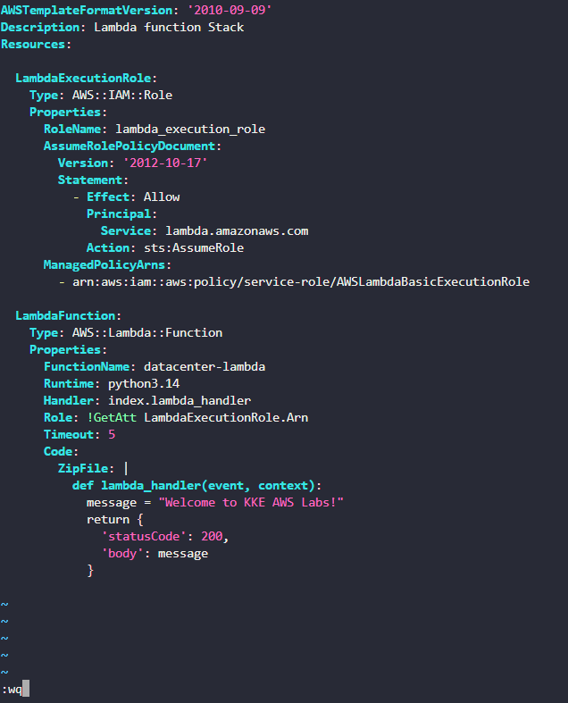
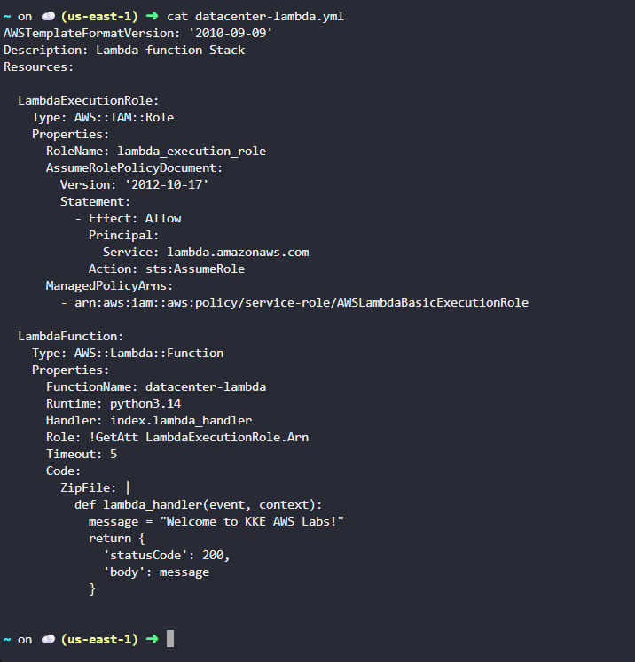
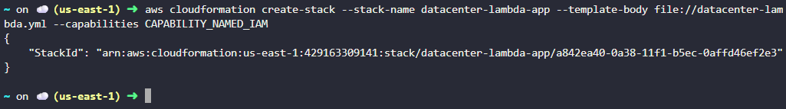
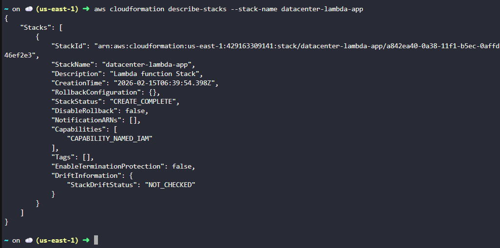
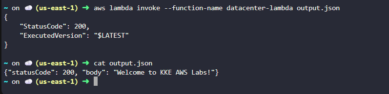

Suggest a folder name:

# Day 48 – Deploying AWS Lambda Using CloudFormation  

## Task Overview  

As part of the **100 Days of Cloud (AWS)** challenge by **KodeKloud**, this task focuses on deploying an AWS Lambda function using AWS CloudFormation.

The Nautilus DevOps team required an Infrastructure as Code solution that:

- Creates a Lambda function named `datacenter-lambda`  
- Uses Python runtime  
- Prints the message **Welcome to KKE AWS Labs!**  
- Returns a status code `200`  
- Creates and attaches an IAM role named `lambda_execution_role`  
- Deploys the stack with the name `datacenter-lambda-app`  

The CloudFormation template was created at:

/root/datacenter-lambda.yml  

Stack Name: datacenter-lambda-app  

---

## Concept  

This task demonstrates:

- Infrastructure as Code (IaC) using CloudFormation  
- Serverless compute using Lambda  
- IAM role-based access control  
- Inline Lambda function deployment  
- Stack lifecycle management using AWS CLI  

This ensures automated and repeatable serverless deployments.

---

## Real-World Use Case  

In real-world environments:

- Organizations deploy Lambda functions using IaC for consistency  
- Automated deployments reduce manual configuration errors  
- IAM roles ensure secure and controlled execution permissions  
- CloudFormation enables version-controlled infrastructure  

Serverless + IaC is a standard practice in modern cloud-native architectures.

---

## Requirements  

- Stack Name: `datacenter-lambda-app`  
- CloudFormation Template Path: `/root/datacenter-lambda.yml`  
- Lambda Function Name: `datacenter-lambda`  
- Runtime: Python  
- IAM Role Name: `lambda_execution_role`  
- Response Body: `Welcome to KKE AWS Labs!`  
- Status Code: `200`  

---

## AWS Services Used  

- AWS CloudFormation  
- AWS Lambda  
- AWS IAM  
- AWS CLI  

---

# Steps Performed  

---

## CloudFormation Template Preparation  

### 1. Created CloudFormation Template File  

Created the file `datacenter-lambda.yml` inside the `/root` directory and verified that it was successfully created.

---

### 2. Prepared Resource Definitions  

Created a separate YAML file containing all required resource definitions including:

- IAM Role (`lambda_execution_role`)  
- Lambda Function (`datacenter-lambda`)  
- Inline Python function code returning status code 200  

YAML file : [datacenter-lambda-stack](./datacenter-lambda.yaml)

---

### 3. Opened Main Template File  

Edited `datacenter-lambda.yml` to insert the prepared CloudFormation configuration.

---

### 4. Pasted Configuration into Template  

Copied the complete resource configuration into `datacenter-lambda.yml` and saved the file.

---

### 5. Verified Template Content  

Reviewed the updated template to ensure:

- Proper YAML formatting  
- Correct resource definitions  
- No syntax errors before deployment  

---

## CloudFormation Stack Deployment  

### 6. Created CloudFormation Stack  

Deployed the stack using the `datacenter-lambda.yml` template and specified the stack name as `datacenter-lambda-app`.

---

## Verification
The following validations confirm successful task completion:

- Checked the stack status and confirmed it displayed **CREATE_COMPLETE**.

    

- Manually invoked the Lambda function and stored the output in `output.json`.
- Confirmed that:
  - The returned `statusCode` was `200`  
  - The response body contained `Welcome to KKE AWS Labs!`  

    

---

## Outcome  

Successfully deployed a **Lambda function using CloudFormation** with:

- Automated IAM role creation  
- Serverless function deployment  
- Correct status code response  
- Expected output message  

The infrastructure was fully deployed using Infrastructure as Code.

---

## Learnings  

- CloudFormation simplifies serverless deployments  
- IAM roles are essential for secure Lambda execution  
- Stack status verification ensures successful deployment  
- Inline Lambda code can be managed directly within templates  
- IaC improves reliability and reproducibility  

---

**Status:** Completed 
