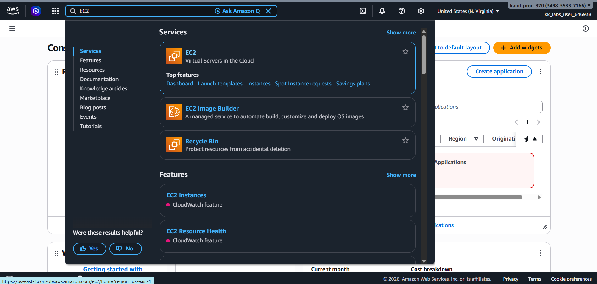
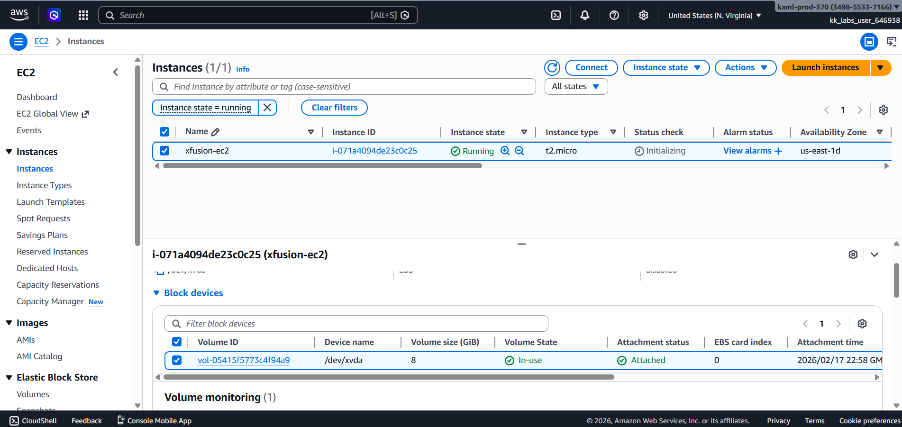
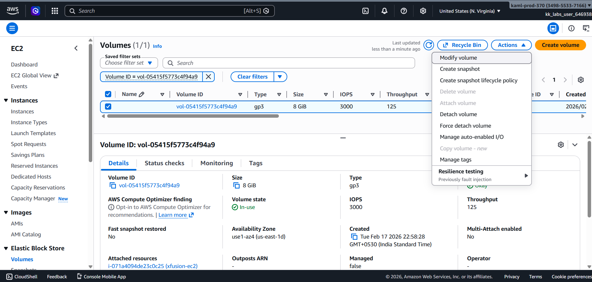
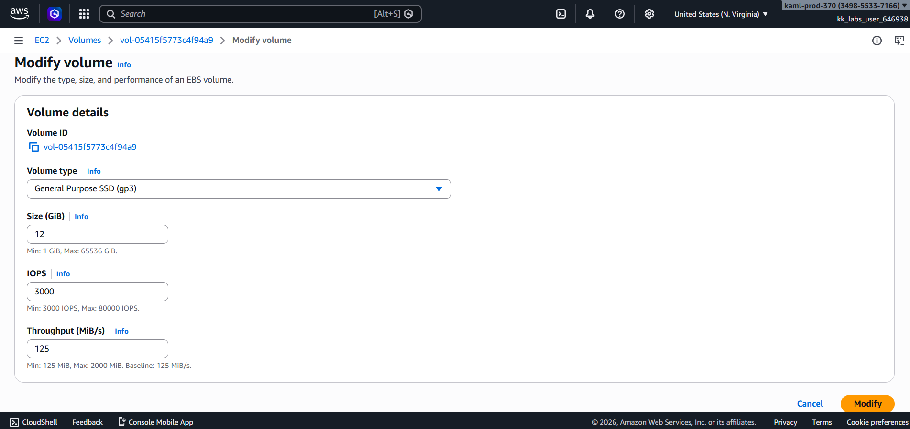
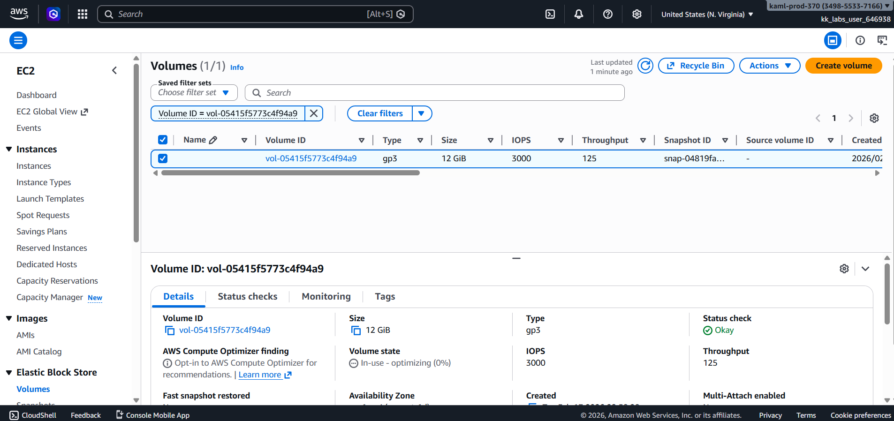
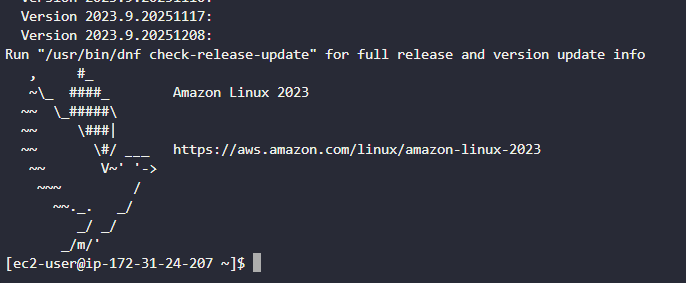
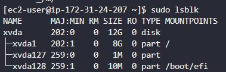
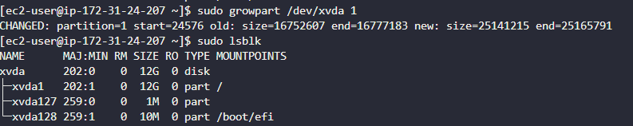
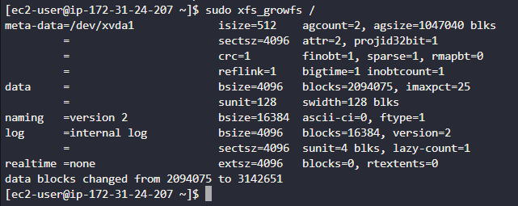
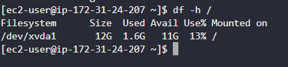

# Day 50 – Expanding EC2 Root Volume Without Downtime  

## Task Overview  

As part of the **100 Days of Cloud (AWS)** challenge by **KodeKloud**, this task focuses on expanding the root EBS volume of a running EC2 instance without disrupting ongoing operations.

The Nautilus DevOps team identified that the EC2 instance `xfusion-ec2` was running out of storage space. The attached root volume was 8 GiB and needed to be expanded to 12 GiB.

The objective was to:

- Identify the attached EBS volume  
- Increase its size from 8 GiB to 12 GiB  
- Extend the root partition inside the instance  
- Ensure the additional storage becomes immediately usable  

SSH access was performed using the key pair located at:

/root/xfusion-keypair.pem

---

## Concept  

This task demonstrates:

- EBS volume resizing  
- Online storage expansion without stopping the instance  
- Linux partition resizing  
- Filesystem expansion  
- Safe production storage scaling  

Although AWS allows live volume resizing, the operating system must also be updated to reflect the new size.

---

## Requirements  

- Instance Name: xfusion-ec2  
- Original Volume Size: 8 GiB  
- Updated Volume Size: 12 GiB  
- Root Partition: /  

---

## AWS Services Used  

- Amazon EC2  
- Amazon EBS  
- Linux Disk Utilities  

---

# Steps Performed  

---

## 1. Verified EC2 Instance and Attached Volume  

Navigated to EC2 → Instances

Confirmed:

- `xfusion-ec2` was running  
- The attached root volume size was 8 GiB  

  

---

## 2. Modified EBS Volume Size  

- Navigated to EC2 → Volumes  
- Selected the root volume attached to `xfusion-ec2`  
- Chose Actions → Modify Volume  

- Updated the size from 8 GiB to 12 GiB  

- Confirmed the modification  
 

---

## 3. Connected to EC2 Instance  

SSH access was established using the provided key pair.

---

## 4. Verified Current Partition Size  

Checked disk layout inside the instance and confirmed that the root partition was still showing 8 GiB even after volume modification.

 

---

## 5. Expanded the Root Partition  

Extended the root partition to utilize the newly allocated space and verified that it now reflected 12 GiB.

 

---

## 6. Expanded the Filesystem  

Expanded the filesystem so the operating system could fully utilize the new partition size.

---

## Verification  

- Confirmed the root filesystem now reflects 12 GiB  
- Verified using disk usage output  
- Ensured no downtime occurred during the operation  

---

## Outcome  

Successfully expanded the root EBS volume of `xfusion-ec2` from 8 GiB to 12 GiB without stopping the instance.

- Storage increased without downtime  
- Root partition updated successfully  
- Filesystem expanded correctly  
- Additional space immediately available  

---

## Learnings  

- EBS volumes can be resized while the instance is running  
- Volume modification alone is not sufficient  
- Partition and filesystem must also be expanded  
- Always verify changes at both AWS console and OS level  

---

**Status:** Completed 
