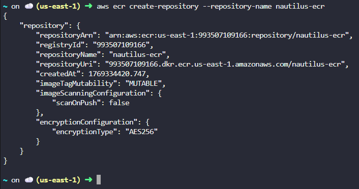
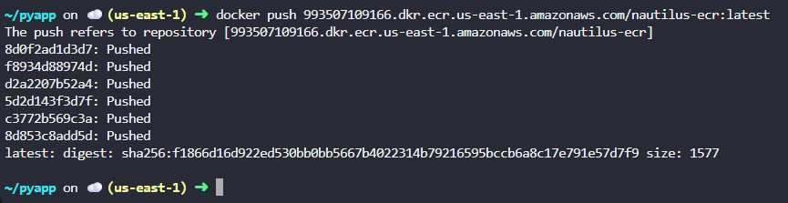

# Day 28 – Create Private Amazon ECR Repository and Push Docker Image (AWS)

## Task Overview
As part of the 100 Days of Cloud (AWS) challenge by KodeKloud, this task focuses on creating a private Amazon Elastic Container Registry (ECR) repository and pushing a Docker image to it.

The objective was to create a private ECR repository named `nautilus-ecr`, build a Docker image using a Dockerfile located at `/root/pyapp` on the aws-client host, and push the image to the repository with the `latest` tag.

---

## Concept
Amazon Elastic Container Registry (ECR) is a fully managed Docker container registry used to securely store, manage, and deploy container images. This task demonstrates a standard CLI-driven DevOps workflow for managing container images in AWS.

---

## Real-World Use Case
Private ECR repositories are commonly used to store proprietary container images, integrate with ECS and EKS, support CI/CD pipelines, and manage versioned application artifacts securely.

---

## Requirements
- ECR repository name: nautilus-ecr
- Repository type: Private
- Dockerfile location: /root/pyapp
- Image tag: latest
- Execution host: aws-client
- AWS credentials: Retrieved using showcreds

---

## AWS Services Used
- Amazon Elastic Container Registry (ECR)
- AWS CLI
- IAM
- Docker

---

## Steps Performed
1. Retrieved AWS credentials on the aws-client host using the showcreds command and configured the AWS CLI using aws configure.

   
   
2. Created a private Amazon ECR repository named nautilus-ecr using the AWS CLI command aws ecr create-repository --repository-name nautilus-ecr.

   

3. Authenticated Docker with Amazon ECR using the command aws ecr get-login-password piped to docker login with the ECR registry URI. 

   

4. Navigated to the directory containing the Dockerfile by changing to /root/pyapp on the aws-client host. 
   
   

5. Built the Docker image from the Dockerfile and tagged it as latest using the docker build command.
   
   

6. Tagged the locally built Docker image with the Amazon ECR repository URI using the docker tag command. 
   
   

7. Pushed the Docker image with the latest tag to the private ECR repository using the docker push command. 
   
   

---

## Verification
The following screenshot confirm successful completion of the task:

- Verified from the AWS Management Console that the private ECR repository exists and the Docker image with the latest tag is present.

   

---

## Outcome
A private Amazon ECR repository named nautilus-ecr was successfully created, and a Docker image built from the Dockerfile located at /root/pyapp was pushed to the repository with the latest tag. The image is now securely stored and ready for deployment.

---

## Learnings
- Amazon ECR provides secure storage for private container images
- AWS CLI is essential for container registry operations
- Docker authentication is required before pushing images
- Proper image tagging supports version control
- CLI-based workflows are standard in DevOps practices

---

**Status:** Completed
